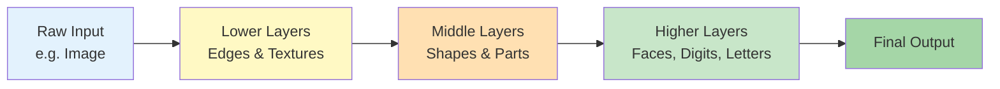
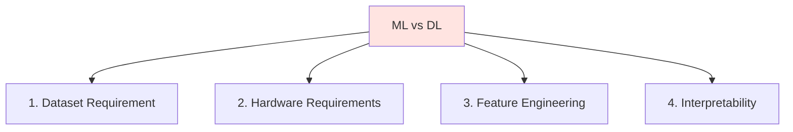
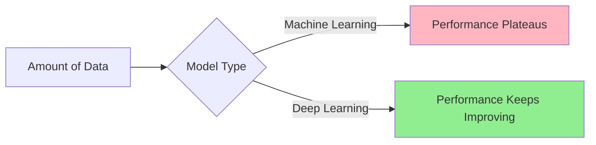
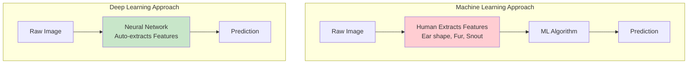
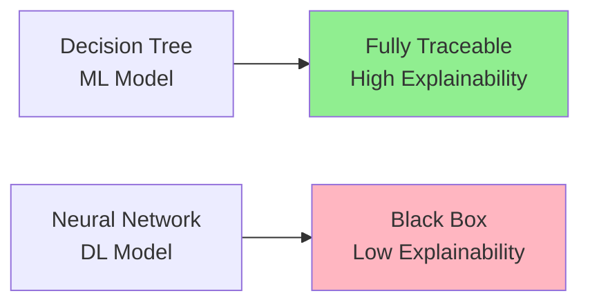
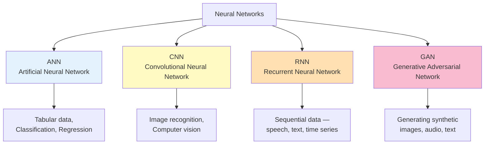
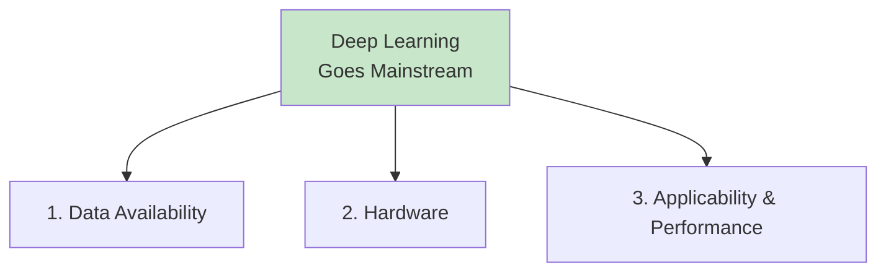

# Deep Learning - Introduction

---

## What is Deep Learning?

Deep Learning is a subfield of Artificial Intelligence and Machine Learning, inspired by the structure of the human brain.

Deep Learning algorithms attempt to draw similar conclusions as humans would by continually analysing data through a logical structure called a **Neural Network**. It is part of a broader family of machine learning methods based on artificial neural networks with **representation learning**.

Deep Learning algorithms use multiple layers to progressively extract higher-level features from raw input.

---

## How Does Deep Learning Differ from Machine Learning?

In Machine Learning, the relationship between input and output is decided through statistical analysis. In Deep Learning, this relationship is learned through a neural network.

Beyond that fundamental difference, the two diverge across several key dimensions:

---

### 1. Dataset Requirement

Deep Learning models require significantly more data than Machine Learning models to perform well.

![[Pasted image 20260102143048.png]]

As the graph shows, after a certain volume of data, the performance of a Machine Learning model **stagnates** — it cannot extract more signal no matter how much more data you add. Deep Learning models, on the other hand, **continue to improve** as data increases.

This is why Deep Learning is described as being **data hungry**.

---

### 2. Hardware Requirements

| | Machine Learning | Deep Learning |
|---|---|---|
| **Hardware** | CPU is sufficient | GPU required |
| **Why** | Statistical computations are sequential | Neural networks involve complex matrix multiplications that must run in parallel |
| **Training Time** | Minutes to hours | Hours to days to weeks |

Deep Learning's computational core — forward and backward passes through layers of a neural network — is essentially massive matrix multiplication. GPUs are architecturally designed to perform thousands of these operations simultaneously, which is why they are non-negotiable for DL training.

---

### 3. Feature Engineering

|                            | Machine Learning                                | Deep Learning                                      |
| -------------------------- | ----------------------------------------------- | -------------------------------------------------- |
| **Approach**               | Features must be manually engineered by a human | Features are automatically extracted from raw data |
| **What this means**        | You decide what the model sees                  | The model decides what matters                     |
| **Term for DL's approach** | —                                               | Representation Learning                            |

**Example - Dog vs Cat Classification:**
- In **Machine Learning**: you must manually engineer features like ear shape, snout length, fur texture, etc. and feed those to the model
- In **Deep Learning**: you feed in the raw image and the network automatically learns to identify the relevant distinguishing features on its own

---

### 4. Interpretability / Explainability

Deep Learning models are often called a **black box**.

The model produces an output, but we have no clear understanding of *why* it produced that specific output or what internal reasoning led to it. If a DL model classifies an image as a dog, we cannot easily inspect what pattern in the image triggered that decision.

Machine Learning models, by contrast, tend to have **high explainability**. A Decision Tree, for example, can be visualised step by step — you can trace exactly which feature at which threshold led to any given prediction.

> [!warning] The Explainability Trade-off
> This is one of the central tensions in modern AI. Deep Learning models are often the highest-performing option, but their black-box nature makes them difficult to audit, debug, and deploy in regulated industries like healthcare, finance, and law where decisions must be justifiable.

---

## Neural Networks

Neural networks are logical structures designed to replicate the way human brains process information — connecting inputs to outputs through layers of interconnected nodes.

There are several types of neural networks, each suited to different kinds of data and problems:

| Network Type | Full Name | Primary Use Case |
|---|---|---|
| **ANN** | Artificial Neural Network | General-purpose — tabular data, classification, regression |
| **CNN** | Convolutional Neural Network | Image recognition, computer vision, image generation |
| **RNN** | Recurrent Neural Network | Sequential data — speech, text, time series |
| **GAN** | Generative Adversarial Network | Generating synthetic images, audio, and text |

---

## Why is Deep Learning Becoming Mainstream Now?

Deep Learning is not new — the foundational ideas have existed since the 1980s. What changed is the confluence of three things arriving simultaneously:

**1. Data Availability**
The internet generated an explosion of labelled data — images, text, audio, video — at a scale that simply did not exist before. Deep Learning's data hunger is finally being met.

**2. Hardware**
Modern GPUs (and more recently TPUs) made it economically feasible to train large neural networks in reasonable time. What once took weeks on a supercomputer now takes hours on a cloud GPU.

**3. Applicability and Performance**
Deep Learning began outperforming every prior approach on benchmark after benchmark — image classification (ImageNet 2012), speech recognition, machine translation, game playing. Once performance results became undeniable, industry adoption accelerated rapidly.

---

## ML vs DL — Full Comparison

| Dimension           | Machine Learning                    | Deep Learning                       |
| ------------------- | ------------------------------------ | ------------------------------------ |
| Data requirement    | Works with small to medium datasets | Requires large datasets             |
| Hardware            | CPU sufficient                      | GPU required                        |
| Training time       | Minutes to hours                    | Hours to weeks                      |
| Feature engineering | Manual — human designed             | Automatic — representation learning |
| Explainability      | High — interpretable models exist   | Low — black box                     |
| Performance ceiling | Plateaus with more data             | Continues to improve with more data |
| Best for            | Structured / tabular data           | Images, text, audio, video          |