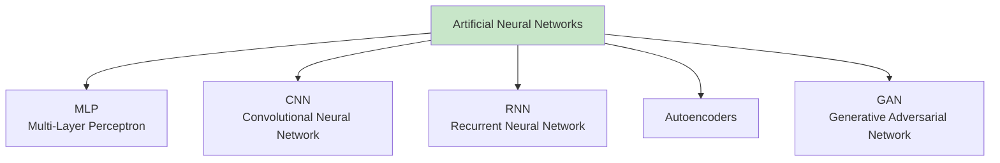
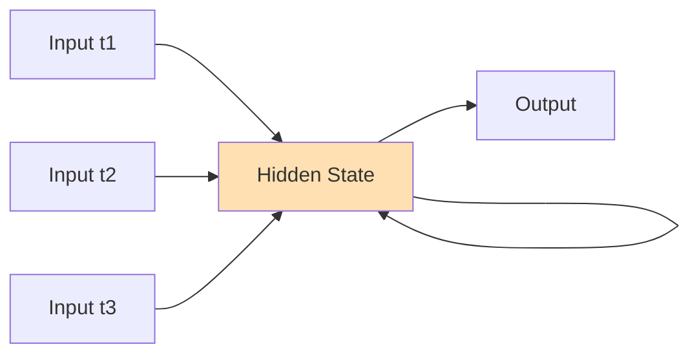
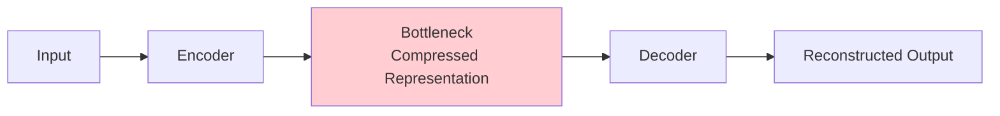
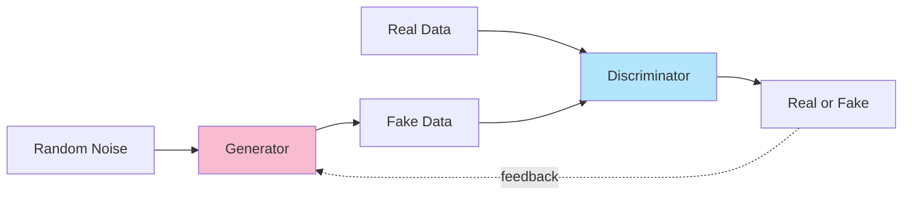

## ANNs (Artificial Neural Networks)

Artificial Neural Networks branch into several specialised architectures, each suited to a different kind of data or task.

---

### 1 MLP - Multi-Layer Perceptron

The most basic and foundational type of neural network - a stack of fully connected layers where every neuron in one layer connects to every neuron in the next. Data flows in a single direction (feedforward), with no loops or memory of previous inputs.

**Best for:** Tabular data, general classification and regression problems. It's often the building block other architectures are built on top of.

---

### 2 CNN - Convolutional Neural Network

Uses filters (kernels) that slide across the input to detect spatial patterns - edges, textures, shapes - layer by layer. Weight sharing across the image means far fewer parameters than an MLP would need for the same input size.

**Best for:** Image recognition, computer vision, object detection - anywhere spatial structure in the data matters.

---

### 3 RNN - Recurrent Neural Network

Unlike MLPs and CNNs, an RNN has a "memory" - it feeds its own output from the previous time step back into itself, allowing it to retain context across a sequence. Vanilla RNNs struggle with long sequences (vanishing gradient problem), which is why variants like **LSTM** and **GRU** are commonly used instead.

**Best for:** Sequential data - text, speech, time series, anything where order matters.

---

### 4 Autoencoders

An encoder-decoder architecture that learns to compress input data into a smaller "bottleneck" representation, then reconstruct the original input from that compressed form. It's trained to make its output match its input, forcing it to learn only the most essential features in between.

**Best for:** Dimensionality reduction, denoising, anomaly detection, and as a pretraining step for other models.

---

### 5 GAN - Generative Adversarial Network

Made up of two competing networks: a **Generator**, which creates fake data, and a **Discriminator**, which tries to tell real data apart from fake. They're trained together - the generator keeps improving to fool the discriminator, and the discriminator keeps improving to catch it, until the generator produces highly realistic outputs.

**Best for:** Generating synthetic images, audio, and text; image-to-image translation, style transfer, deepfakes.

---

### Summary Table

| Type | Key Mechanism | Primary Use Case |
|---|---|---|
| **MLP** | Fully connected layers, feedforward | Tabular data, general classification/regression |
| **CNN** | Convolutional filters, weight sharing | Image recognition, computer vision |
| **RNN** | Recurrent connections, sequence memory | Text, speech, time series |
| **Autoencoders** | Encoder-decoder, bottleneck compression | Dimensionality reduction, denoising, anomaly detection |
| **GAN** | Generator vs Discriminator (adversarial) | Synthetic data generation, image generation |