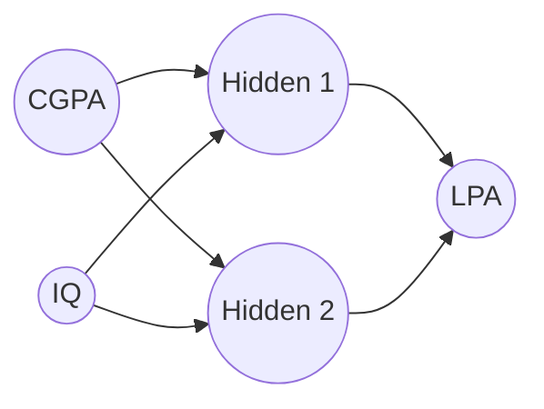
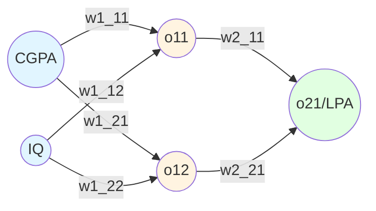
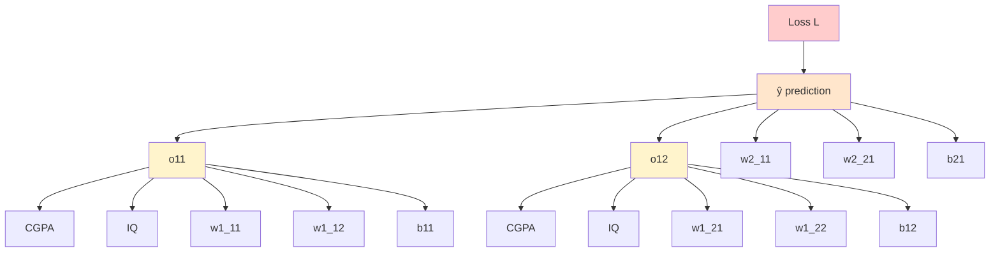
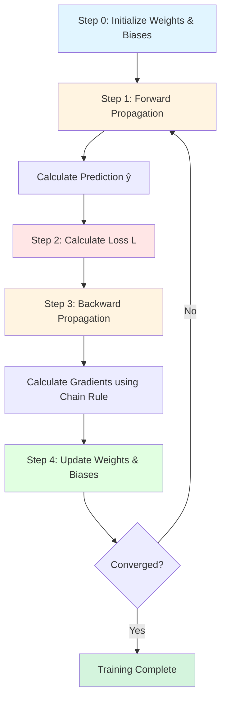

Backpropagation is short for **backward propagation of errors**.

**Formal Definition:** Backward propagation is an algorithm for supervised learning of artificial neural networks using gradient descent. Given an artificial neural network and an error function, the method calculates the gradient of the error function with respect to the neural network's weights.

**In Simple Terms:** It's an algorithm used to train neural networks by adjusting weights and biases to minimize prediction errors.

**The Sculptor Analogy:** Imagine you're a sculptor creating a statue. You start with a rough block of marble (random weights). After each chisel strike (forward pass), you step back and look at how far you are from your vision (calculate loss). Then you figure out exactly where and how hard to chisel next (backpropagation calculates gradients). Each strike brings you closer to your masterpiece. Backpropagation is the algorithm that tells you exactly where to strike and with how much force.

---

## What Does "Training a Neural Network" Mean?

Training a neural network means **finding the optimal values of weights and biases** so that the network makes accurate predictions.

Think of weights and biases as the "knobs and dials" of your neural network. Training is the process of adjusting these knobs to get the best possible output. Without proper training, a neural network is just a random function generator - useless!

### The Fundamental Training Question

How do we know which direction to adjust each weight? This is where backpropagation shines. It computes the exact contribution of each weight to the total error, allowing us to adjust them precisely.

### Example Problem: Predicting Student Placement Package

Let's say we have some data of CGPA, IQ and LPA which tells us how much will the student be placed for (LPA denotes Lakhs per annum):

|CGPA|IQ|LPA|
|---|---|---|
|8|80|8|
|7|70|7|

**Neural Network Architecture:**

Now training a neural network actually means finding the correct value of weights and biases. For a given data, backpropagation is an algorithm which helps us calculate the optimum value of weights and biases.

Backpropagation follows a series of steps to calculate the correct value of weights and biases.

---

## Our Training Dataset

|CGPA|IQ|Package (LPA)|
|---|---|---|
|8|80|3|
|9|60|5|
|5|70|8|
|7|120|11|

**Detailed Neural Network with Weight Labels:**

**Parameters:**

- Input to Hidden Layer: $$w_{1,1}^1, w_{1,2}^1, w_{2,1}^1, w_{2,2}^1, b_1^1, b_1^2$$
- Hidden to Output Layer: $$w_{1,1}^2, w_{2,1}^2, b_2^1$$

**Total: 9 trainable parameters**

**Understanding the Notation:**

- $$w_{i,j}^l$$ means: weight at layer $$l$$, from neuron $$j$$ to neuron $$i$$
- $$b_i^l$$ means: bias at layer $$l$$, for neuron $$i$$
- $$o_{i,j}$$ means: output of neuron $$j$$ in layer $$i$$

This systematic notation becomes crucial when dealing with deeper networks with hundreds of layers!

---

## Steps of Backpropagation

### Step 0: Initialize Weights and Biases

Some folks give random values to weights and biases. Some folks give zero to weights and one to biases. We are gonna use the latter approach today:

**Initialization:**

- All weights = 0
- All biases = 1

**Activation function used:** Linear (while explaining backpropagation)

**Important Note on Initialization:** In practice, initializing all weights to zero is actually **bad** because it leads to symmetry problems - all neurons in a layer would learn the same thing! Real-world initialization strategies include:

- **Xavier/Glorot initialization:** Scales weights based on the number of input and output neurons
- **He initialization:** Better for ReLU activation functions
- **Random initialization:** Small random values to break symmetry

For our teaching purposes, we use zero weights and unit biases for simplicity.

---

### Step 1: Forward Propagation - Select a Point and Predict

You select a point (row) OR a student.

Predict using initial values of weights and biases. We actually calculate what is the LPA predicted.

Using dot products and that whole matrix maths, we get a number at the end using forward propagation.

**Forward Pass Calculations:**

Hidden Layer: $$o_{1,1} = w_{1,1}^1 \cdot CGPA + w_{1,2}^1 \cdot IQ + b_1^1$$

$$o_{1,2} = w_{2,1}^1 \cdot CGPA + w_{2,2}^1 \cdot IQ + b_1^2$$

Output Layer: $$\hat{y} = o_{2,1} = w_{1,1}^2 \cdot o_{1,1} + w_{2,1}^2 \cdot o_{1,2} + b_2^1$$

**Example:** Let's say we get a value of 18 LPA but the value in data is 3 LPA.

Now we calculate the error and then we adjust the value of weights and biases in the next steps.

**The Assembly Line Analogy:** Think of forward propagation as an assembly line in a factory. Raw materials (inputs) enter at one end, pass through various stations (hidden layers), and a finished product emerges (output). Each station transforms the material slightly. If the final product is defective, we need to figure out which station(s) contributed to the defect - that's where backpropagation comes in!

---

### Step 2: Calculate Loss

Choose a loss function.

Since this is a regression problem, **MSE (Mean Squared Error)** is used here:

$$L = (y - \hat{y})^2 = (3 - 18)^2 = 225$$

**Error = 225**

My $$\hat{y}$$ is 18 and I need to reduce it.

$$\hat{y} = o_{2,1} = w_{1,1}^2 \cdot o_{1,1} + w_{2,1}^2 \cdot o_{1,2} + b_2^1$$

We have to minimize the loss.

**Why Square the Error?** We use $$(y - \hat{y})^2$$ instead of just $$(y - \hat{y})$$ for several reasons:

1. **Eliminates negative values:** Errors of +5 and -5 should both be considered as magnitude 5
2. **Penalizes large errors more:** An error of 10 is treated as much worse than two errors of 5
3. **Mathematically convenient:** The derivative is simple and elegant
4. **Corresponds to Gaussian assumptions:** MSE is the maximum likelihood estimator when errors are normally distributed

**The Archery Analogy:** The loss function is like measuring how far your arrow landed from the bullseye. A loss of 225 means you're way off target! The squared term means missing by 15 units is far worse than missing by 5 units three times. Our goal is to adjust our aim (weights) to consistently hit the bullseye (minimize loss).

---

### Step 3: Understanding the Error Dependency

**Dependency Flowchart:**

As you can see, this is a **complex hierarchy**. The loss depends on the prediction, which depends on hidden layer outputs, which depend on inputs and all the weights and biases.

**The Butterfly Effect in Neural Networks:** This dependency graph shows us why neural networks are so powerful yet so complex to train. Changing even a single weight in the first layer creates a ripple effect through the entire network, ultimately affecting the final loss. Backpropagation's genius is in calculating exactly how much each weight contributes to this ripple effect.

**Mathematical Perspective:** We can express the loss as a complex composite function:

$$L = f(w_1^2, w_2^2, b_2, g_1(w_{1,1}^1, w_{1,2}^1, b_1^1, x), g_2(w_{2,1}^1, w_{2,2}^1, b_1^2, x))$$

Where $$g_1$$ and $$g_2$$ are the hidden layer computations. To optimize this, we need calculus - specifically, the chain rule of differentiation.

---

### Step 4: Update Weights and Biases Using Gradient Descent

We have to update weights and biases using the **gradient descent algorithm**.

**Update Rules:**

For weights: $$w_{new} = w_{old} - \eta \cdot \frac{\partial L}{\partial w}$$

For biases: $$b_{new} = b_{old} - \eta \cdot \frac{\partial L}{\partial b}$$

Where:

- $$\eta$$ (eta) = learning rate
- $$\frac{\partial L}{\partial w}$$ = partial derivative of loss with respect to weight

**The Mountain Hiker Analogy:** Imagine you're blindfolded on a foggy mountain and need to reach the valley (minimum loss). You can't see where you're going, but you can feel the slope under your feet. The gradient $$\frac{\partial L}{\partial w}$$ tells you which direction is downhill. The learning rate $$\eta$$ determines how big of a step you take. Too big, and you might overshoot the valley. Too small, and you'll take forever to get there. Gradient descent is your strategy for systematically walking downhill until you reach the bottom.

**Specific Update Equations:**

$$w_{1,1}^{2(new)} = w_{1,1}^{2(old)} - \eta \cdot \frac{\partial L}{\partial w_{1,1}^2}$$

$$w_{2,1}^{2(new)} = w_{2,1}^{2(old)} - \eta \cdot \frac{\partial L}{\partial w_{2,1}^2}$$

$$b_2^{1(new)} = b_2^{1(old)} - \eta \cdot \frac{\partial L}{\partial b_2^1}$$

Similarly for hidden layer parameters:

$$w_{1,1}^{1(new)} = w_{1,1}^{1(old)} - \eta \cdot \frac{\partial L}{\partial w_{1,1}^1}$$

$$w_{1,2}^{1(new)} = w_{1,2}^{1(old)} - \eta \cdot \frac{\partial L}{\partial w_{1,2}^1}$$

$$w_{2,1}^{1(new)} = w_{2,1}^{1(old)} - \eta \cdot \frac{\partial L}{\partial w_{2,1}^1}$$

$$w_{2,2}^{1(new)} = w_{2,2}^{1(old)} - \eta \cdot \frac{\partial L}{\partial w_{2,2}^1}$$

$$b_1^{1(new)} = b_1^{1(old)} - \eta \cdot \frac{\partial L}{\partial b_1^1}$$

$$b_1^{2(new)} = b_1^{2(old)} - \eta \cdot \frac{\partial L}{\partial b_1^2}$$

Now we have to focus on the **second term in the equation**: partial derivative of loss with respect to weight.

We have to calculate the value of these **9 derivatives** (since there are 9 trainable parameters) which in turn will complete the algorithm for us.

**Why the Minus Sign?** The negative sign in the update rule is crucial. The gradient $$\frac{\partial L}{\partial w}$$ points in the direction of **increasing** loss. Since we want to **decrease** loss, we move in the opposite direction (hence the minus sign). It's like feeling the upward slope and deliberately walking in the opposite direction to go downhill.

---

## Calculating Gradients Using Chain Rule

![[Pasted image 20260128045701.png]]

Now we know by **chain rule of differentiation**:

$$\frac{\partial L}{\partial w_{1,1}^2} = \frac{\partial L}{\partial \hat{y}} \cdot \frac{\partial \hat{y}}{\partial w_{1,1}^2}$$

**The Chain Rule - The Heart of Backpropagation:**

The chain rule is a fundamental theorem from calculus that allows us to compute derivatives of composite functions. In essence:

_"If output $$y$$ depends on intermediate variable $$u$$, and $$u$$ depends on input $$x$$, then the rate of change of $$y$$ with respect to $$x$$ equals the rate of change of $$y$$ with respect to $$u$$ multiplied by the rate of change of $$u$$ with respect to $$x$$."_

Mathematically: $$\frac{dy}{dx} = \frac{dy}{du} \cdot \frac{du}{dx}$$

This extends to longer chains: $$\frac{\partial L}{\partial w} = \frac{\partial L}{\partial \hat{y}} \cdot \frac{\partial \hat{y}}{\partial o} \cdot \frac{\partial o}{\partial w}$$

**The Domino Effect Analogy:** Imagine a chain of dominos. The final domino (loss) falls because of the one before it (prediction), which falls because of the one before that (hidden layer), and so on. The chain rule calculates how a small push on the first domino (changing a weight) eventually affects how far the last domino falls (change in loss). It breaks down this complex causation into a product of simple, local effects.

### Calculating $$\frac{\partial L}{\partial \hat{y}}$$

$$L = (y - \hat{y})^2$$

Using the power rule and chain rule:

$$\frac{\partial L}{\partial \hat{y}} = \frac{\partial (y - \hat{y})^2}{\partial \hat{y}} = 2(y - \hat{y}) \cdot (-1) = -2(y - \hat{y})$$

**Step-by-step derivation:**

1. Let $$u = y - \hat{y}$$
2. Then $$L = u^2$$
3. By power rule: $$\frac{\partial L}{\partial u} = 2u$$
4. By chain rule: $$\frac{\partial u}{\partial \hat{y}} = -1$$
5. Combined: $$\frac{\partial L}{\partial \hat{y}} = 2u \cdot (-1) = -2(y - \hat{y})$$

**Interpretation:** When our prediction $$\hat{y}$$ is too high (e.g., predicted 18, actual is 3), then $$(y - \hat{y}) = -15$$, giving us a gradient of $$+30$$. This positive gradient tells us to reduce $$\hat{y}$$ (because we subtract the gradient).

### Calculating $$\frac{\partial \hat{y}}{\partial w_{1,1}^2}$$

$$\hat{y} = o_{1,1} \cdot w_{1,1}^2 + o_{1,2} \cdot w_{2,1}^2 + b_2^1$$

Taking the partial derivative with respect to $$w_{1,1}^2$$ (treating all other variables as constants):

$$\frac{\partial \hat{y}}{\partial w_{1,1}^2} = \frac{\partial (o_{1,1} \cdot w_{1,1}^2 + o_{1,2} \cdot w_{2,1}^2 + b_2^1)}{\partial w_{1,1}^2} = o_{1,1}$$

**Why?** Because:

- The derivative of $$o_{1,1} \cdot w_{1,1}^2$$ with respect to $$w_{1,1}^2$$ is $$o_{1,1}$$
- The other terms don't contain $$w_{1,1}^2$$, so their derivatives are zero

**Interpretation:** The rate at which our prediction changes when we adjust $$w_{1,1}^2$$ is exactly equal to the activation $$o_{1,1}$$ from the previous layer. If $$o_{1,1}$$ is large, then $$w_{1,1}^2$$ has a big impact on the prediction.

### Our First Result

$$\boxed{\frac{\partial L}{\partial w_{1,1}^2} = -2(y - \hat{y}) \cdot o_{1,1}}$$

**What This Tells Us:**

- If we underpredict $$(y > \hat{y})$$, the gradient is positive → increase $$w_{1,1}^2$$
- If we overpredict $$(y < \hat{y})$$, the gradient is negative → decrease $$w_{1,1}^2$$
- The magnitude is proportional to both the error and the input activation $$o_{1,1}$$
- If $$o_{1,1} = 0$$, this weight doesn't contribute to the error and shouldn't be updated

---

We just calculated the first of the 9 parameters that we were supposed to calculate. The process is exactly the same. We apply chain rule once again.

### Calculating $$\frac{\partial L}{\partial w_{2,1}^2}$$

$$\frac{\partial L}{\partial w_{2,1}^2} = \frac{\partial L}{\partial \hat{y}} \cdot \frac{\partial \hat{y}}{\partial w_{2,1}^2}$$

$$\frac{\partial \hat{y}}{\partial w_{2,1}^2} = o_{1,2}$$

**Result:** $$\boxed{\frac{\partial L}{\partial w_{2,1}^2} = -2(y - \hat{y}) \cdot o_{1,2}}$$

Notice the symmetry with the previous result - the only difference is that this weight is multiplied by $$o_{1,2}$$ instead of $$o_{1,1}$$.

### Calculating $$\frac{\partial L}{\partial b_2^1}$$

$$\frac{\partial L}{\partial b_2^1} = \frac{\partial L}{\partial \hat{y}} \cdot \frac{\partial \hat{y}}{\partial b_2^1}$$

Since $$\hat{y} = o_{1,1} \cdot w_{1,1}^2 + o_{1,2} \cdot w_{2,1}^2 + b_2^1$$:

$$\frac{\partial \hat{y}}{\partial b_2^1} = 1$$

**Result:** $$\boxed{\frac{\partial L}{\partial b_2^1} = -2(y - \hat{y})}$$

**Bias Insight:** The bias gradient doesn't depend on any input! It's purely determined by the error. This makes sense - the bias shifts the entire activation function up or down, independent of the input values. It's like adjusting the baseline level of a neuron's responsiveness.

---

## Hidden Layer Gradients

For hidden layer parameters, we need to go deeper with the chain rule. This is where backpropagation truly earns its name - the error propagates **backward** through the layers.

**The Challenge:** Hidden layer weights don't directly affect the output. Their effect is mediated through the hidden layer activations, which then influence the output. We need a three-link chain instead of a two-link chain.

### Calculating $$\frac{\partial L}{\partial w_{1,1}^1}$$

$$\frac{\partial L}{\partial w_{1,1}^1} = \frac{\partial L}{\partial \hat{y}} \cdot \frac{\partial \hat{y}}{\partial o_{1,1}} \cdot \frac{\partial o_{1,1}}{\partial w_{1,1}^1}$$

Breaking it down:

**First link - already calculated:** $$\frac{\partial L}{\partial \hat{y}} = -2(y - \hat{y})$$

**Second link - output layer weight:** From $$\hat{y} = o_{1,1} \cdot w_{1,1}^2 + o_{1,2} \cdot w_{2,1}^2 + b_2^1$$: $$\frac{\partial \hat{y}}{\partial o_{1,1}} = w_{1,1}^2$$

**Third link - hidden layer weight:** From $$o_{1,1} = w_{1,1}^1 \cdot CGPA + w_{1,2}^1 \cdot IQ + b_1^1$$: $$\frac{\partial o_{1,1}}{\partial w_{1,1}^1} = CGPA$$

**Result:** $$\boxed{\frac{\partial L}{\partial w_{1,1}^1} = -2(y - \hat{y}) \cdot w_{1,1}^2 \cdot CGPA}$$

**Critical Insight - The Credit Assignment Problem:** Notice that this gradient contains $$w_{1,1}^2$$ - a weight from the **next** layer! This is the essence of backpropagation: to know how much to adjust a weight in an earlier layer, we need to know the weights in later layers. The error signal flows backward through the network, weighted by the connections. If $$w_{1,1}^2$$ is small, then $$w_{1,1}^1$$ gets less "blame" for the error, even if the error is large.

**The Telephone Game Analogy:** Imagine playing telephone where a message gets distorted as it passes through people. When the final message is wrong, how much should we blame each person in the chain? Backpropagation solves this by considering how much each person changed the message (the weights). A person who barely whispered (small weight) shouldn't be blamed as much as someone who shouted a completely different word (large weight).

### Calculating $$\frac{\partial L}{\partial w_{1,2}^1}$$

Following the same chain:

$$\frac{\partial L}{\partial w_{1,2}^1} = \frac{\partial L}{\partial \hat{y}} \cdot \frac{\partial \hat{y}}{\partial o_{1,1}} \cdot \frac{\partial o_{1,1}}{\partial w_{1,2}^1}$$

The only difference is the last term: $$\frac{\partial o_{1,1}}{\partial w_{1,2}^1} = IQ$$

**Result:** $$\boxed{\frac{\partial L}{\partial w_{1,2}^1} = -2(y - \hat{y}) \cdot w_{1,1}^2 \cdot IQ}$$

### Calculating $$\frac{\partial L}{\partial b_1^1}$$

$$\frac{\partial L}{\partial b_1^1} = \frac{\partial L}{\partial \hat{y}} \cdot \frac{\partial \hat{y}}{\partial o_{1,1}} \cdot \frac{\partial o_{1,1}}{\partial b_1^1}$$

Since $$\frac{\partial o_{1,1}}{\partial b_1^1} = 1$$:

$$\boxed{\frac{\partial L}{\partial b_1^1} = -2(y - \hat{y}) \cdot w_{1,1}^2}$$

### Remaining Gradients for Second Hidden Neuron

For the second hidden neuron ($$o_{1,2}$$), the chain now goes through $$w_{2,1}^2$$ instead of $$w_{1,1}^2$$:

$$\boxed{\frac{\partial L}{\partial w_{2,1}^1} = -2(y - \hat{y}) \cdot w_{2,1}^2 \cdot CGPA}$$

$$\boxed{\frac{\partial L}{\partial w_{2,2}^1} = -2(y - \hat{y}) \cdot w_{2,1}^2 \cdot IQ}$$

$$\boxed{\frac{\partial L}{\partial b_1^2} = -2(y - \hat{y}) \cdot w_{2,1}^2}$$

**Pattern Recognition:** Notice the beautiful symmetry in these equations:

- All contain the error term: $$-2(y - \hat{y})$$
- Hidden layer gradients include the corresponding output weight: $$w_{1,1}^2$$ or $$w_{2,1}^2$$
- Weight gradients (not bias) are multiplied by the input: $$CGPA$$ or $$IQ$$

This pattern extends to networks of any depth!

---

## Summary of All Calculated Gradients

![[Pasted image 20260128054433.png]]

**Output Layer Gradients:**

|Parameter|Gradient|
|---|---|
|$$w_{1,1}^2$$|$$-2(y - \hat{y}) \cdot o_{1,1}$$|
|$$w_{2,1}^2$$|$$-2(y - \hat{y}) \cdot o_{1,2}$$|
|$$b_2^1$$|$$-2(y - \hat{y})$$|

**Hidden Layer Gradients:**

|Parameter|Gradient|
|---|---|
|$$w_{1,1}^1$$|$$-2(y - \hat{y}) \cdot w_{1,1}^2 \cdot CGPA$$|
|$$w_{1,2}^1$$|$$-2(y - \hat{y}) \cdot w_{1,1}^2 \cdot IQ$$|
|$$w_{2,1}^1$$|$$-2(y - \hat{y}) \cdot w_{2,1}^2 \cdot CGPA$$|
|$$w_{2,2}^1$$|$$-2(y - \hat{y}) \cdot w_{2,1}^2 \cdot IQ$$|
|$$b_1^1$$|$$-2(y - \hat{y}) \cdot w_{1,1}^2$$|
|$$b_1^2$$|$$-2(y - \hat{y}) \cdot w_{2,1}^2$$|

**The General Pattern:** For any weight $$w_{ij}^l$$ connecting neuron $$j$$ in layer $$l-1$$ to neuron $$i$$ in layer $$l$$:

$$\frac{\partial L}{\partial w_{ij}^l} = \text{(error signal from layer } l+1 \text{)} \times \text{(activation from layer } l-1 \text{)}$$

This local learning rule is what makes backpropagation so elegant and efficient!

---

## Complete Backpropagation Algorithm Flow

Let's go through each of the individual steps once again:

![[Pasted image 20260128055952.png]]

**The Complete Process:**

### Step-by-Step Breakdown

1. **Initialize:** Set all weights to 0, all biases to 1 (or use proper random initialization in practice)
2. **Forward Pass:** Calculate $$\hat{y}$$ using current weights, flowing information from input to output
3. **Calculate Loss:** $$L = (y - \hat{y})^2$$ - measure how wrong we are
4. **Backward Pass:** Calculate all 9 gradients using chain rule, flowing error from output to input
5. **Update:** Apply gradient descent to all parameters: $$w_{new} = w_{old} - \eta \cdot \frac{\partial L}{\partial w}$$
6. **Repeat:** Go back to step 2 for next data point or next epoch

**Computational Efficiency:** Backpropagation is remarkably efficient. For a network with $$n$$ parameters, computing all gradients takes roughly the same time as two forward passes. Before backpropagation, people tried to estimate gradients by perturbing each weight individually, which would require $$n$$ forward passes - making large networks practically untrainable!

---

## Epochs and Convergence

This whole operation is performed **multiple times (multiple epochs)** and this is performed until **convergence** is achieved.

**Epoch:** We are giving our algorithm multiple chances over our data. One epoch = one complete pass through all training examples.

**Why Multiple Epochs?**

- One pass through data is usually not enough
- Weights need gradual adjustment
- Each epoch refines the model further
- Training continues until loss stops decreasing
- Think of it like studying for an exam - you read the material multiple times, each time understanding it better

**Convergence Criteria:**

- **Loss threshold:** Stop when $L < \epsilon$ for some small $\epsilon$
- **Plateau detection:** Stop when loss change between epochs becomes very small (e.g., $|L_{epoch_n} - L_{epoch_{n-1}}| < 0.0001$)
- **Maximum epochs:** Set a limit to prevent infinite training (e.g., 1000 epochs)
- **Validation performance:** Stop when validation loss stops decreasing (early stopping)
- **Gradient magnitude:** Stop when $|\nabla L| < \epsilon$ (gradients become very small)

**The Learning Curve:** If you plot loss vs. epochs, you typically see:

1. **Rapid descent:** Initial epochs show dramatic loss reduction
2. **Gradual improvement:** Middle epochs show steady progress
3. **Plateau:** Final epochs show diminishing returns

**Typical Training Patterns:**

- **Underfitting:** Loss remains high even after many epochs → Need more complex model or better features
- **Good fit:** Both training and validation loss decrease together
- **Overfitting:** Training loss decreases but validation loss increases → Model memorizing instead of learning

**The Practice Makes Perfect Analogy:** Training epochs are like practicing a musical instrument. The first few practice sessions show rapid improvement. After weeks of practice, you're still improving but more slowly. Eventually, you reach a plateau where more practice doesn't help much - you've learned what you can from this particular piece. In neural networks, this plateau signals convergence.