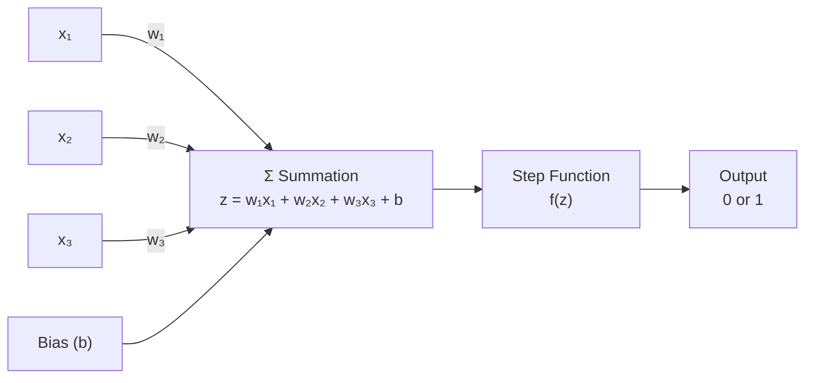
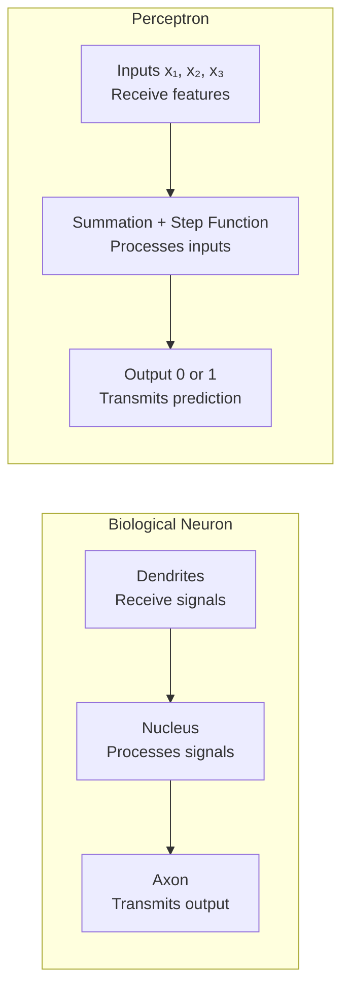
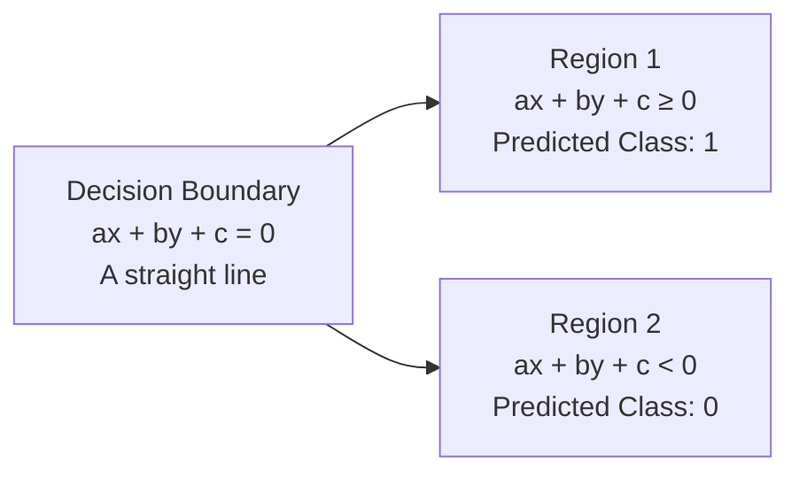
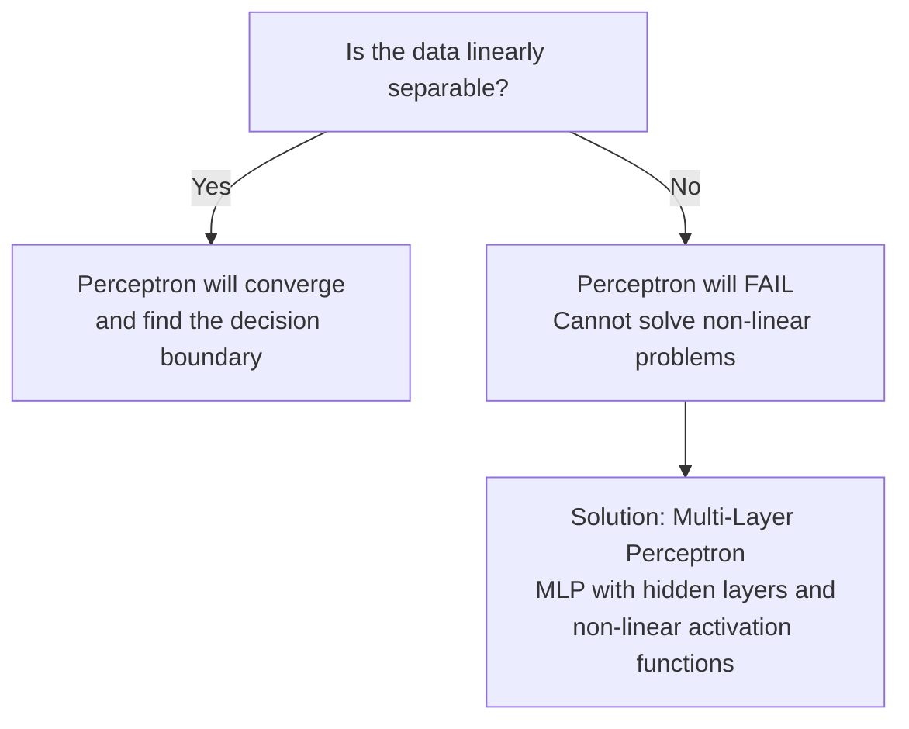

# What is a Perceptron?

A Perceptron is an algorithm used for **supervised machine learning**. It is like any other algorithm - similar in spirit to Linear Regression - except it is designed in a way that made it naturally become the fundamental building block of Deep Learning.

It can also be interpreted as a **mathematical model** or a **mathematical function** that maps inputs to an output through a series of operations.

![[Pasted image 20260102150129.png]]

A more formal view of the perceptron:

![[Pasted image 20260102150253.png]]

---

## Structure of a Perceptron

A perceptron takes multiple numerical inputs, applies a weight to each, sums them up, adds a bias, and passes the result through an activation function to produce an output.

**What each component does:**

| Component | Role |
|---|---|
| **Inputs** $x_1, x_2, \ldots, x_n$ | The features fed into the perceptron |
| **Weights** $w_1, w_2, \ldots, w_n$ | Control how much influence each input has |
| **Bias** $b$ | Shifts the decision boundary - allows the model to fit data that does not pass through the origin |
| **Summation** $z = \sum w_i x_i + b$ | Combines all weighted inputs into a single scalar |
| **Step Function** $f(z)$ | Activation - outputs 1 if $z \geq 0$, outputs 0 if $z < 0$ |
| **Output** | Binary prediction - class 0 or class 1 |

---

## Perceptron vs Biological Neuron

![[Pasted image 20260102151141.png]]

The perceptron is modelled after the biological neuron. The structural parallels are clear:

Despite the visual similarity, there are fundamental differences:

| Dimension | Biological Neuron | Perceptron |
|---|---|---|
| **Complexity** | Extraordinarily complex - billions of chemical and electrical interactions | Mathematically simple - weighted sum followed by a step function |
| **Nucleus / Processing** | The nucleus is a black box - we do not fully understand what happens inside | Fully transparent - we know exactly that summation and the step function are happening |
| **Neuroplasticity** | Dendrite thickness changes over time as connections strengthen or weaken with experience | Connection weights are updated only during training and remain fixed at inference |

---

## Geometric Intuition

![[Pasted image 20260102152319.png]]

![[Pasted image 20260102152438.png]]

The summation inside a perceptron produces the equation:

$$z = w_1 x_1 + w_2 x_2 + b$$

This is equivalent to the equation of a **straight line** in 2D:

$$ax + by + c = 0$$

The step function then evaluates:

$$f(z) = \begin{cases} 1 & \text{if } z \geq 0 \\ 0 & \text{if } z < 0 \end{cases}$$

Which corresponds to two regions in the feature space:

**What this means geometrically:**
- The perceptron draws a **straight line** (in 2D), a **plane** (in 3D), or a **hyperplane** (in higher dimensions) through the feature space
- Everything on one side of that line is classified as Class 1
- Everything on the other side is classified as Class 0
- This is why the perceptron is also known as a **binary classifier**

---

## How a Perceptron Learns

The perceptron updates its weights iteratively using the **Perceptron Learning Rule**:

$$w_i \leftarrow w_i + \eta \cdot (y - \hat{y}) \cdot x_i$$

| Term | Meaning |
|---|---|
| $w_i$ | Weight for input $x_i$ |
| $\eta$ | Learning rate - controls how large each update step is |
| $y$ | True label (0 or 1) |
| $\hat{y}$ | Predicted label (0 or 1) |
| $(y - \hat{y})$ | Error - zero if prediction is correct, non-zero if wrong |

If the prediction is correct, $(y - \hat{y}) = 0$ and the weights do not change. If the prediction is wrong, the weights are nudged in the direction that would have produced the correct output. This repeats until the model converges or a maximum number of iterations is reached.

---

## Limitation - Linear Separability

> [!warning] Critical Limitation
> A perceptron can only correctly classify data that is **linearly separable** - data that can be divided into two classes by a straight line (or hyperplane in higher dimensions).

**Classic example of perceptron failure - XOR problem:**

| $x_1$ | $x_2$ | XOR Output |
|---|---|---|
| 0 | 0 | 0 |
| 0 | 1 | 1 |
| 1 | 0 | 1 |
| 1 | 1 | 0 |

No single straight line can separate the 1s from the 0s in XOR. This is a fundamentally non-linear problem and a single perceptron cannot solve it - no matter how long it trains.

This limitation is precisely what motivated the development of **Multi-Layer Perceptrons (MLPs)** and eventually all of modern Deep Learning - by stacking multiple perceptrons with non-linear activation functions, the network can learn arbitrarily complex decision boundaries.