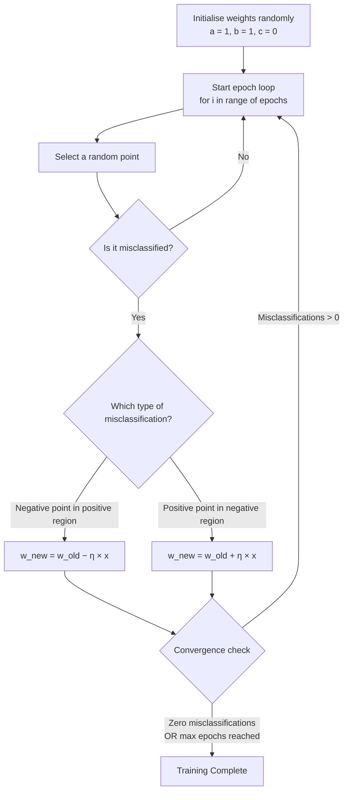
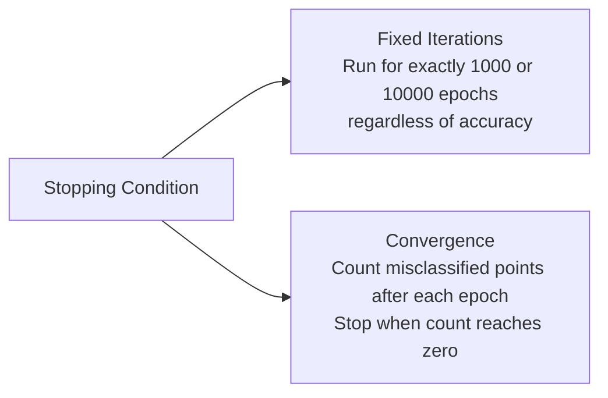
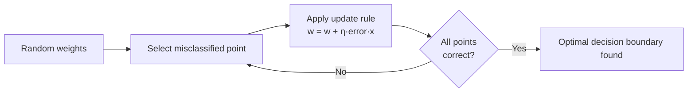

## Problem Setup

Consider training a model on student placement data where:

- **X-axis** - CGPA of students
- **Y-axis** - IQ of students
- **Green points** - students who were placed
- **Red points** - students who were not placed

![[Pasted image 20260116205941.png]]

The goal is to find a line that correctly separates the green points from the red points.

---

## The Decision Boundary

The general equation of a straight line used as a decision boundary:

$$ax_1 + bx_2 + c = 0$$

Where $x_1$ = CGPA and $x_2$ = IQ.

If a third feature is added (e.g., 10th grade marks), the equation extends naturally:

$$ax_1 + bx_2 + cx_3 + d = 0$$

In higher dimensions, this line becomes a **hyperplane**. The goal of training is to discover the values of $a$, $b$, and $c$ that draw the boundary which correctly classifies students as placed or not placed.

---

## Positive and Negative Regions

Every line divides the 2D feature space into two regions. Using inequality operators, we can define which side of the line is positive and which is negative:

$$2x + 3y + 5 > 0 \quad \text{(positive region)}$$
$$2x + 3y + 5 < 0 \quad \text{(negative region)}$$

![[Pasted image 20260116210959.png]]

A misclassification occurs when a point lands on the wrong side - a placed student (positive class) falls in the negative region, or a not-placed student (negative class) falls in the positive region.

---

## How Changing Coefficients Moves the Line

For a line $Ax + By + C = 0$:

| Coefficient Changed | Effect on the Line |
|---|---|
| **C** | Shifts the line - changes the x and y intercepts without rotating |
| **A** | Rotates the line - changes the slope relative to the x-axis |
| **B** | Rotates the line - changes the slope relative to the y-axis |

This is important because the Perceptron Trick works by nudging these coefficients to move the line toward correct classification.

---

## The Perceptron Trick

The core idea: whenever the line misclassifies a point, adjust the coefficients slightly so the line moves toward that point and eventually classifies it correctly.

![[Pasted image 20260116210557.png]]

### Transformation Rules

**Rule 1 - Negative point in the positive region:**
The model predicts placed, but the student was not placed.
Subtract the point's coordinates from the line coefficients.

**Rule 2 - Positive point in the negative region:**
The model predicts not placed, but the student was placed.
Add the point's coordinates to the line coefficients.

In both cases, append a `1` to the point's coordinates to account for the bias term $C$:

$$\text{Point } (x, y) \rightarrow (x,\ y,\ 1)$$

### Manual Calculation Example

**Given:** Line equation $2x + 3y + 5 = 0$, misclassified point $(4, 5)$ in the positive region (negative class)

![[Pasted image 20260116211814.png]]

Applying Rule 1 - subtract the point from the coefficients:

```
Coefficients:   2    3    5
Point:          4    5    1
                ―――――――――――――
New coefficients: -2   -2    4
```

New equation: $-2x - 2y + 4 = 0$

---

## Learning Rate

Applying the full subtraction or addition in a single step causes the line to overshoot - it moves too aggressively and may misclassify points that were previously correct.

Instead, we scale the adjustment by a **learning rate** $\eta$ (typically a small value like 0.1), making gradual corrections:

$$w_{\text{new}} = w_{\text{old}} - \eta \cdot x_i$$

**Example:** Instead of subtracting 4 directly, we subtract $0.1 \times 4 = 0.4$

This makes the line inch toward the misclassified point rather than jumping past it.

---

## The Full Perceptron Algorithm

### Notation

Standard mathematical form:

$$Ax + By + C = 0$$

Machine learning notation (generalised):

$$w_0 + w_1x_1 + w_2x_2 = 0$$

Defining $x_0 = 1$ to absorb the bias:

$$w_0x_0 + w_1x_1 + w_2x_2 = 0 \quad \Rightarrow \quad \sum_{i=0}^{2} w_i x_i = 0$$

### Algorithm Flow



### Detailed Pseudocode

```
Parameters:
    epochs = 1000
    learning rate η = 0.1

for i in range(epochs):

    randomly select a point (student)

    if point belongs to negative class AND Σ(wᵢ × xᵢ) ≥ 0:
        # not placed, but model predicts placed
        w_new = w_old − η × x

    if point belongs to positive class AND Σ(wᵢ × xᵢ) ≤ 0:
        # placed, but model predicts not placed
        w_new = w_old + η × x
```

### Unified Update Rule

Both conditions above collapse into a single equation:

$$w_{\text{new}} = w_{\text{old}} + \eta \cdot (y_i - \hat{y}_i) \cdot x_i$$

| Term | Meaning |
|---|---|
| $\eta$ | Learning rate |
| $y_i$ | Actual label - 0 (not placed) or 1 (placed) |
| $\hat{y}_i$ | Predicted label - 0 or 1 |
| $(y_i - \hat{y}_i)$ | Error - 0 if correct, ±1 if wrong |
| $x_i$ | Feature vector of the selected point |

When the prediction is correct, $(y_i - \hat{y}_i) = 0$ and the weights do not change. When wrong, the weights are nudged in the direction that corrects the error.

**Simplified final algorithm:**

```
for i in range(epochs):
    select a random point i
    w_new = w_old + η(yᵢ − ŷᵢ)xᵢ
```

### Convergence Criteria



> [!note] What is an Epoch?
> One complete pass through the entire training dataset is called an **epoch**. If you have 100 students and loop through all 100 once, that is one epoch.

---

## Summary



> [!tip] Notebook
> The full implementation of the Perceptron Trick is in `perceptron-trick.ipynb`