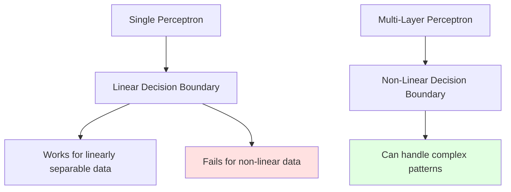
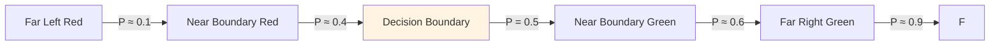
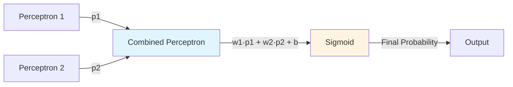
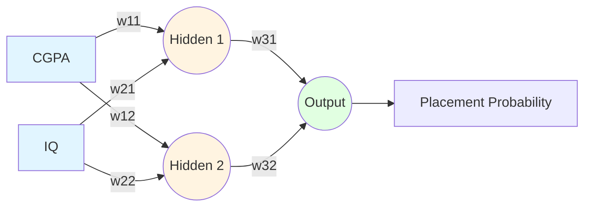
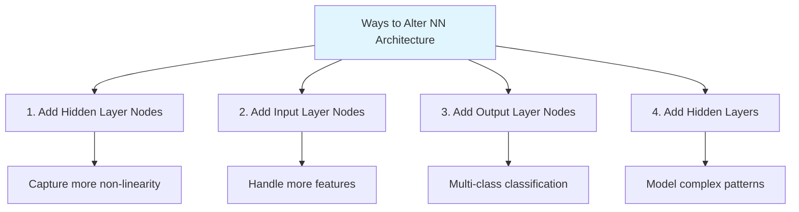
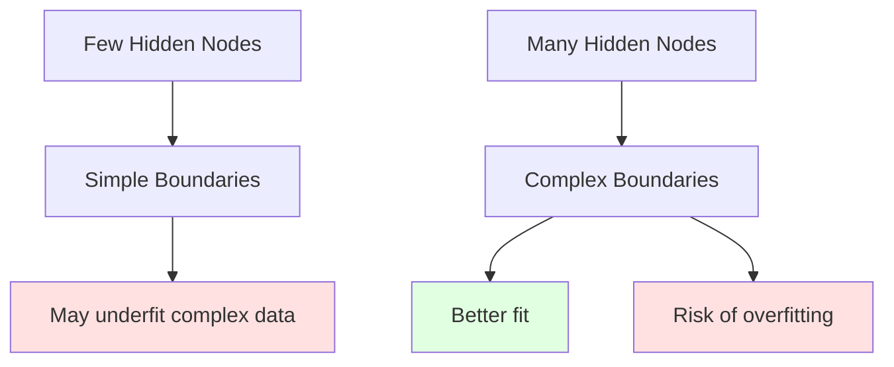
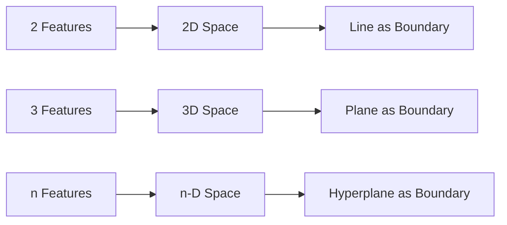
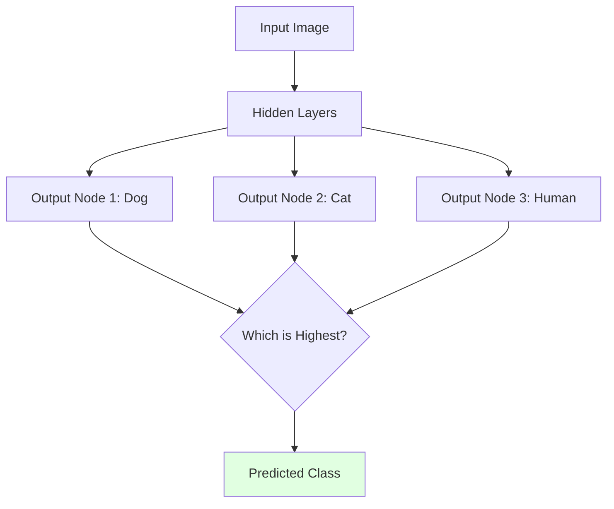
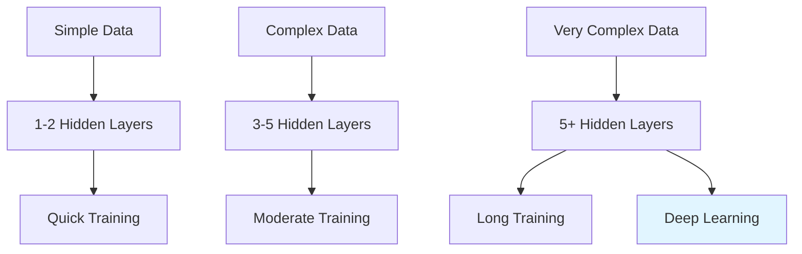
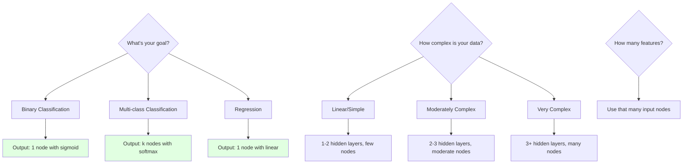

## The Need for Multi-Layer Perceptrons

![[Pasted image 20260119014221.png]]

As we can understand by looking at the problem, we need to design a multi-layer perceptron that can capture the non-linearity of the dataset and classify it accurately.

**The Problem with Single Perceptrons**: A single perceptron can only draw a straight line. But real-world data is often curved, circular, or has complex patterns that can't be separated by a single straight line.

**Analogy**: Imagine trying to separate red and blue marbles that are arranged in two concentric circles. A straight line will never work, no matter how you draw it. You need something more flexible.



---

# Perceptron with Sigmoid

![[Pasted image 20260119014512.png]]

For developing intuition behind multi-layer perceptrons, we'll use:

- **Activation function**: Sigmoid
- **Loss function**: Log loss (Binary Cross-Entropy)

This is essentially using logistic regression as our building block.

## Understanding Probability Output

The sigmoid function outputs a probability from 0 to 1. Taking our student placement example:

- **On the decision line**: Probability = 0.5 (boundary between placed/not placed)
- **Moving toward green region** (right): Probability > 0.5 (higher chance of placement)
- **Moving toward red region** (left): Probability < 0.5 (lower chance of placement)

The further you move from the boundary, the more confident the prediction becomes.

**Sigmoid Function**:

$$\sigma(z) = \frac{1}{1 + e^{-z}}$$



---

# The Core Intuition: Superimposing Lines

![[Pasted image 20260119015235.png]]

![[Pasted image 20260119015315.png]]

## The Basic Idea

To understand the abstract idea behind Multi-Layer Perceptrons:

1. We have 2 lines dividing the data into categories (students getting placed)
2. We **superimpose** both of those lines
3. We **smoothen** the result to get the final answer

This is the fundamental intuition behind a multi-layer perceptron.

**Analogy**: Think of it like having two expert opinions. One doctor says you have a 70% chance of recovering, another says 80%. How do you combine these opinions into a single, more informed prediction?

---

## Mathematical Implementation

![[Pasted image 20260119015654.png]]

Consider we have 2 lines (classifiers) distinguishing the dataset into 2 classes.

**Example**: Student Y

- Classification 1: Probability of placement = 0.7
- Classification 2: Probability of placement = 0.8

### Naive Approach (Wrong)

Simply adding: $0.7 + 0.8 = 1.5$

**Problem**: Probability can never be greater than 1.

### Correct Approach: Linear Combination + Sigmoid

1. Add the probabilities: $0.7 + 0.8 = 1.5$
2. Pass through sigmoid function:

$$\sigma(1.5) = \frac{1}{1 + e^{-1.5}} \approx 0.82$$

![[Pasted image 20260119015929.png]]

We do this for every student, finding the **linear combination** of 2 perceptrons to calculate the new probability.

## Adding Weights and Bias

We can make this more sophisticated with **weighted perceptrons**:

$$z = w_1 \cdot p_1 + w_2 \cdot p_2 + b$$

Where:

- $p_1$ = output of perceptron 1
- $p_2$ = output of perceptron 2
- $w_1$, $w_2$ = weights (importance of each perceptron)
- $b$ = bias term

Then apply sigmoid: $\sigma(z)$

**Why weights?** One perceptron might be more reliable than the other. Weights allow us to give more importance to the better classifier.

![[Pasted image 20260119020235.png]]

**Key Insight**: The output of 2 perceptrons acts as the input for a 3rd one. This is how we create a **multi-layer** perceptron.



---

# Implementing MLP: Student Placement Problem

![[Pasted image 20260119020840.png]]

Let's apply this to our original problem: predicting student placement based on IQ and CGPA.

## Network Architecture



**Layers**:

1. **Input Layer**: 2 nodes (CGPA, IQ)
2. **Hidden Layer**: 2 nodes (perceptrons combining inputs differently)
3. **Output Layer**: 1 node (final placement probability)

**Fundamental Principle**: We are forming **linear combinations** of multiple perceptrons.

---

# Altering Neural Network Architecture

There are 4 main ways to modify the architecture of a neural network:



---

## 1. Adding Nodes in Hidden Layer

![[Pasted image 20260119021011.png]]

**Purpose**: Increase the number of nodes/perceptrons in the hidden layer.

**Benefits**:

- Captures non-linearity of data much better
- Creates better decision boundaries for non-linear data
- More nodes = more flexible boundary shapes

**Analogy**: Think of each hidden node as a different "expert" looking at the data from a different angle. More experts mean you can understand more complex patterns.

**Example**:

- 2 hidden nodes: Can create 2 linear boundaries that combine
- 10 hidden nodes: Can create 10 linear boundaries that combine into very complex shapes
- 100 hidden nodes: Can approximate almost any boundary shape

**Trade-off**: More nodes = more powerful model, but also:

- Longer training time
- More risk of overfitting
- Needs more data



---

## 2. Adding Nodes in Input Layer

**Purpose**: Add nodes in the input layer when input features increase.

**Rule**: This should **only** be done when the input columns increase in your data.

**Example**:

- Originally: 2 inputs (CGPA, IQ)
- New feature added: 12th marks
- Action: Add a 3rd node in the input layer for 12th marks

**Important**: You don't arbitrarily add input nodes. They directly correspond to features in your data.

### Impact on Geometry

With 2 inputs: Decision boundary is a **line** (in 2D space) With 3 inputs: Decision boundary is a **plane** (in 3D space) With n inputs: Decision boundary is a **hyperplane** (in n-dimensional space)

![[Pasted image 20260119021557.png]]



---

## 3. Adding Nodes in Output Layer

![[Pasted image 20260119021738.png]]

**Purpose**: Increase the number of nodes in the output layer for **multi-class classification**.

**When to use**: When you need to classify into more than 2 categories.

**Examples**:

- Image classification: Dog, Cat, or Human
- Handwriting recognition: Digits 0-9 (10 classes)
- Sentiment analysis: Positive, Neutral, or Negative

### How It Works

Each output node represents one class:

- Node 1: Probability of being a Dog
- Node 2: Probability of being a Cat
- Node 3: Probability of being a Human

**Classification Rule**: Choose the class with the highest probability.

**Example**:

```
Output: [Dog: 0.85, Cat: 0.10, Human: 0.05]
Prediction: Dog (highest probability)
```



**Typical activation for multi-class**: Softmax (ensures all probabilities sum to 1)

---

## 4. Adding Hidden Layers

![[Pasted image 20260119021753.png]]

**Purpose**: Handle complex non-linear data that requires multiple levels of abstraction.

**When to use**: When data has hierarchical or deeply complex patterns.

### Depth vs Width

- **Width**: Number of nodes in a layer (captures complexity at one level)
- **Depth**: Number of hidden layers (captures hierarchical features)

**Example - Image Recognition**:

- **Layer 1**: Detects edges and simple shapes
- **Layer 2**: Combines edges into parts (eyes, nose, wheels)
- **Layer 3**: Combines parts into objects (faces, cars)

### Universal Function Approximator (UFA)

Neural networks are called **Universal Function Approximators** because:

**Given**:

- Enough hidden layers
- Enough nodes per layer
- Enough training time

**Then**: The network can approximate any continuous function and capture any complexity in the data.

**Analogy**: Think of it like building with LEGO blocks. With enough blocks (nodes) and enough layers of construction (hidden layers), you can build anything from a simple house to a detailed spaceship.



### Practical Considerations

**Shallow Networks (1-2 hidden layers)**:

- Good for simple patterns
- Fast to train
- Easy to interpret

**Deep Networks (3+ hidden layers)**:

- Better for complex patterns
- Slower to train
- Harder to interpret
- Called "Deep Learning"

**Rule of Thumb**: Start simple (1-2 hidden layers) and add more layers only if:

- Your data is very complex
- You have enough training data
- Simple models aren't performing well

---

# Key Takeaways

1. **MLPs solve non-linear problems**: Single perceptrons can only draw straight lines; MLPs can draw curves and complex boundaries.
    
2. **Linear combinations create non-linearity**: By combining multiple linear perceptrons and passing through activation functions, we create non-linear decision boundaries.
    
3. **Architecture matters**: The number of layers and nodes determines what patterns your network can learn.
    
4. **Four ways to modify architecture**:
    
    - More hidden nodes → Better capture complexity
    - More input nodes → Handle more features
    - More output nodes → Multi-class classification
    - More hidden layers → Hierarchical feature learning
5. **Universal approximation**: With enough capacity, neural networks can approximate any function. This makes them incredibly powerful but also requires careful design to avoid overfitting.
    
6. **Start simple**: Begin with simple architectures and add complexity only when needed. More isn't always better.
    

---

# Architecture Decision Guide


