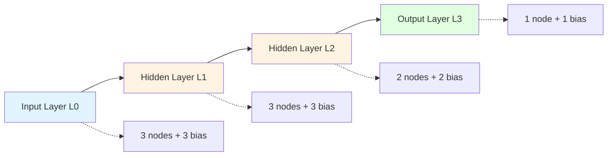
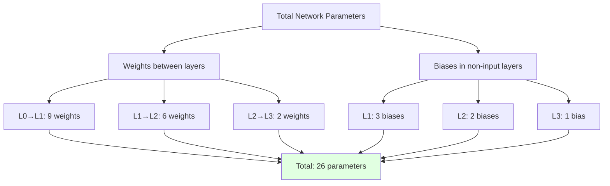
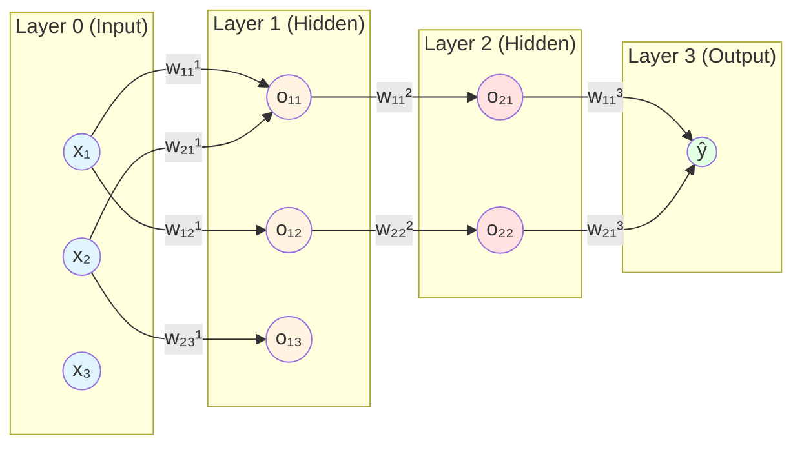
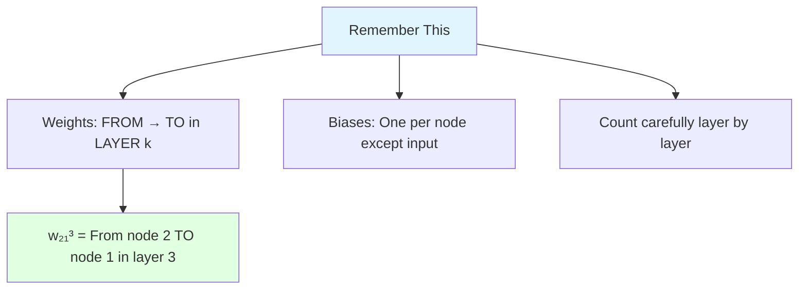

Before understanding back propagation, we must first master Multi-Layer Perceptron (MLP) notation and parameter counting.

---

# Understanding the Network Architecture

![[Pasted image 20260119023155.png]]

## Dataset Notation

$$\text{Data} = {m \times n}$$

Where:

- $m$ = number of rows (samples/data points)
- $n$ = number of features/columns
- Each row is denoted by $x_i$ (where $i$ goes from 1 to $m$)

**Example**: If we have 4 students with 3 features each (CGPA, IQ, 12th marks), then $m = 4$ and $n = 3$.

## Layer Structure

The neural network shown has **4 layers** in total:

1. **Input Layer (L0)**: Receives the raw data
2. **Hidden Layer 1 (L1)**: First processing layer
3. **Hidden Layer 2 (L2)**: Second processing layer
4. **Output Layer (L3)**: Final prediction



---

# Counting Trainable Parameters

![[Pasted image 20260119023617.png]]

**Total trainable parameters in this network: 26**

Let's break down how we calculate this step by step.

## What are Trainable Parameters?

Trainable parameters are the values that the neural network learns during training:

- **Weights**: Connect neurons between layers
- **Biases**: One per neuron (except input layer)

**Analogy**: Think of weights as the strength of connections between brain neurons, and biases as each neuron's personal threshold for activation.

---

## Detailed Calculation

### Layer 0 → Layer 1 (Input to Hidden Layer 1)

**Structure**:

- Input Layer: 3 nodes (features)
- Hidden Layer 1: 3 nodes

**Weights**: Each of the 3 input nodes connects to each of the 3 hidden nodes

$$\text{Weights} = 3 \times 3 = 9$$

**Biases**: Each node in Hidden Layer 1 has one bias

$$\text{Biases} = 3$$

**Total for L0 → L1**: $9 + 3 = 12$ parameters

```
Input Nodes     Hidden Layer 1 Nodes
(3 nodes)       (3 nodes)

   •  ─────────→  ●  (bias b₁₁)
   •  ─────────→  ●  (bias b₁₂)
   •  ─────────→  ●  (bias b₁₃)

9 weights + 3 biases = 12 parameters
```

---

### Layer 1 → Layer 2 (Hidden Layer 1 to Hidden Layer 2)

**Structure**:

- Hidden Layer 1: 3 nodes
- Hidden Layer 2: 2 nodes

**Weights**: Each of the 3 nodes from L1 connects to each of the 2 nodes in L2

$$\text{Weights} = 3 \times 2 = 6$$

**Biases**: Each node in Hidden Layer 2 has one bias

$$\text{Biases} = 2$$

**Total for L1 → L2**: $6 + 2 = 8$ parameters

```
Hidden Layer 1  Hidden Layer 2
(3 nodes)       (2 nodes)

   ●  ─────────→  ●  (bias b₂₁)
   ●  ─────────→  ●  (bias b₂₂)
   ●

6 weights + 2 biases = 8 parameters
```

---

### Layer 2 → Layer 3 (Hidden Layer 2 to Output Layer)

**Structure**:

- Hidden Layer 2: 2 nodes
- Output Layer: 1 node

**Weights**: Each of the 2 nodes from L2 connects to 1 output node

$$\text{Weights} = 2 \times 1 = 2$$

**Biases**: The single output node has one bias

$$\text{Biases} = 1$$

**Total for L2 → L3**: $2 + 1 = 3$ parameters

```
Hidden Layer 2  Output Layer
(2 nodes)       (1 node)

   ●  ─────────→  ●  (bias b₃₁)
   ●

2 weights + 1 bias = 3 parameters
```

---

## Total Parameter Count

$$\text{Total Parameters} = 12 + 8 + 3 = 26$$

### Summary Table

|Connection|Weights|Biases|Total|
|---|---|---|---|
|L0 → L1|3 × 3 = 9|3|**12**|
|L1 → L2|3 × 2 = 6|2|**8**|
|L2 → L3|2 × 1 = 2|1|**3**|
|**Total**|**17**|**9**|**26**|

### General Formula

For any two consecutive layers:

$$\text{Parameters} = (\text{nodes in previous layer} \times \text{nodes in current layer}) + \text{nodes in current layer}$$

Or more compactly:

$$\text{Parameters} = (n_{\text{prev}} \times n_{\text{curr}}) + n_{\text{curr}}$$

$$= n_{\text{curr}} \times (n_{\text{prev}} + 1)$$



---

# MLP Notation System

![[Pasted image 20260119023755.png]]

Now let's understand how to denote weights, biases, and outputs in a standardized way.

## Bias Notation

$$b_{ij}$$

Where:

- $i$ = layer number
- $j$ = node number in that specific layer

**Examples**:

- $b_{11}$ = bias of node 1 in layer 1
- $b_{23}$ = bias of node 3 in layer 2
- $b_{31}$ = bias of node 1 in layer 3 (output layer)

**Important**: Input layer (L0) has **no biases** because it just receives raw data.

---

## Output Notation

$$o_{ij}$$

Where:

- $i$ = layer number
- $j$ = node number in that specific layer

**Examples**:

- $o_{02}$ = output of node 2 in input layer (which is just the input value $x_{i2}$)
- $o_{13}$ = output of node 3 in hidden layer 1
- $o_{31}$ = output of the final layer (the prediction $\hat{y}_i$)

---

## Weight Notation (Most Complex)

$$w_{ij}^k$$

This is the trickiest part. Let's break it down:

- **Superscript $k$**: Which layer is the weight **entering into**
- **Subscript $i$**: Which node number in the **previous layer** is it coming from
- **Subscript $j$**: Which node number in the **current layer** (layer $k$) is it going to

**In simpler terms**:

- $k$ = destination layer (where the weight is going)
- $i$ = source node (where it's coming from)
- $j$ = destination node (where it's going to in layer $k$)

**Mnemonic**: "Weight $w_{ij}^k$ flows FROM node $i$ TO node $j$ in layer $k$"

---

## Visual Explanation with Color Coding



---

## Detailed Weight Examples

### Example 1: $w_{21}^1$ (Red → Yellow)

```
Layer 0        Layer 1
(Input)        (Hidden 1)

  x₁  ●
              ↗  ● o₁₁
  x₂  ●  ────
      ↑       ↘  ● o₁₂
    node 2
                 ● o₁₃
```

- **Superscript 1**: Weight is entering **Layer 1**
- **Subscript 2**: Coming from **node 2** of previous layer (Layer 0)
- **Subscript 1**: Going to **node 1** of Layer 1

**Translation**: Weight connecting the 2nd input feature ($x_2$) to the 1st node in Hidden Layer 1 ($o_{11}$)

---

### Example 2: $w_{32}^2$ (Yellow → Pink)

```
Layer 1        Layer 2
(Hidden 1)     (Hidden 2)

  o₁₁  ●
                 ● o₂₁
  o₁₂  ●
              ↗  ● o₂₂
  o₁₃  ●  ────    ↑
      ↑       node 2
    node 3
```

- **Superscript 2**: Weight is entering **Layer 2**
- **Subscript 3**: Coming from **node 3** of previous layer (Layer 1)
- **Subscript 2**: Going to **node 2** of Layer 2

**Translation**: Weight connecting the 3rd node in Hidden Layer 1 ($o_{13}$) to the 2nd node in Hidden Layer 2 ($o_{22}$)

---

### Example 3: $w_{11}^3$ (Pink → Green)

```
Layer 2        Layer 3
(Hidden 2)     (Output)

  o₂₁  ●  ────→  ● ŷ
      ↑          ↑
    node 1    node 1
                 
  o₂₂  ●
```

- **Superscript 3**: Weight is entering **Layer 3** (output)
- **Subscript 1**: Coming from **node 1** of previous layer (Layer 2)
- **Subscript 1**: Going to **node 1** of Layer 3 (the only output node)

**Translation**: Weight connecting the 1st node in Hidden Layer 2 ($o_{21}$) to the output node ($\hat{y}_i$)

---

## Complete Annotated Diagram

Here's a fully annotated network showing all notation:

```
INPUT LAYER (L0)          HIDDEN LAYER 1 (L1)         HIDDEN LAYER 2 (L2)         OUTPUT LAYER (L3)
No biases                 Biases: b₁₁, b₁₂, b₁₃      Biases: b₂₁, b₂₂           Bias: b₃₁

x_i1 ●                    ● o₁₁                       ● o₂₁                       ● ŷᵢ
     │ w₁₁¹              │ (+ b₁₁)                   │ (+ b₂₁)                   │ (+ b₃₁)
     │ w₁₂¹              │ w₁₁²                      │ w₁₁³                      │
     │ w₁₃¹              │ w₁₂²                      │ w₂₁³                      │
     ├─────────────────→ ● o₁₂ ──────────────────→ ● o₂₂ ──────────────────→ PREDICTION
x_i2 ●                    │ (+ b₁₂)                   (+ b₂₂)
     │ w₂₁¹              │ w₂₁²
     │ w₂₂¹              │ w₂₂²
     │ w₂₃¹              │
     ├─────────────────→ ● o₁₃
x_i3 ●                      (+ b₁₃)
     │ w₃₁¹                w₃₁²
     │ w₃₂¹                w₃₂²
     │ w₃₃¹
     └─────────────────→

12 parameters              8 parameters                3 parameters
(9 weights + 3 biases)    (6 weights + 2 biases)     (2 weights + 1 bias)

TOTAL: 26 TRAINABLE PARAMETERS
```

---

## Weight Matrix Representation

For computational purposes, weights are organized into matrices:

### Weights from L0 to L1: $W^1$ (shape: 3×3)

$$W^1 = \begin{bmatrix} w_{11}^1 & w_{12}^1 & w_{13}^1 \ w_{21}^1 & w_{22}^1 & w_{23}^1 \ w_{31}^1 & w_{32}^1 & w_{33}^1 \end{bmatrix}$$

Each row represents connections from one input node to all nodes in Layer 1.

### Weights from L1 to L2: $W^2$ (shape: 3×2)

$$W^2 = \begin{bmatrix} w_{11}^2 & w_{12}^2 \ w_{21}^2 & w_{22}^2 \ w_{31}^2 & w_{32}^2 \end{bmatrix}$$

### Weights from L2 to L3: $W^3$ (shape: 2×1)

$$W^3 = \begin{bmatrix} w_{11}^3 \ w_{21}^3 \end{bmatrix}$$

---

## Bias Vector Representation

### Biases for Layer 1: $B^1$

$$B^1 = \begin{bmatrix} b_{11} \ b_{12} \ b_{13} \end{bmatrix}$$

### Biases for Layer 2: $B^2$

$$B^2 = \begin{bmatrix} b_{21} \ b_{22} \end{bmatrix}$$

### Bias for Layer 3: $B^3$

$$B^3 = [b_{31}]$$

---

# Computing Node Outputs

## General Formula for a Node

The output of any node $j$ in layer $k$ is:

$$o_{kj} = \sigma\left(\sum_{i=1}^{n_{k-1}} w_{ij}^k \cdot o_{(k-1)i} + b_{kj}\right)$$

Where:

- $\sigma$ = activation function (sigmoid, ReLU, etc.)
- $n_{k-1}$ = number of nodes in previous layer
- $o_{(k-1)i}$ = output from node $i$ in previous layer

**In plain English**:

1. Take all outputs from the previous layer
2. Multiply each by its corresponding weight
3. Sum all these weighted values
4. Add the bias
5. Pass through activation function

---

## Concrete Example: Computing $o_{11}$

Let's calculate the output of the first node in Hidden Layer 1:

$$o_{11} = \sigma(w_{11}^1 \cdot x_{i1} + w_{21}^1 \cdot x_{i2} + w_{31}^1 \cdot x_{i3} + b_{11})$$

**Step by step**:

1. Take input $x_{i1}$ and multiply by $w_{11}^1$
2. Take input $x_{i2}$ and multiply by $w_{21}^1$
3. Take input $x_{i3}$ and multiply by $w_{31}^1$
4. Sum all three products
5. Add bias $b_{11}$
6. Apply sigmoid function $\sigma$

**Example with numbers**:

- Inputs: $x_{i1} = 3.5$, $x_{i2} = 120$, $x_{i3} = 85$
- Weights: $w_{11}^1 = 0.5$, $w_{21}^1 = 0.01$, $w_{31}^1 = 0.02$
- Bias: $b_{11} = -2$

$$\text{Before activation} = (0.5 \times 3.5) + (0.01 \times 120) + (0.02 \times 85) - 2$$ $$= 1.75 + 1.2 + 1.7 - 2 = 2.65$$

$$o_{11} = \sigma(2.65) = \frac{1}{1 + e^{-2.65}} \approx 0.93$$

---

# Why This Notation Matters

Understanding this notation is crucial because:

1. **Back Propagation**: You need to know which weight connects to which node to calculate gradients
2. **Implementation**: Code uses this structure (weight matrices, bias vectors)
3. **Debugging**: You can trace specific connections when something goes wrong
4. **Communication**: This is the standard notation used in papers and documentation

**Analogy**: It's like learning the coordinate system before studying maps. Once you understand $(x, y)$ notation, you can navigate anywhere. Same with neural network notation.

---

# Key Takeaways (For When You're Drunk)

1. **Parameter Count**: Weights = (previous layer size × current layer size), Biases = current layer size
    
2. **Bias Notation** $b_{ij}$: Layer $i$, Node $j$. Simple.
    
3. **Output Notation** $o_{ij}$: Layer $i$, Node $j$. Simple.
    
4. **Weight Notation** $w_{ij}^k$:
    
    - $k$ (top) = which layer it's ENTERING
    - $i$ (bottom left) = which node it's LEAVING FROM
    - $j$ (bottom right) = which node it's GOING TO (in layer $k$)
5. **Reading weights**: $w_{21}^3$ means "weight from node 2 (previous layer) to node 1 of layer 3"
    
6. **Total parameters** = All weights + All biases (but not input layer biases)
    



**One sentence summary**: Superscript tells you the destination layer, first subscript tells you where it's coming from, second subscript tells you where it's going within that destination layer.