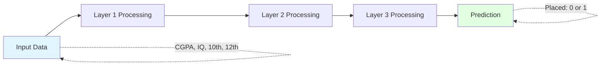
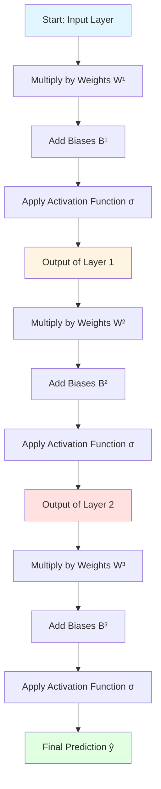
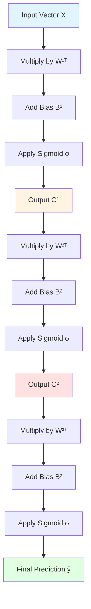

# Forward Propagation

## How Does a Neural Network Make Predictions?

![[Pasted image 20260119024816.png]]

Forward propagation is the process of computing the output of a neural network by passing input data through each layer, from input to output.

**The Big Picture**: Think of it like an assembly line. Raw materials (input data) enter at one end, go through multiple processing stations (hidden layers), and come out as a finished product (prediction) at the other end.

---

# Example Dataset

We have student data with the following features:

|CGPA|IQ|10th marks|12th marks|Placed|
|---|---|---|--:|---|
|7.2|72|69|81|1|
|8.1|92|75|76|0|

**Number of trainable parameters**: 26 (as calculated in previous notes)

**Goal**: The neural network will learn these 26 parameters (weights and biases) to predict whether a student will be placed or not.



---

# Computing Output Layer by Layer

Forward propagation calculates the output **one layer at a time**, moving from left to right through the network.

## The Process



---

# Matrix Representation of Weights

![[Pasted image 20260119031240.png]]

To efficiently compute forward propagation, we organize weights into matrices.

## Network Architecture

**Input Layer (L0)**: 4 nodes (CGPA, IQ, 10th, 12th) **Hidden Layer 1 (L1)**: 3 nodes **Hidden Layer 2 (L2)**: 2 nodes **Output Layer (L3)**: 1 node

## Weight Matrices

### Layer 1 Weights: $W^1$ (Shape: 4×3)

$$W^1 = \begin{bmatrix} w_{11}^1 & w_{12}^1 & w_{13}^1 \ w_{21}^1 & w_{22}^1 & w_{23}^1 \ w_{31}^1 & w_{32}^1 & w_{33}^1 \ w_{41}^1 & w_{42}^1 & w_{43}^1 \end{bmatrix}$$

**Dimensions**: 4 rows (from 4 input nodes) × 3 columns (to 3 hidden nodes)

**Reading the matrix**:

- Row 1: All weights from input node 1 (CGPA) to Layer 1
- Row 2: All weights from input node 2 (IQ) to Layer 1
- Column 1: All weights going to node 1 of Layer 1
- Column 2: All weights going to node 2 of Layer 1

### Layer 2 Weights: $W^2$ (Shape: 3×2)

$$W^2 = \begin{bmatrix} w_{11}^2 & w_{12}^2 \ w_{21}^2 & w_{22}^2 \ w_{31}^2 & w_{32}^2 \end{bmatrix}$$

**Dimensions**: 3 rows (from 3 Layer 1 nodes) × 2 columns (to 2 Layer 2 nodes)

### Layer 3 Weights: $W^3$ (Shape: 2×1)

$$W^3 = \begin{bmatrix} w_{11}^3 \ w_{21}^3 \end{bmatrix}$$

**Dimensions**: 2 rows (from 2 Layer 2 nodes) × 1 column (to 1 output node)

---

# Matrix Multiplication in Forward Propagation

![[Pasted image 20260119031421.png]]

## Layer 1 Computation

### Input Vector

For a single student $i$:

$$X_i = \begin{bmatrix} x_{i1} \ x_{i2} \ x_{i3} \ x_{i4} \end{bmatrix} = \begin{bmatrix} \text{CGPA} \ \text{IQ} \ \text{10th} \ \text{12th} \end{bmatrix}$$

### Formula

$$O^1 = \sigma(W^1{}^T X + B^1)$$

Where:

- $W^1{}^T$ is the transpose of $W^1$ (shape: 3×4)
- $X$ is the input vector (shape: 4×1)
- $B^1$ is the bias vector (shape: 3×1)
- $\sigma$ is the activation function (sigmoid)

### Detailed Calculation

$$\begin{bmatrix} o_{11} \ o_{12} \ o_{13} \end{bmatrix} = \sigma\left(\begin{bmatrix} w_{11}^1 & w_{21}^1 & w_{31}^1 & w_{41}^1 \ w_{12}^1 & w_{22}^1 & w_{32}^1 & w_{42}^1 \ w_{13}^1 & w_{23}^1 & w_{33}^1 & w_{43}^1 \end{bmatrix} \begin{bmatrix} x_{i1} \ x_{i2} \ x_{i3} \ x_{i4} \end{bmatrix} + \begin{bmatrix} b_{11} \ b_{12} \ b_{13} \end{bmatrix}\right)$$

**Breaking it down**:

$$o_{11} = \sigma(w_{11}^1 x_{i1} + w_{21}^1 x_{i2} + w_{31}^1 x_{i3} + w_{41}^1 x_{i4} + b_{11})$$

$$o_{12} = \sigma(w_{12}^1 x_{i1} + w_{22}^1 x_{i2} + w_{32}^1 x_{i3} + w_{42}^1 x_{i4} + b_{12})$$

$$o_{13} = \sigma(w_{13}^1 x_{i1} + w_{23}^1 x_{i2} + w_{33}^1 x_{i3} + w_{43}^1 x_{i4} + b_{13})$$

---

## Layer 2 Computation

### Input to Layer 2

The output of Layer 1 becomes the input to Layer 2:

$$O^1 = \begin{bmatrix} o_{11} \ o_{12} \ o_{13} \end{bmatrix}$$

### Formula

$$O^2 = \sigma(W^2{}^T O^1 + B^2)$$

### Detailed Calculation

$$\begin{bmatrix} o_{21} \ o_{22} \end{bmatrix} = \sigma\left(\begin{bmatrix} w_{11}^2 & w_{21}^2 & w_{31}^2 \ w_{12}^2 & w_{22}^2 & w_{32}^2 \end{bmatrix} \begin{bmatrix} o_{11} \ o_{12} \ o_{13} \end{bmatrix} + \begin{bmatrix} b_{21} \ b_{22} \end{bmatrix}\right)$$

**Breaking it down**:

$$o_{21} = \sigma(w_{11}^2 o_{11} + w_{21}^2 o_{12} + w_{31}^2 o_{13} + b_{21})$$

$$o_{22} = \sigma(w_{12}^2 o_{11} + w_{22}^2 o_{12} + w_{32}^2 o_{13} + b_{22})$$

---

## Layer 3 Computation (Output Layer)

### Input to Layer 3

$$O^2 = \begin{bmatrix} o_{21} \ o_{22} \end{bmatrix}$$

### Formula

$$\hat{y}_i = \sigma(W^3{}^T O^2 + B^3)$$

### Detailed Calculation

$$\hat{y}_i = \sigma\left(\begin{bmatrix} w_{11}^3 & w_{21}^3 \end{bmatrix} \begin{bmatrix} o_{21} \ o_{22} \end{bmatrix} + b_{31}\right)$$

$$\hat{y}_i = \sigma(w_{11}^3 o_{21} + w_{21}^3 o_{22} + b_{31})$$

This final value $\hat{y}_i$ is the prediction: the probability that student $i$ will be placed.

---

# Visualizing Matrix Multiplication

![[Pasted image 20260119031738.png]]

## Complete Forward Propagation Flow

```
INPUT                  LAYER 1                 LAYER 2                OUTPUT
(4 nodes)              (3 nodes)               (2 nodes)              (1 node)

┌──────┐              ┌──────┐               ┌──────┐              ┌──────┐
│ x_i1 │──┐           │ o_11 │──┐            │ o_21 │──┐           │      │
│ CGPA │  │           │      │  │            │      │  │           │      │
└──────┘  │           └──────┘  │            └──────┘  │           │ ŷ_i  │
          │    W¹               │    W²                │    W³     │      │
┌──────┐  ├──────→    ┌──────┐  ├──────→     ┌──────┐  ├──────→    │      │
│ x_i2 │  │           │ o_12 │  │            │ o_22 │  │           │      │
│  IQ  │  │           │      │  │            │      │  │           └──────┘
└──────┘  │           └──────┘  │            └──────┘  │
          │                     │                      │
┌──────┐  │           ┌──────┐  │                      │
│ x_i3 │  │           │ o_13 │  │                      │
│ 10th │  │           │      │  │                      │
└──────┘  │           └──────┘  │                      │
          │              +      │                      │
┌──────┐  │           ┌──────┐  │              +       │           +
│ x_i4 │──┘           │  B¹  │  │           ┌──────┐   │         ┌──────┐
│ 12th │              └──────┘  │           │  B²  │   │         │  B³  │
└──────┘                 ↓      │           └──────┘   │         └──────┘
                         σ      │               ↓      │            ↓
                      (sigmoid) └───────────────σ───────────────────σ
                                             (sigmoid)            (sigmoid)

Matrix Shapes:
W¹: 4×3          W²: 3×2          W³: 2×1
B¹: 3×1          B²: 2×1          B³: 1×1
```

---

## Detailed Matrix Operation for Layer 1

### Step-by-Step Visualization

```
Step 1: Input × Weights (Transpose)

    ┌─────────────────────┐
    │  W¹ᵀ (3×4)          │
    │                     │
    │ w₁₁¹ w₂₁¹ w₃₁¹ w₄₁¹ │
    │ w₁₂¹ w₂₂¹ w₃₂¹ w₄₂¹ │  
    │ w₁₃¹ w₂₃¹ w₃₃¹ w₄₃¹ │
    └─────────────────────┘
              ×
    ┌──────┐
    │ x_i1 │
    │ x_i2 │
    │ x_i3 │
    │ x_i4 │
    └──────┘
        ‖
        ↓
    ┌───────────────────────────────────────────┐
    │ w₁₁¹x_i1 + w₂₁¹x_i2 + w₃₁¹x_i3 + w₄₁¹x_i4 │
    │ w₁₂¹x_i1 + w₂₂¹x_i2 + w₃₂¹x_i3 + w₄₂¹x_i4 │
    │ w₁₃¹x_i1 + w₂₃¹x_i2 + w₃₃¹x_i3 + w₄₃¹x_i4 │
    └───────────────────────────────────────────┘

Step 2: Add Biases

    ┌───────────────────────────────────────────┐
    │ w₁₁¹x_i1 + w₂₁¹x_i2 + w₃₁¹x_i3 + w₄₁¹x_i4 │ + │ b₁₁  │
    │ w₁₂¹x_i1 + w₂₂¹x_i2 + w₃₂¹x_i3 + w₄₂¹x_i4 │   │ b₁₂  │
    │ w₁₃¹x_i1 + w₂₃¹x_i2 + w₃₃¹x_i3 + w₄₃¹x_i4 │   │ b₁₃  │
    └───────────────────────────────────────────┘
                ‖
                ↓
    ┌─────────────────────────────────────────────────┐
    │ w₁₁¹x_i1 + w₂₁¹x_i2 + w₃₁¹x_i3 + w₄₁¹x_i4 + b₁₁ │
    │ w₁₂¹x_i1 + w₂₂¹x_i2 + w₃₂¹x_i3 + w₄₂¹x_i4 + b₁₂ │
    │ w₁₃¹x_i1 + w₂₃¹x_i2 + w₃₃¹x_i3 + w₄₃¹x_i4 + b₁₃ │
    └─────────────────────────────────────────────────┘

Step 3: Apply Activation Function (Sigmoid)

    ┌─────────────────────────────────────────────────┐
    │ w₁₁¹x_i1 + w₂₁¹x_i2 + w₃₁¹x_i3 + w₄₁¹x_i4 + b₁₁ │
    │ w₁₂¹x_i1 + w₂₂¹x_i2 + w₃₂¹x_i3 + w₄₂¹x_i4 + b₁₂ │
    │ w₁₃¹x_i1 + w₂₃¹x_i2 + w₃₃¹x_i3 + w₄₃¹x_i4 + b₁₃ │
    └─────────────────────────────────────────────────┘
                    σ (apply sigmoid to each)
                    ↓
    ┌────────────────────────────────────────────────────┐
    │ σ(w₁₁¹x_i1 + w₂₁¹x_i2 + w₃₁¹x_i3 + w₄₁¹x_i4 + b₁₁) │
    │ σ(w₁₂¹x_i1 + w₂₂¹x_i2 + w₃₂¹x_i3 + w₄₂¹x_i4 + b₁₂) │
    │ σ(w₁₃¹x_i1 + w₂₃¹x_i2 + w₃₃¹x_i3 + w₄₃¹x_i4 + b₁₃) │
    └────────────────────────────────────────────────────┘
                    ‖
                    ↓
    ┌──────┐
    │ o₁₁  │
    │ o₁₂  │  ← Output of Layer 1
    │ o₁₃  │
    └──────┘
```

---

## Concrete Numerical Example

Let's compute forward propagation with actual numbers for one student.

### Input Data (Student 1)

$$X = \begin{bmatrix} 7.2 \ 72 \ 69 \ 81 \end{bmatrix}$$

### Assume Random Initial Weights for Layer 1

$$W^1 = \begin{bmatrix} 0.5 & 0.3 & 0.2 \ 0.01 & 0.02 & 0.03 \ 0.015 & 0.01 & 0.02 \ 0.012 & 0.018 & 0.015 \end{bmatrix}, \quad B^1 = \begin{bmatrix} -2 \ -1.5 \ -3 \end{bmatrix}$$

### Computing Layer 1 Node 1

$$z_{11} = w_{11}^1 x_1 + w_{21}^1 x_2 + w_{31}^1 x_3 + w_{41}^1 x_4 + b_{11}$$

$$z_{11} = (0.5)(7.2) + (0.01)(72) + (0.015)(69) + (0.012)(81) - 2$$

$$z_{11} = 3.6 + 0.72 + 1.035 + 0.972 - 2 = 4.327$$

$$o_{11} = \sigma(4.327) = \frac{1}{1 + e^{-4.327}} \approx 0.987$$

### Computing Layer 1 Node 2

$$z_{12} = (0.3)(7.2) + (0.02)(72) + (0.01)(69) + (0.018)(81) - 1.5$$

$$z_{12} = 2.16 + 1.44 + 0.69 + 1.458 - 1.5 = 4.248$$

$$o_{12} = \sigma(4.248) \approx 0.986$$

### Computing Layer 1 Node 3

$$z_{13} = (0.2)(7.2) + (0.03)(72) + (0.02)(69) + (0.015)(81) - 3$$

$$z_{13} = 1.44 + 2.16 + 1.38 + 1.215 - 3 = 3.195$$

$$o_{13} = \sigma(3.195) \approx 0.961$$

**Output of Layer 1**:

$$O^1 = \begin{bmatrix} 0.987 \ 0.986 \ 0.961 \end{bmatrix}$$

This process continues through Layer 2 and Layer 3 to produce the final prediction.

---

# Summary of Forward Propagation



## General Formula for Any Layer $k$

$$O^k = \sigma(W^k{}^T O^{k-1} + B^k)$$

Where:

- $O^k$ = output of layer $k$
- $W^k$ = weight matrix connecting layer $k-1$ to layer $k$
- $O^{k-1}$ = output of previous layer (input to current layer)
- $B^k$ = bias vector for layer $k$
- $\sigma$ = activation function

---

# Key Concepts

## 1. Matrix Dimensions Must Match

For matrix multiplication to work:

$$\text{(rows of } W^T \text{)} = \text{(elements in } O^{k-1}\text{)}$$

**Example**:

- $W^1$ is 4×3, so $W^1{}^T$ is 3×4
- Input $X$ has 4 elements
- Result: 3×4 multiplied by 4×1 gives 3×1 ✓

## 2. Why Transpose?

We transpose the weight matrix so that:

- Each row of $W^T$ represents all weights going **to** one node
- This allows us to compute all nodes in a layer simultaneously

## 3. Activation Functions

The sigmoid function $\sigma$ is applied **element-wise**:

$$\sigma\left(\begin{bmatrix} z_1 \ z_2 \ z_3 \end{bmatrix}\right) = \begin{bmatrix} \sigma(z_1) \ \sigma(z_2) \ \sigma(z_3) \end{bmatrix}$$

Where: $\sigma(z) = \frac{1}{1 + e^{-z}}$

---

# Why Forward Propagation Matters

1. **Making Predictions**: This is how the network actually generates outputs
2. **Training Foundation**: We need forward propagation to compute the loss, which we then minimize during training
3. **Efficiency**: Matrix operations allow us to compute all nodes in parallel using GPUs
4. **Scalability**: Same process works for networks with millions of parameters

**Analogy**: Forward propagation is like following a recipe. You take ingredients (input), follow steps in order (layers), and get a dish (prediction). The recipe (weights and biases) improves with practice (training).

---

# Common Mistakes to Avoid

1. **Forgetting to transpose weights**: $W \cdot X$ vs $W^T \cdot X$ gives different results
2. **Wrong matrix dimensions**: Always check that dimensions align for multiplication
3. **Forgetting biases**: They're easy to overlook but crucial for performance
4. **Not applying activation**: Forgetting $\sigma$ makes the network just linear algebra (no non-linearity)
5. **Confusing notation**: Remember $W^k$ connects layer $k-1$ to layer $k$

---

# Practical Tips

1. **Start small**: Work through examples by hand with 2-3 nodes per layer
2. **Verify dimensions**: Before coding, write out the shape of each matrix
3. **Use broadcasting**: Modern frameworks can automatically add biases without explicit loops
4. **Vectorize**: Process multiple students at once by stacking them into a matrix
5. **Check intermediate outputs**: Print layer outputs during debugging to ensure correct flow

```python
# Pseudocode for forward propagation
def forward_propagation(X, W1, B1, W2, B2, W3, B3):
    # Layer 1
    Z1 = np.dot(W1.T, X) + B1
    O1 = sigmoid(Z1)
    
    # Layer 2
    Z2 = np.dot(W2.T, O1) + B2
    O2 = sigmoid(Z2)
    
    # Layer 3 (Output)
    Z3 = np.dot(W3.T, O2) + B3
    y_pred = sigmoid(Z3)
    
    return y_pred, O1, O2  # Return prediction and intermediate outputs
```

---

# Key Takeaways

1. **Forward propagation flows left to right**: Input → Hidden Layers → Output
2. **Each layer does three things**: Multiply by weights, add bias, apply activation
3. **Matrix multiplication is key**: It allows efficient parallel computation
4. **Dimensions must match**: Always verify matrix shapes before multiplying
5. **Output of one layer = input to next**: This creates the "forward" flow
6. **Same process for all layers**: Once you understand one layer, you understand them all

**One sentence**: Forward propagation transforms input through learned weights and activations to produce a prediction.