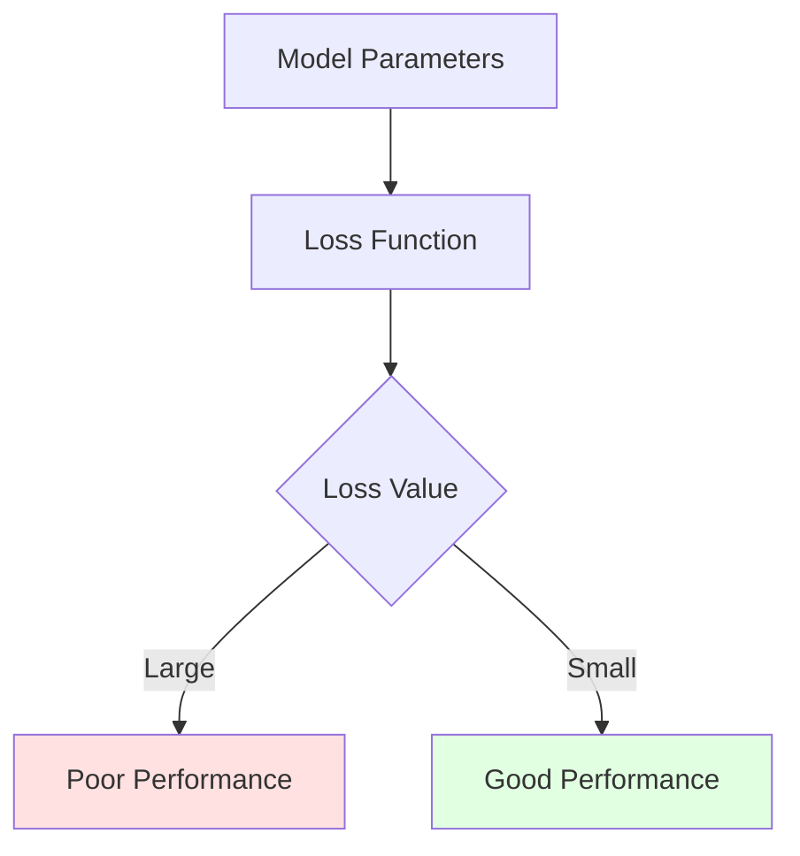
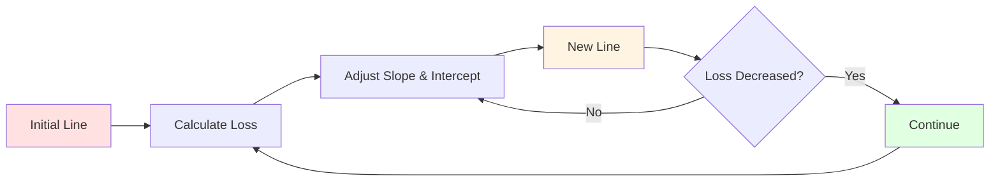
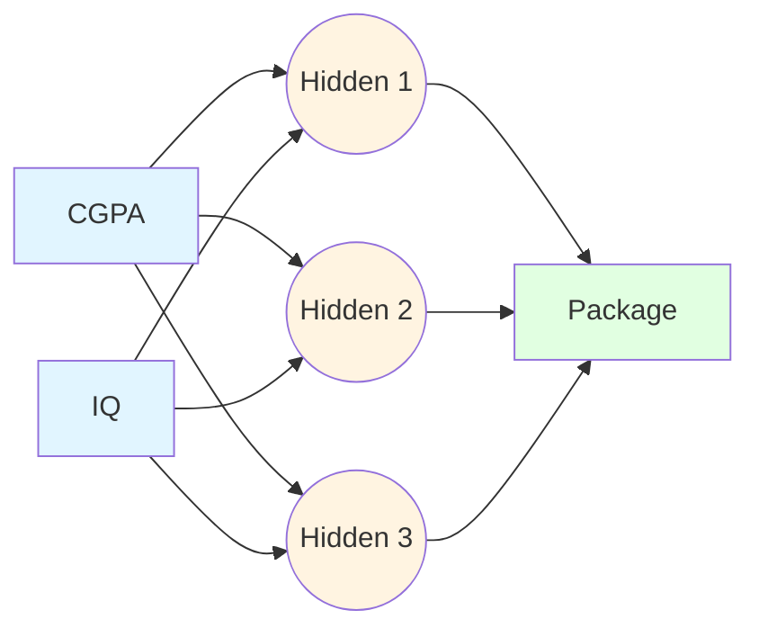
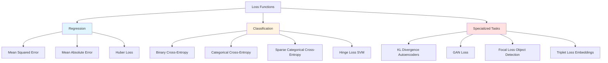
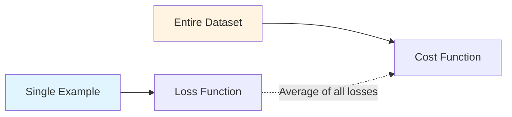
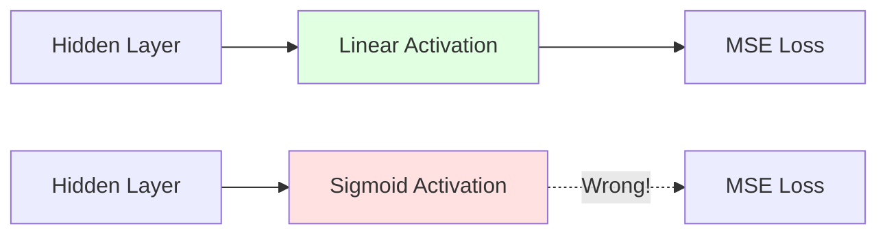
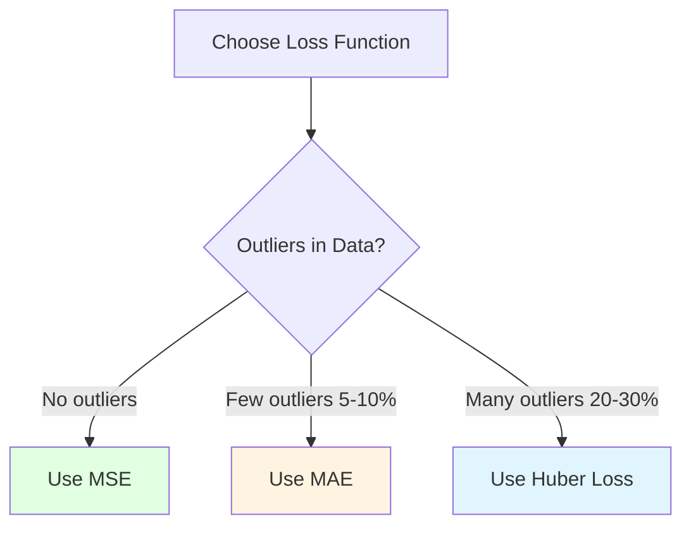
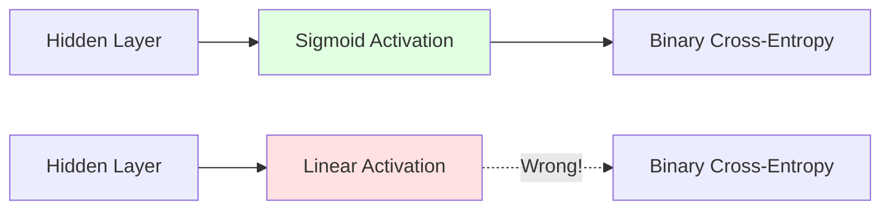
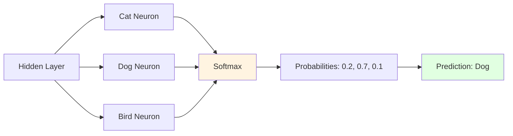
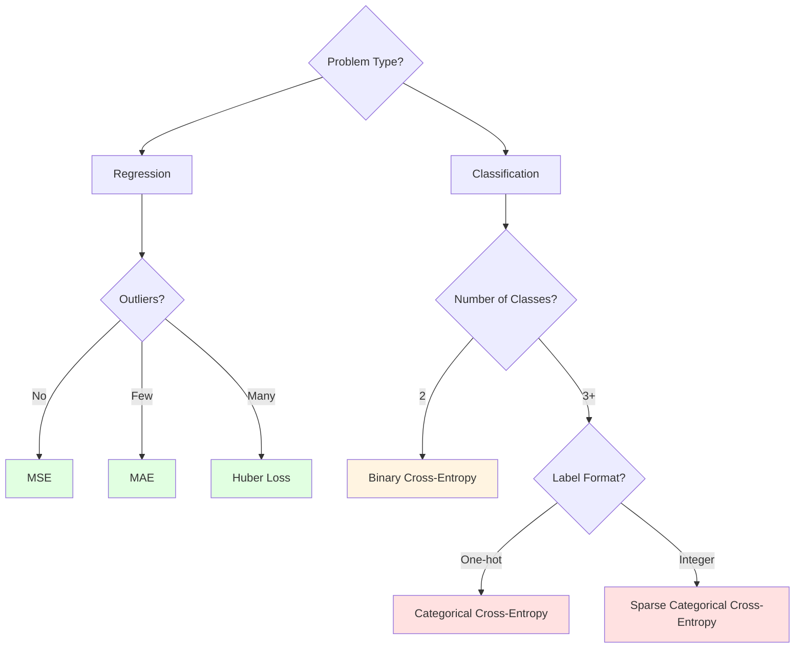

## What is a Loss Function?

A **loss function** is a method of evaluating how well your algorithm is modeling your dataset. It is a mechanism that tells us how well our algorithm is performing.

**Simple interpretation**:

- Large loss function output = Algorithm performing poorly
- Small loss function output = Algorithm performing well

**Mathematical perspective**: A loss function is a function of machine learning parameters (weights and biases), just like a mathematical function depends on certain variables.

$$L = f(w_1, w_2, ..., w_n, b_1, b_2, ..., b_m)$$



---

## Why is Loss Function Important?

> "You can't improve what you can't measure" - Peter Drucker

Loss functions are essential because they provide a quantifiable metric that we can optimize during training.

### Example: Linear Regression

In linear regression, we calculate the loss function of a line by measuring how far predictions are from actual values. We then adjust the **slope** and **intercept** to minimize this loss.



**Visualization concept**:

```
        Actual Points
           *
              *    ← Error (distance from line)
    ╱────────────
  ╱  *           ← Fitted line
╱        *
    Adjust slope → to minimize total error
```

---

### Example: Deep Learning for Salary Prediction

**Dataset**:

| CGPA | IQ  | Package (LPA) |
| ---- | --- | ------------- |
| 7.1  | 83  | 3.2           |
| 8.5  | 91  | 4.5           |
| 6.3  | 102 | 6.1           |
| 5.1  | 87  | 2.7           |

**Neural Network Architecture**:



**Training Process**:

1. **Initialize**: Start with random values for weights and biases
2. **Forward Propagation**: Predict output for first student
    - Example: Predict package = 3.7 LPA (actual = 3.2 LPA)
3. **Calculate Loss**: Use Mean Squared Error
    - $\text{Loss} = (3.2 - 3.7)^2 = 0.25$
4. **Update Parameters**: Use gradient descent to adjust weights and biases
5. **Repeat**: For all students in the dataset

**Goal**: Minimize the loss function value

---

## Types of Loss Functions in Deep Learning



### Summary Table

|Task|Loss Functions|
|---|---|
|**Regression**|Mean Squared Error, Mean Absolute Error, Huber Loss|
|**Binary Classification**|Binary Cross-Entropy (Log Loss)|
|**Multi-class Classification**|Categorical Cross-Entropy, Sparse Categorical Cross-Entropy, Hinge Loss|
|**Autoencoders**|KL Divergence|
|**GANs**|Discriminator Loss, MinMax GAN Loss|
|**Object Detection**|Focal Loss|
|**Embeddings**|Triplet Loss|

**Note**: You can implement custom loss functions tailored to your specific problem. Each function has its own advantages and disadvantages.

---

## Loss Function vs Cost Function

![[Pasted image 20260122144010.png]]

Using the same problem: Given CGPA and IQ, predict package.

### Key Difference

**Loss Function**: Calculated on a **single training example**

- Also called **error function**
- Measures error for one data point

$$L(y_i, \hat{y}_i) = \text{Error for student } i$$

**Cost Function**: Calculated on the **entire batch/dataset**

- Average of all loss values
- Measures overall model performance

$$J = \frac{1}{n} \sum_{i=1}^{n} L(y_i, \hat{y}_i)$$



---

# Common Loss Functions

## 1. Mean Squared Error (MSE)

Also known as:

- **Squared Loss**
- **L2 Loss**

Used widely in linear regression and neural networks for regression tasks.

![[Pasted image 20260122144419.png]]

### Loss Function (Single Example)

$$L(y_i, \hat{y}_i) = (y_i - \hat{y}_i)^2$$

### Cost Function (Entire Dataset)

$$J = \frac{1}{n} \sum_{i=1}^{n} (y_i - \hat{y}_i)^2$$

Alternative form with regularization:

$$J = \frac{1}{2n} \sum_{i=1}^{n} (y_i - \hat{y}_i)^2$$

(The $\frac{1}{2}$ makes gradient calculation cleaner)

---

### Why Square the Difference?

**Question**: Why not just calculate the difference $|y_i - \hat{y}_i|$?

**Answer**: Without squaring, positive and negative errors cancel out.

**Example**:

```
Point 1: Actual = 5, Predicted = 3  → Error = +2
Point 2: Actual = 3, Predicted = 5  → Error = -2
Average Error = (2 + (-2))/2 = 0  ← Misleading!
```

With squaring, all errors become positive and add up correctly.

### Error Magnification Property

The squaring operation magnifies larger errors:

|Distance from True Value|Error (Absolute)|Error (Squared)|
|---|---|---|
|1 unit|1|1|
|2 units|2|4|
|3 units|3|9|

**Geometric interpretation**:

```
Points close to line → Small penalty (linear)
Points far from line → Large penalty (quadratic)

         *  ← Far point: heavily punished
    ━━━━━━━━━━ Line
  *          ← Close point: lightly punished
```

**Effect**: Points farther from the line are punished more severely (quadratic penalty), while points closer are treated more leniently.

---

### Advantages and Disadvantages

|Advantages ✓|Disadvantages ✗|
|---|---|
|**Easy to interpret**: Simple mathematical formula|**Unit is squared**: Error is in $y^2$ units, not $y$ units|
|**Always differentiable**: Smooth gradient everywhere|**Not robust to outliers**: Outliers have disproportionate influence|
|**Single global minimum**: Convex function, guaranteed convergence||

**Visual comparison**:

```
MSE Behavior:
    Loss
      ↑
      │     ╱╲
      │    ╱  ╲    ← Steep penalty for outliers
      │   ╱    ╲
      │  ╱      ╲
      │ ╱        ╲
      └─────────────→ Error
```

---

### Critical Condition for Deep Learning

**IMPORTANT**: When using MSE in deep learning, the **activation function of the output layer MUST be linear** (identity function).

$$\text{Output node: } f(z) = z \text{ (no activation)}$$

**Why?** MSE is designed for regression problems where output can be any real number. Sigmoid or other bounded activations would constrain the output range.



---

## 2. Mean Absolute Error (MAE)

Also known as:

- **L1 Loss**
- **Manhattan Distance**

### Loss Function (Single Example)

$$L(y_i, \hat{y}_i) = |y_i - \hat{y}_i|$$

### Cost Function (Entire Dataset)

$$J = \frac{1}{n} \sum_{i=1}^{n} |y_i - \hat{y}_i|$$

**Key difference from MSE**: Replace square with absolute value.

---

### Comparison with MSE

```
MAE vs MSE Error Penalty:

Error  | MAE | MSE
   1   |  1  |  1
   2   |  2  |  4
   3   |  3  |  9
   4   |  4  | 16

MAE: Linear penalty
MSE: Quadratic penalty
```

---

### Advantages and Disadvantages

|Advantages ✓|Disadvantages ✗|
|---|---|
|**Intuitive and easy to understand**|**Not differentiable at 0**: Sharp corner at error = 0|
|**Same units as y**: Error in original units (not squared)|**Requires subgradient descent**: Higher computational complexity|
|**Robust to outliers**: Outliers don't dominate the loss||

**Visual comparison**:

```
MAE Behavior:
    Loss
      ↑
      │    ╱│╲
      │   ╱ │ ╲    ← Linear penalty (fair treatment)
      │  ╱  │  ╲
      │ ╱   │   ╲
      │╱    │    ╲
      └─────┴─────→ Error
            0
```

**When to use MAE**: When your dataset has outliers and you want them to have less influence on the model.

---

## 3. Huber Loss

A **hybrid** loss function that combines the best of MSE and MAE.

### The Problem

Scenario: 25% of your data points are outliers.

- **MSE**: Will be heavily influenced by outliers, pulling the model toward them
- **MAE**: Will treat all points equally, potentially underfitting the majority

**Huber Loss**: Treats normal points like MSE (smooth, fast convergence) and outliers like MAE (robust).

### Formula

$$L_\delta(y, \hat{y}) = \begin{cases} \frac{1}{2}(y - \hat{y})^2 & \text{if } |y - \hat{y}| \leq \delta \ \delta |y - \hat{y}| - \frac{1}{2}\delta^2 & \text{if } |y - \hat{y}| > \delta \end{cases}$$

Where $\delta$ is a hyperparameter (threshold) that determines when to switch from MSE to MAE behavior.

### How It Works

```
Huber Loss Behavior:

    Loss
      ↑
      │      ╱
      │     ╱     ← Linear (MAE) for large errors
      │    ╱
      │   ╱╲      ← Quadratic (MSE) for small errors
      │  ╱  ╲
      │ ╱    ╲
      └───────────→ Error
          δ
```

**Interpretation**:

- **Small errors** ($|y - \hat{y}| \leq \delta$): Use MSE (quadratic penalty)
- **Large errors** ($|y - \hat{y}| > \delta$): Use MAE (linear penalty)

**When to use**: When your dataset has outliers, but you still want smooth gradients for normal points.



---

## 4. Binary Cross-Entropy (Log Loss)

Used for **binary classification** problems (2 classes: Yes/No, 0/1).

### When to Use

- Logistic regression
- Binary classification in neural networks
- Output layer has **sigmoid activation**

### Loss Function (Single Example)

$$L(y, \hat{y}) = -y \log(\hat{y}) - (1-y) \log(1-\hat{y})$$

Where:

- $y$ = actual label (0 or 1)
- $\hat{y}$ = predicted probability (between 0 and 1)

### Cost Function (Entire Dataset)

$$J = -\frac{1}{n} \sum_{i=1}^{n} \left[ y_i \log(\hat{y}_i) + (1-y_i) \log(1-\hat{y}_i) \right]$$

---

### Understanding the Formula

**Case 1**: Actual label $y = 1$ (positive class)

$$L = -\log(\hat{y})$$

- If $\hat{y} = 1$ (correct): $L = 0$ (no penalty)
- If $\hat{y} = 0.5$ (uncertain): $L = 0.69$ (medium penalty)
- If $\hat{y} = 0.01$ (wrong): $L = 4.6$ (high penalty)

**Case 2**: Actual label $y = 0$ (negative class)

$$L = -\log(1-\hat{y})$$

- If $\hat{y} = 0$ (correct): $L = 0$ (no penalty)
- If $\hat{y} = 0.5$ (uncertain): $L = 0.69$ (medium penalty)
- If $\hat{y} = 0.99$ (wrong): $L = 4.6$ (high penalty)

**Key insight**: The loss heavily penalizes confident wrong predictions.

```
Penalty vs Prediction (y=1):

Loss
  │
 5│              ╱
  │            ╱
 3│          ╱
  │        ╱
 1│      ╱
  │    ╱
 0│──╱─────────────
  0  0.2  0.6  1.0  ŷ
  
Heavy penalty for predicting low when actual is 1
```

---

### Critical Condition

**IMPORTANT**: The **output layer activation function MUST be sigmoid** when using binary cross-entropy.

$$\sigma(z) = \frac{1}{1 + e^{-z}}$$

This ensures $\hat{y} \in (0, 1)$, which is required for the logarithm to be defined.



---

### Advantages and Disadvantages

|Advantages ✓|Disadvantages ✗|
|---|---|
|**Differentiable**: Easy to apply gradient descent|**Can have multiple local minima**: May not find global optimum|
|**Probabilistic interpretation**: Outputs represent confidence|**Not intuitive**: Formula is harder to understand than MSE|
|**Heavily penalizes confident errors**: Good for classification||

---

## 5. Categorical Cross-Entropy

![[Pasted image 20260122150545.png]]

Used for **multi-class classification** problems (3+ classes).

### When to Use

- Softmax regression
- Multi-class classification in neural networks
- Output layer has **softmax activation**

### Loss Function (Single Example)

$$L(y, \hat{y}) = -\sum_{j=1}^{K} y_j \log(\hat{y}_j)$$

Where:

- $K$ = number of classes
- $y_j$ = actual label for class $j$ (one-hot encoded)
- $\hat{y}_j$ = predicted probability for class $j$

### Cost Function (Entire Dataset)

$$J = -\frac{1}{n} \sum_{i=1}^{n} \sum_{j=1}^{K} y_{ij} \log(\hat{y}_{ij})$$

---

### Example: 3-Class Problem

For $K = 3$ classes (Cat, Dog, Bird), expanding the formula:

$$L = -\left[ y_1 \log(\hat{y}_1) + y_2 \log(\hat{y}_2) + y_3 \log(\hat{y}_3) \right]$$

**Example calculation**:

Actual: Dog (one-hot encoded as $[0, 1, 0]$) Predicted: $[\hat{y}_1=0.2, \hat{y}_2=0.7, \hat{y}_3=0.1]$

$$L = -[0 \cdot \log(0.2) + 1 \cdot \log(0.7) + 0 \cdot \log(0.1)]$$ $$L = -\log(0.7) \approx 0.357$$

**Note**: Only the term corresponding to the true class contributes to the loss (since other $y_j = 0$).

---

### Network Architecture

**Rule**: Number of output neurons = Number of classes

**Example**: 3 classes → 3 output neurons



---

### Softmax Activation Function

**IMPORTANT**: Output layer activation MUST be softmax for categorical cross-entropy.

$$\hat{y}_j = \frac{e^{z_j}}{\sum_{k=1}^{K} e^{z_k}}$$

Where $z_j$ is the raw output (logit) for class $j$.

**Properties**:

1. All outputs are between 0 and 1: $\hat{y}_j \in (0, 1)$
2. All outputs sum to 1: $\sum_{j=1}^{K} \hat{y}_j = 1$

**Example**:

Raw outputs: $z = [2.0, 1.0, 0.1]$

$$\hat{y}_1 = \frac{e^{2.0}}{e^{2.0} + e^{1.0} + e^{0.1}} = \frac{7.39}{7.39 + 2.72 + 1.11} = 0.66$$

$$\hat{y}_2 = \frac{e^{1.0}}{11.22} = 0.24$$

$$\hat{y}_3 = \frac{e^{0.1}}{11.22} = 0.10$$

Sum: $0.66 + 0.24 + 0.10 = 1.0$ ✓

---

### One-Hot Encoding

**Required**: True labels must be one-hot encoded.

**Example**: 3 classes (Cat, Dog, Bird)

|Actual Class|One-Hot Encoding|
|---|---|
|Cat|[1, 0, 0]|
|Dog|[0, 1, 0]|
|Bird|[0, 0, 1]|

**Why?** The formula $\sum y_j \log(\hat{y}_j)$ requires $y_j \in {0, 1}$ for each class.

---

### How It Works: Complete Example

**Problem**: Classify images as Cat, Dog, or Bird

**Step 1**: One-hot encode labels

```
Actual: Dog → [0, 1, 0]
```

**Step 2**: Forward propagation

```
Hidden layers → Output layer (3 neurons)
Raw outputs: [2.0, 3.5, 1.2]
```

**Step 3**: Apply softmax

```
ŷ = [0.18, 0.71, 0.11]  (probabilities sum to 1)
```

**Step 4**: Calculate loss

```
L = -[0·log(0.18) + 1·log(0.71) + 0·log(0.11)]
L = -log(0.71) ≈ 0.34
```

**Step 5**: Backpropagation (minimize loss by adjusting weights)

---

## 6. Sparse Categorical Cross-Entropy

A variant of categorical cross-entropy that's more **memory efficient**.

### Key Difference from Categorical Cross-Entropy

**Categorical Cross-Entropy**:

- Requires one-hot encoding: $[0, 1, 0, 0, 0]$
- Label format: Vector of size $K$

**Sparse Categorical Cross-Entropy**:

- Uses integer labels directly: $1$ (instead of $[0, 1, 0, 0, 0]$)
- Label format: Single integer

### Formula

Since only one $y_j = 1$ and others are 0, we only compute the loss for the true class:

$$L = -\log(\hat{y}_c)$$

Where $c$ is the index of the true class.

### Cost Function

$$J = -\frac{1}{n} \sum_{i=1}^{n} \log(\hat{y}_{i,c_i})$$

Where $c_i$ is the true class index for sample $i$.

---

### Example Comparison

**Categorical CE**:

```python
True label: [0, 1, 0, 0, 0]  (one-hot encoded)
Predictions: [0.1, 0.7, 0.1, 0.05, 0.05]
Loss = -[0·log(0.1) + 1·log(0.7) + 0·log(0.1) + ...]
     = -log(0.7) ≈ 0.357
```

**Sparse Categorical CE**:

```python
True label: 1  (integer)
Predictions: [0.1, 0.7, 0.1, 0.05, 0.05]
Loss = -log(0.7) ≈ 0.357  (same result!)
```

---

### Advantages of Sparse Version

1. **Memory efficient**: No need to store one-hot vectors
2. **Simpler data preparation**: No one-hot encoding step
3. **Faster computation**: Only compute one logarithm instead of $K$

**When to prefer sparse version**:

- Large number of classes (100+)
- Memory constraints
- Integer labels are natural for your problem

### Comparison Table

|Aspect|Categorical CE|Sparse Categorical CE|
|---|---|---|
|**Label format**|One-hot vectors [0,1,0]|Integers 0,1,2|
|**Encoding required**|Yes|No|
|**Memory usage**|High (K values per sample)|Low (1 value per sample)|
|**Computation**|Sum over all classes|Single logarithm|
|**Output layer**|Softmax (same)|Softmax (same)|
|**Use case**|Small K, one-hot natural|Large K, integer natural|

---

# Summary of Loss Functions

## Quick Reference Table

|Loss Function|Task|Output Activation|Formula|Use When|
|---|---|---|---|---|
|**MSE**|Regression|Linear|$\frac{1}{n}\sum(y-\hat{y})^2$|No outliers|
|**MAE**|Regression|Linear|$\frac{1}{n}\sum\|y-\hat{y}\|$|With outliers|
|**Huber**|Regression|Linear|Hybrid MSE/MAE|Many outliers|
|**Binary CE**|Binary Classification|Sigmoid|$-y\log\hat{y}-(1-y)\log(1-\hat{y})$|2 classes|
|**Categorical CE**|Multi-class|Softmax|$-\sum y_j\log\hat{y}_j$|One-hot labels|
|**Sparse Categorical CE**|Multi-class|Softmax|$-\log\hat{y}_c$|Integer labels, large K|

---

## Decision Tree for Choosing Loss Function



---

## Critical Activation Function Requirements

|Loss Function|Required Output Activation|
|---|---|
|MSE, MAE, Huber|**Linear** (identity)|
|Binary Cross-Entropy|**Sigmoid**|
|Categorical Cross-Entropy|**Softmax**|
|Sparse Categorical Cross-Entropy|**Softmax**|

**Remember**: Mismatching activation and loss functions will cause training to fail or produce nonsensical results!

---

# Key Takeaways

1. **Loss functions measure performance**: They quantify how well your model is doing on individual examples.
    
2. **Cost functions aggregate losses**: They average loss across the entire dataset for optimization.
    
3. **Different tasks need different losses**:
    
    - Regression → MSE, MAE, or Huber
    - Binary classification → Binary Cross-Entropy
    - Multi-class → Categorical or Sparse Categorical Cross-Entropy
4. **Match activation to loss**:
    
    - Linear output → MSE/MAE/Huber
    - Sigmoid output → Binary Cross-Entropy
    - Softmax output → Categorical Cross-Entropy
5. **Consider your data**:
    
    - Outliers → Use MAE or Huber instead of MSE
    - Many classes → Use Sparse instead of Categorical CE
    - Custom problems → Design custom loss functions
6. **Loss functions enable learning**: Without them, gradient descent has nothing to minimize. They are the foundation of all neural network training.
    

**One sentence**: Loss functions convert the abstract goal of "good predictions" into concrete numbers that gradient descent can optimize.