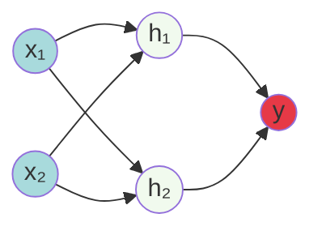
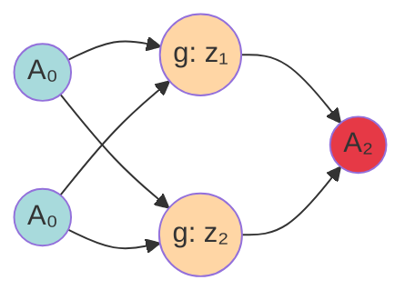

## Neuron Output Formula

In artificial neural networks, each neuron forms a weighted sum of its inputs and passes the resulting scalar value through a function referred to as an **activation function** or **transfer function**.

If a neuron has $n$ inputs, the output of activation of neurons is:

$$a = g (w_1x_1 + w_2x_2 + w_3x_3 + \ldots + w_nx_n + b)$$

where:

- $w_i$ are the weights
- $x_i$ are the inputs
- $b$ is the bias term
- $g$ is the activation function

The function $g$ is referred to as an **activation function**.

---

## Neural Network Architecture

**Neural network with 2 inputs, a hidden layer with 2 nodes, and a single output layer:**

The activation function is the **gate** between the input and the output of a neuron. It basically decides whether or not a neuron will be activated.

**Critical Point:** If we do not use activation functions, our artificial neural network will perform just like a linear model.

---

## Why Are Activation Functions Needed?

Consider a neural network with:

- 2 nodes in the input layer
- 2 nodes in the hidden layer
- A single node in the output layer

Each of the nodes in the hidden layer has $A_1$ and $A_2$ as its activation functions.

### Mathematical Proof (Linear Activation Case)

Let's assume $g$ is a **linear function**: $g(z) = z$

**Layer 0 → Layer 1:** $$A_1 = w_1 \cdot A_0 + b_1$$ $$A_1 = g(z_1) = z_1$$

**Layer 1 → Layer 2:** $$A_2 = g(w_2 \cdot A_1 + b_2) = w_2 \cdot A_1 + b_2$$

**Insert the value of $A_1$ and expand:** $$A_2 = w_2 \cdot (w_1 \cdot A_0 + b_1) + b_2$$ $$A_2 = w_2w_1 \cdot A_0 + w_2b_1 + b_2 = w' \cdot A_0 + b'$$ $$A_2 = w' \cdot A_0 + b'$$

where:

- $A_0$ is the input
- $A_2$ is the output
- $w' = w_2w_1$ (collapsed weights)
- $b' = w_2b_1 + b_2$ (collapsed bias)

### Result

There is a **polynomial of degree 1** (linear relationship) between the input and output, which is why a **single line** is observed as the decision boundary.

Now imagine if this linear activation function was **non-linear** and could help capture the non-linearity-this is what explains the use of activation functions.

**This is the reason why activation functions are preferred to be non-linear.**

---

## Qualities of an Ideal Activation Function

### 1. **Non-Linear**

- Enables learning of complex patterns and non-linear decision boundaries
- Without non-linearity, deep networks collapse to single-layer linear models
- Essential for universal function approximation (Cybenko, 1989)

### 2. **Differentiable**

- **Why?** Because we are using gradient descent and we need to differentiate to update the weights (basically follow the entire process of backpropagation)
- Gradient-based optimization requires computing $\frac{\partial L}{\partial w}$
- At minimum, should be differentiable almost everywhere (e.g., ReLU at 0)

### 3. **Computationally Inexpensive**

- Fast computation during forward and backward passes
- Network training involves millions of activation function evaluations
- Simple functions (e.g., ReLU) preferred over complex ones (e.g., softmax for hidden layers)

### 4. **Zero-Centered**

- The output of activation function should be zero-centered or normalized
- It has been empirically proven that a neural network converges faster if the input to it is zero-centered
- **Example:** $\tanh(x)$ is a zero-centered activation function with range $[-1, 1]$
- **Problem with non-zero-centered:** Sigmoid outputs only positive values, causing zig-zagging dynamics during gradient descent (LeCun et al., 1998)

### 5. **Non-Saturating**

- **Saturating functions:** Outputs are "squeezed" into a bounded range
    - Sigmoid: squeezes outputs between $[0, 1]$
    - $\tanh$: squeezes outputs between $[-1, 1]$
- **Problem:** If the activation function is saturating, the **vanishing gradient problem** can be observed
- In saturation regions, gradients become extremely small ($\approx 0$), preventing weight updates
- **Non-saturating functions:** ReLU, Leaky ReLU, ELU (do not saturate for positive inputs)

---

## Common Activation Functions

### 1. **Sigmoid (Logistic)**

$$\sigma(x) = \frac{1}{1 + e^{-x}}$$

**Properties:**

- Range: $(0, 1)$
- Smooth and differentiable
- **Issues:** Not zero-centered, saturates at both ends (vanishing gradients)
- **Use case:** Binary classification output layer

### 2. **Hyperbolic Tangent (tanh)**

$$\tanh(x) = \frac{e^x - e^{-x}}{e^x + e^{-x}}$$

**Properties:**

- Range: $(-1, 1)$
- Zero-centered (better than sigmoid)
- **Issues:** Still saturates at both ends
- **Use case:** Hidden layers in RNNs, LSTMs

### 3. **Rectified Linear Unit (ReLU)**

$$\text{ReLU}(x) = \max(0, x)$$

**Properties:**

- Range: $[0, \infty)$
- Computationally efficient
- Non-saturating for positive values
- **Issues:** Not zero-centered, "dying ReLU" problem (neurons can become inactive)
- **Use case:** Default choice for hidden layers in deep networks

### 4. **Leaky ReLU**

$$\text{Leaky ReLU}(x) = \max(\alpha x, x), \quad \alpha \in (0, 1)$$

Typically $\alpha = 0.01$

**Properties:**

- Addresses dying ReLU problem
- Allows small negative gradients when $x < 0$

### 5. **Exponential Linear Unit (ELU)**

$$\text{ELU}(x) = \begin{cases} x & \text{if } x > 0 \ \alpha(e^x - 1) & \text{if } x \leq 0 \end{cases}$$

**Properties:**

- Smooth everywhere
- Outputs have mean closer to zero
- **Issue:** Computationally more expensive (exponential)

### 6. **Softmax** (Output Layer)

$$\text{Softmax}(x_i) = \frac{e^{x_i}}{\sum_{j=1}^{K} e^{x_j}}$$

**Properties:**

- Converts logits to probability distribution
- Sum of outputs = 1
- **Use case:** Multi-class classification output layer

---

## The Vanishing Gradient Problem

**Occurs when:** Using saturating activation functions (sigmoid, tanh) in deep networks

**Mechanism:**

1. During backpropagation: $\frac{\partial L}{\partial w_l} = \frac{\partial L}{\partial a_L} \cdot \prod_{i=l}^{L-1} \frac{\partial a_{i+1}}{\partial a_i}$
2. For sigmoid: $\sigma'(x) = \sigma(x)(1-\sigma(x)) \leq 0.25$
3. Gradient product shrinks exponentially with depth
4. Early layers receive vanishingly small gradients
5. Weights barely update → network fails to learn

**Solutions:**

- Use non-saturating activations (ReLU family)
- Batch normalization
- Residual connections (ResNets)
- Proper weight initialization (Xavier, He initialization)

---

## Activation Function Comparison

|Function|Range|Zero-Centered|Saturating|Computational Cost|Gradient Issues|
|---|---|---|---|---|---|
|Sigmoid|$(0, 1)$|✗|✓|Medium|Vanishing|
|tanh|$(-1, 1)$|✓|✓|Medium|Vanishing|
|ReLU|$[0, \infty)$|✗|✗ (for $x>0$)|Low|Dying ReLU|
|Leaky ReLU|$(-\infty, \infty)$|✗|✗|Low|Minimal|
|ELU|$(-\alpha, \infty)$|≈✓|✗|High|Minimal|

---

## Key Takeaways

- **Non-linearity** is essential for learning complex patterns
- **ReLU** is the default choice for modern deep networks
- **Sigmoid/Softmax** are used for output layers in classification
- **Zero-centered** functions improve convergence speed
- **Non-saturating** functions prevent vanishing gradients
- Choice of activation function significantly impacts training dynamics and final performance