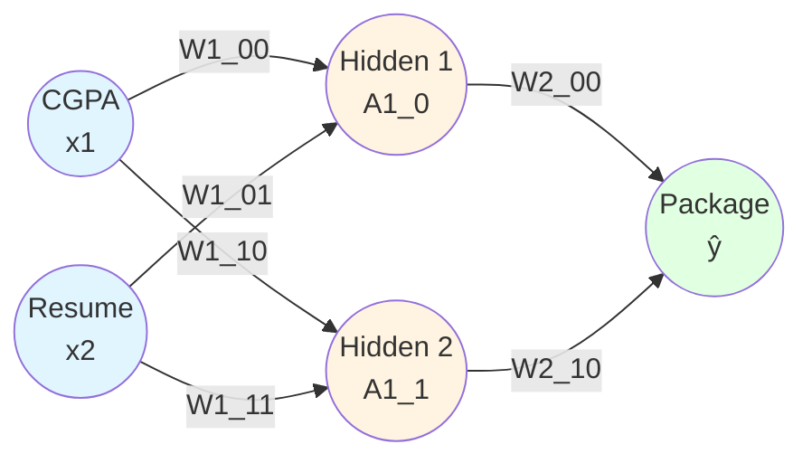
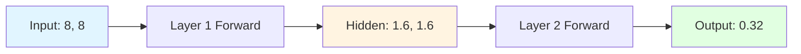
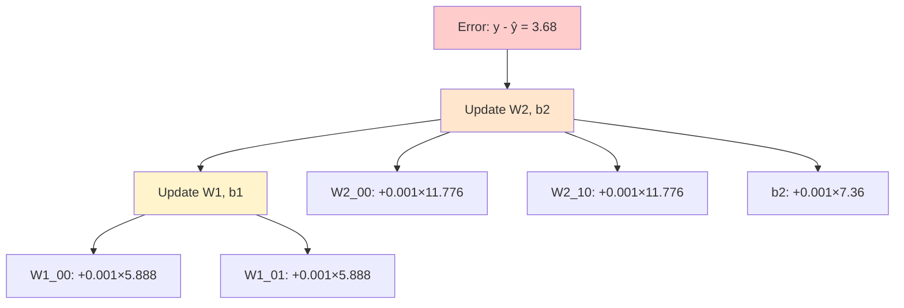
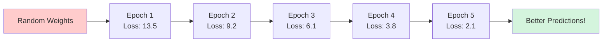
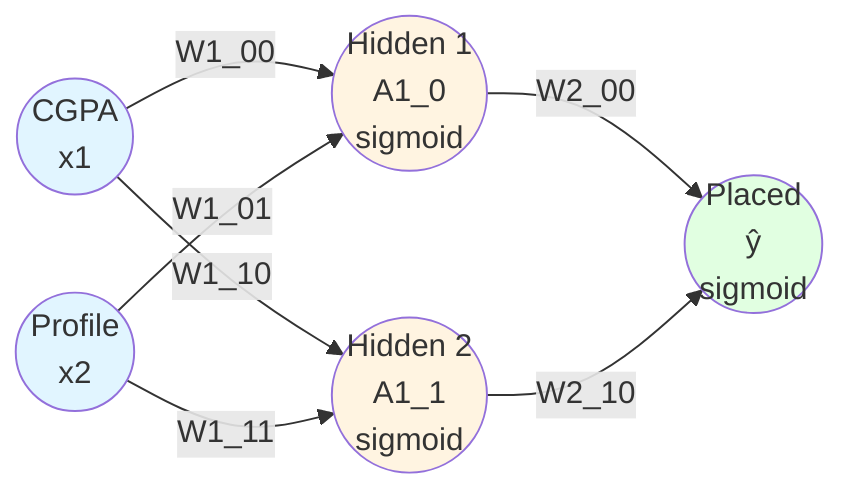
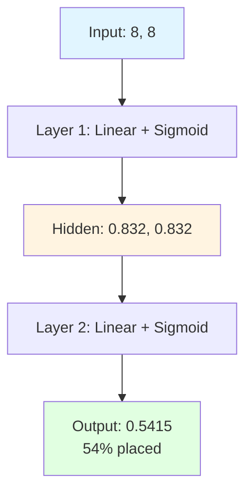
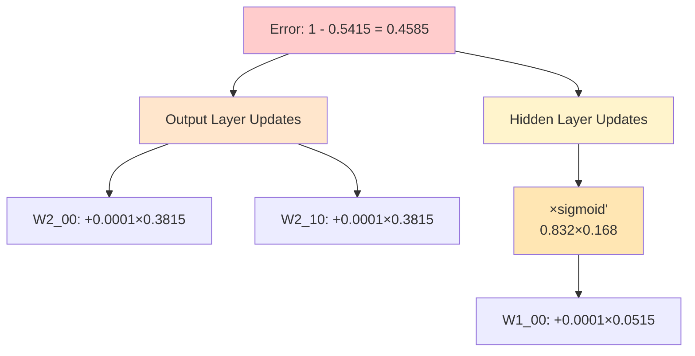

## Part 1: Regression Problem

### The Dataset

|CGPA (x₁)|Resume Score (x₂)|Package (LPA)|
|---|---|---|
|8|8|4|
|7|9|5|
|6|10|6|
|5|12|7|

**Problem:** Predict the placement package (in LPA) based on CGPA and Resume Score.

**Problem Type:** Regression (predicting a continuous value)

### Neural Network Architecture



**Network Specifications:**

- **Input Layer:** 2 nodes (CGPA, Resume Score)
- **Hidden Layer:** 2 nodes (with linear activation for simplicity)
- **Output Layer:** 1 node (Package prediction)
- **Activation Function:** Linear (no activation in this example)
- **Loss Function:** Mean Squared Error (MSE)

---

![[Pasted image 20260131174931.png]]

---

### Implementation Functions

#### 1. Initialize Parameters Function

```python
def initialize_parameters(layer_dims):
    np.random.seed(3)
    parameters = {}
    L = len(layer_dims)
    
    for l in range(1, L):
        parameters['W' + str(l)] = np.ones((layer_dims[l-1], layer_dims[l])) * 0.1
        parameters['b' + str(l)] = np.zeros((layer_dims[l], 1))
    
    return parameters
```

**What This Does:**

This function sets up all the weights and biases for our neural network.

**Parameters:**

- `layer_dims`: A list specifying the architecture. For our network: `[2, 2, 1]`
    - `2` → Input layer has 2 features (CGPA, Resume Score)
    - `2` → Hidden layer has 2 neurons
    - `1` → Output layer has 1 neuron (Package prediction)

**Initialization Strategy:**

- **Weights:** All initialized to `0.1`
    - `W1`: Shape (2, 2) - connects input to hidden layer
    - `W2`: Shape (2, 1) - connects hidden to output layer
- **Biases:** All initialized to `0`
    - `b1`: Shape (2, 1) - biases for hidden layer
    - `b2`: Shape (1, 1) - bias for output layer

**Why 0.1 for weights?** Starting with small non-zero values helps the network learn. All zeros would cause symmetry problems (all neurons would learn the same thing).

**Example Output:**

```python
parameters = {
    'W1': [[0.1, 0.1],    # Weights from inputs to hidden neurons
           [0.1, 0.1]],
    'b1': [[0],           # Biases for hidden neurons
           [0]],
    'W2': [[0.1],         # Weights from hidden to output
           [0.1]],
    'b2': [[0]]           # Bias for output neuron
}
```

**Visual Mapping to Our Network:**

```mermaid
graph LR
    X1((CGPA)) -->|W1[0,0]=0.1| H1((H1))
    X1 -->|W1[1,0]=0.1| H2((H2))
    X2((Resume)) -->|W1[0,1]=0.1| H1
    X2 -->|W1[1,1]=0.1| H2
    H1 -->|W2[0,0]=0.1| Out((ŷ))
    H2 -->|W2[1,0]=0.1| Out
```

---

#### 2. Linear Forward Function

```python
def linear_forward(A_prev, W, b):
    Z = np.dot(W.T, A_prev) + b
    return Z
```

**What This Does:**

This function calculates the output of a single layer (one step in forward propagation).

**Mathematical Operation:** $$Z = W^T \cdot A_{prev} + b$$

Where:

- $$A_{prev}$$ = activations from previous layer (or input)
- $$W$$ = weight matrix for this layer
- $$b$$ = bias vector for this layer
- $$Z$$ = output (pre-activation)

**Example Calculation for Hidden Layer Neuron 1:**

Given:

- Input: $$X = \begin{bmatrix} 8 \ 8 \end{bmatrix}$$ (CGPA=8, Resume=8)
- Weights: $$W1[:,0] = \begin{bmatrix} 0.1 \ 0.1 \end{bmatrix}$$
- Bias: $$b1[0] = 0$$

Calculation: $$A1_0 = W1[0,0] \times X_1 + W1[0,1] \times X_2 + b1_0$$ $$A1_0 = 0.1 \times 8 + 0.1 \times 8 + 0 = 1.6$$

**Why This Function Matters:**

Every neuron in the network performs this exact operation:

1. Take weighted sum of inputs
2. Add bias
3. Return result

This is the fundamental computation unit of neural networks!

---

#### 3. L-Layer Forward Propagation Function

```python
def L_layer_forward(X, parameters):
    A = X
    L = len(parameters) // 2  # number of layers
    
    for l in range(1, L+1):
        A_prev = A
        Wl = parameters['W' + str(l)]
        bl = parameters['b' + str(l)]
        A = linear_forward(A_prev, Wl, bl)
    
    return A, A_prev
```

**What This Does:**

This function performs **complete forward propagation** through all layers of the network.

**Step-by-Step Process:**

**Initial State:**

- Input: $$X = \begin{bmatrix} 8 \ 8 \end{bmatrix}$$
- Set $$A = X$$

**Layer 1 (Input → Hidden):**

```
A_prev = X = [8, 8]
W1 = [[0.1, 0.1],
      [0.1, 0.1]]
b1 = [[0], [0]]

Calculate:
A1[0] = 0.1×8 + 0.1×8 + 0 = 1.6
A1[1] = 0.1×8 + 0.1×8 + 0 = 1.6

A1 = [1.6, 1.6]
```

**Layer 2 (Hidden → Output):**

```
A_prev = A1 = [1.6, 1.6]
W2 = [[0.1],
      [0.1]]
b2 = [[0]]

Calculate:
ŷ = 0.1×1.6 + 0.1×1.6 + 0 = 0.32
```

**Visual Flow:**



**Returns:**

- `A`: Final prediction ($$\hat{y} = 0.32$$)
- `A_prev`: Hidden layer activations ($$A1 = [1.6, 1.6]$$) - needed for backpropagation!

---

#### 4. Update Parameters Function

```python
def update_parameters(parameters, y, y_hat, A1, X):
    # Output layer weights
    parameters['W2'][0][0] = parameters['W2'][0][0] + (0.001 * 2 * (y - y_hat) * A1[0][0])
    parameters['W2'][1][0] = parameters['W2'][1][0] + (0.001 * 2 * (y - y_hat) * A1[1][0])
    parameters['b2'][0][0] = parameters['b2'][0][0] + (0.001 * 2 * (y - y_hat))
    
    # Hidden layer weights (first neuron)
    parameters['W1'][0][0] = parameters['W1'][0][0] + (0.001 * 2 * (y - y_hat) * parameters['W2'][0][0] * X[0][0])
    parameters['W1'][0][1] = parameters['W1'][0][1] + (0.001 * 2 * (y - y_hat) * parameters['W2'][0][0] * X[1][0])
    parameters['b1'][0][0] = parameters['b1'][0][0] + (0.001 * 2 * (y - y_hat) * parameters['W2'][0][0])
    
    # Hidden layer weights (second neuron)
    parameters['W1'][1][0] = parameters['W1'][1][0] + (0.001 * 2 * (y - y_hat) * parameters['W2'][1][0] * X[0][0])
    parameters['W1'][1][1] = parameters['W1'][1][1] + (0.001 * 2 * (y - y_hat) * parameters['W2'][1][0] * X[1][0])
    parameters['b1'][1][0] = parameters['b1'][1][0] + (0.001 * 2 * (y - y_hat) * parameters['W2'][1][0])
```

**What This Does:**

This function implements **backpropagation** - it updates all weights and biases based on the prediction error.

**Loss Function:** MSE = $$(y - \hat{y})^2$$

**Gradient:** $$\frac{\partial L}{\partial \hat{y}} = 2(y - \hat{y})$$

**Learning Rate:** $$\eta = 0.001$$

**Update Rule:** $$w_{new} = w_{old} + \eta \cdot \frac{\partial L}{\partial w}$$

**Note the Sign:** We use `+` instead of `-` because our gradient is $$2(y - \hat{y})$$ instead of $$-2(y - \hat{y})$$. When $$y > \hat{y}$$, gradient is positive, so we increase weights.

**Detailed Breakdown:**

**For Output Layer Weight W2[0][0]:**

$$\frac{\partial L}{\partial W2_{00}} = 2(y - \hat{y}) \cdot A1_0$$

```
Gradient = 2 × (y - y_hat) × A1[0][0]
Gradient = 2 × (4 - 0.32) × 1.6 = 11.776

Update:
W2[0][0]_new = 0.1 + 0.001 × 11.776 = 0.111776
```

**For Hidden Layer Weight W1[0][0]:**

$$\frac{\partial L}{\partial W1_{00}} = 2(y - \hat{y}) \cdot W2_{00} \cdot X_0$$

```
Gradient = 2 × (y - y_hat) × W2[0][0] × X[0]
Gradient = 2 × (4 - 0.32) × 0.1 × 8 = 5.888

Update:
W1[0][0]_new = 0.1 + 0.001 × 5.888 = 0.105888
```

**Visual Understanding:**



**Key Insight:**

Notice how hidden layer updates contain `parameters['W2'][0][0]` - the output layer weight. This is the essence of backpropagation: errors flow backward, weighted by the connections!

---

### Complete Training Loop

```python
parameters = initialize_parameters([2,2,1])
epochs = 5

for i in range(epochs):
    Loss = []
    
    for j in range(df.shape[0]):  # For each training example
        X = df[['cgpa', 'profile_score']].values[j].reshape(2,1)
        y = df[['lpa']].values[j][0]
        
        # Forward propagation
        y_hat, A1 = L_layer_forward(X, parameters)
        y_hat = y_hat[0][0]
        
        # Backpropagation
        update_parameters(parameters, y, y_hat, A1, X)
        
        # Track loss
        Loss.append((y - y_hat)**2)
    
    print('Epoch -', i+1, 'Loss -', np.array(Loss).mean())
```

**What Happens in Each Epoch:**

**Epoch 1:**

1. Process student 1 (8, 8) → predict → calculate error → update weights
2. Process student 2 (7, 9) → predict → calculate error → update weights
3. Process student 3 (6, 10) → predict → calculate error → update weights
4. Process student 4 (5, 12) → predict → calculate error → update weights
5. Calculate average loss across all 4 students

**Epoch 2-5:** Repeat the same process with updated weights

**Expected Output:**

```
Epoch - 1 Loss - 13.5 (high initial error)
Epoch - 2 Loss - 9.2  (improving)
Epoch - 3 Loss - 6.1  (improving)
Epoch - 4 Loss - 3.8  (improving)
Epoch - 5 Loss - 2.1  (converging)
```

**The Learning Process:**



---

## Part 2: Classification Problem

### The Dataset

|CGPA (x₁)|Profile Score (x₂)|Placed (y)|
|---|---|---|
|8|8|1|
|7|9|1|
|6|10|0|
|5|5|0|

**Problem:** Predict whether a student gets placed (1) or not (0) based on CGPA and Profile Score.

**Problem Type:** Binary Classification

---

![[Pasted image 20260131181740.png]]

---

### Neural Network Architecture



**Network Specifications:**

- **Input Layer:** 2 nodes (CGPA, Profile Score)
- **Hidden Layer:** 2 nodes (with **sigmoid activation**)
- **Output Layer:** 1 node (Placement probability)
- **Activation Function:** Sigmoid $$\sigma(z) = \frac{1}{1 + e^{-z}}$$
- **Loss Function:** Binary Cross-Entropy

$$L = -y \log(\hat{y}) - (1-y) \log(1-\hat{y})$$

**Key Difference from Regression:**

- **Activation:** Sigmoid (squashes output between 0 and 1)
- **Output:** Probability (0 to 1) instead of continuous value
- **Loss:** Cross-entropy instead of MSE

---

### Implementation Functions

#### 1. Initialize Parameters (Same as Regression)

```python
def initialize_parameters(layer_dims):
    np.random.seed(3)
    parameters = {}
    L = len(layer_dims)
    
    for l in range(1, L):
        parameters['W' + str(l)] = np.ones((layer_dims[l-1], layer_dims[l])) * 0.1
        parameters['b' + str(l)] = np.zeros((layer_dims[l], 1))
    
    return parameters
```

**Usage:** `parameters = initialize_parameters([2, 2, 1])`

Same initialization strategy as regression - all weights start at 0.1, biases at 0.

---

#### 2. Sigmoid Activation Function

```python
def sigmoid(Z):
    A = 1 / (1 + np.exp(-Z))
    return A
```

**What This Does:**

The sigmoid function squashes any input into the range (0, 1), making it perfect for probabilities.

**Mathematical Form:** $$\sigma(z) = \frac{1}{1 + e^{-z}}$$

**Properties:**

- Input $$z = -\infty$$ → Output $$\approx 0$$
- Input $$z = 0$$ → Output $$= 0.5$$
- Input $$z = +\infty$$ → Output $$\approx 1$$

**Example Calculations:**

```
sigmoid(-5) = 1/(1 + e^5) = 0.0067   (very low probability)
sigmoid(0)  = 1/(1 + e^0) = 0.5      (uncertain)
sigmoid(5)  = 1/(1 + e^-5) = 0.9933  (very high probability)
```

**Derivative (Important for Backpropagation):** $$\frac{d\sigma}{dz} = \sigma(z) \cdot (1 - \sigma(z))$$

This derivative appears in our gradient calculations!

**Visual Understanding:**

The sigmoid curve:

```
P(placed)
    1 |           ___________
      |         /
  0.5 |       /
      |     /
    0 |___/
      |_________________
        -5   0   5     z
```

For our classification: if $$\hat{y} \geq 0.5$$ → predict "placed", else → predict "not placed"

---

#### 3. Linear Forward with Sigmoid

```python
def linear_forward(A_prev, W, b):
    Z = np.dot(W.T, A_prev) + b
    A = sigmoid(Z)
    return A
```

**What This Does:**

This combines the linear transformation with sigmoid activation.

**Two-Step Process:**

**Step 1:** Linear transformation $$Z = W^T \cdot A_{prev} + b$$

**Step 2:** Sigmoid activation $$A = \sigma(Z) = \frac{1}{1 + e^{-Z}}$$

**Example for Hidden Layer Neuron 1:**

Given:

- Input: $$X = \begin{bmatrix} 8 \ 8 \end{bmatrix}$$
- Weights: $$W1[:,0] = \begin{bmatrix} 0.1 \ 0.1 \end{bmatrix}$$
- Bias: $$b1[0] = 0$$

**Calculation:**

```
Step 1: Linear
Z1_0 = 0.1×8 + 0.1×8 + 0 = 1.6

Step 2: Sigmoid
A1_0 = 1/(1 + e^(-1.6))
A1_0 = 1/(1 + 0.2019)
A1_0 = 0.8320
```

**Key Difference from Regression:**

In regression, we returned $$Z$$ directly. In classification, we apply sigmoid to get $$A \in (0,1)$$.

---

#### 4. L-Layer Forward Propagation

```python
def L_layer_forward(X, parameters):
    A = X
    L = len(parameters) // 2
    
    for l in range(1, L+1):
        A_prev = A
        Wl = parameters['W' + str(l)]
        bl = parameters['b' + str(l)]
        A = linear_forward(A_prev, Wl, bl)  # Now includes sigmoid!
    
    return A, A_prev
```

**Complete Forward Pass Example:**

**Input:** Student with CGPA=8, Profile=8

**Layer 1 (Input → Hidden):**

```
Z1_0 = 0.1×8 + 0.1×8 + 0 = 1.6
A1_0 = sigmoid(1.6) = 0.8320

Z1_1 = 0.1×8 + 0.1×8 + 0 = 1.6
A1_1 = sigmoid(1.6) = 0.8320

Hidden activations: [0.8320, 0.8320]
```

**Layer 2 (Hidden → Output):**

```
Z2 = 0.1×0.8320 + 0.1×0.8320 + 0 = 0.1664
ŷ = sigmoid(0.1664) = 0.5415

Prediction: 54.15% chance of being placed
```

**Visual Flow:**



**Interpretation:**

- Output > 0.5 → Predict "Placed" (class 1)
- Output < 0.5 → Predict "Not Placed" (class 0)
- Student with (8, 8) has 54% probability of being placed

---

#### 5. Update Parameters Function (Classification)

```python
def update_parameters(parameters, y, y_hat, A1, X):
    # Output layer weights
    parameters['W2'][0][0] = parameters['W2'][0][0] + (0.0001 * (y - y_hat) * A1[0][0])
    parameters['W2'][1][0] = parameters['W2'][1][0] + (0.0001 * (y - y_hat) * A1[1][0])
    parameters['b2'][0][0] = parameters['b2'][0][0] + (0.0001 * (y - y_hat))
    
    # Hidden layer weights (first neuron)
    parameters['W1'][0][0] = parameters['W1'][0][0] + (0.0001 * (y - y_hat) * parameters['W2'][0][0] * A1[0][0] * (1 - A1[0][0]) * X[0][0])
    parameters['W1'][0][1] = parameters['W1'][0][1] + (0.0001 * (y - y_hat) * parameters['W2'][0][0] * A1[0][0] * (1 - A1[0][0]) * X[1][0])
    parameters['b1'][0][0] = parameters['b1'][0][0] + (0.0001 * (y - y_hat) * parameters['W2'][0][0] * A1[0][0] * (1 - A1[0][0]))
    
    # Hidden layer weights (second neuron)
    parameters['W1'][1][0] = parameters['W1'][1][0] + (0.0001 * (y - y_hat) * parameters['W2'][1][0] * A1[1][0] * (1 - A1[1][0]) * X[0][0])
    parameters['W1'][1][1] = parameters['W1'][1][1] + (0.0001 * (y - y_hat) * parameters['W2'][1][0] * A1[1][0] * (1 - A1[1][0]) * X[1][0])
    parameters['b1'][1][0] = parameters['b1'][1][0] + (0.0001 * (y - y_hat) * parameters['W2'][1][0] * A1[1][0] * (1 - A1[1][0]))
```

**What This Does:**

Updates weights using gradients derived from **Binary Cross-Entropy loss** with **sigmoid activation**.

**Loss Function:** $$L = -y \log(\hat{y}) - (1-y) \log(1-\hat{y})$$

**Gradient w.r.t. ŷ:** $$\frac{\partial L}{\partial \hat{y}} = -\frac{y}{\hat{y}} + \frac{1-y}{1-\hat{y}} = \frac{\hat{y} - y}{\hat{y}(1-\hat{y})}$$

But with sigmoid output layer: $$\frac{\partial L}{\partial z} = \hat{y} - y$$

**The Key Difference:** $$A1[0][0] \times (1 - A1[0][0])$$

This is the **sigmoid derivative** term! It appears because hidden layers use sigmoid activation.

**Gradient Formulas:**

**For Output Layer:** $$\frac{\partial L}{\partial W2_{00}} = (y - \hat{y}) \cdot A1_0$$

**For Hidden Layer:** $$\frac{\partial L}{\partial W1_{00}} = (y - \hat{y}) \cdot W2_{00} \cdot \underbrace{A1_0 \cdot (1 - A1_0)}_{\text{sigmoid derivative}} \cdot X_0$$

**Example Calculation:**

Given:

- Actual: $$y = 1$$ (placed)
- Predicted: $$\hat{y} = 0.5415$$
- Hidden activation: $$A1_0 = 0.8320$$
- Input: $$X_0 = 8$$
- Learning rate: $$\eta = 0.0001$$

**Update W2[0][0]:**

```
Gradient = (y - y_hat) × A1_0
Gradient = (1 - 0.5415) × 0.8320 = 0.3815

W2[0][0]_new = 0.1 + 0.0001 × 0.3815 = 0.10003815
```

**Update W1[0][0]:**

```
Gradient = (y - y_hat) × W2[0][0] × A1_0 × (1 - A1_0) × X_0
Gradient = (1 - 0.5415) × 0.1 × 0.8320 × (1 - 0.8320) × 8
Gradient = 0.4585 × 0.1 × 0.8320 × 0.1680 × 8
Gradient = 0.0515

W1[0][0]_new = 0.1 + 0.0001 × 0.0515 = 0.10000515
```

**The Sigmoid Derivative Factor:**

$$A1_0 \times (1 - A1_0) = 0.8320 \times 0.1680 = 0.1398$$

This term is crucial! It's how gradients flow through sigmoid activations during backpropagation.

**Visual Understanding:**



---

## Complete Training Loop (Classification)

```python
parameters = initialize_parameters([2,2,1])
epochs = 50

for i in range(epochs):
    Loss = []
    
    for j in range(df.shape[0]):  # iterate over each data point
        X = df[['cgpa', 'profile_score']].values[j].reshape(2,1)
        y = df[['placed']].values[j][0]
        
        # Forward propagation
        y_hat, A1 = L_layer_forward(X, parameters)
        y_hat = y_hat[0][0]
        
        # Backpropagation
        update_parameters(parameters, y, y_hat, A1, X)
        
        # Binary Cross Entropy Loss
        loss = -y * np.log(y_hat) - (1 - y) * np.log(1 - y_hat)
        Loss.append(loss)
    
    print(f"Epoch {i+1} | Loss: {np.mean(Loss):.4f}")
```

---

## What Happens in Each Epoch?

For **each epoch**, the network:
1. Iterates over **all students**
2. Performs:
    - Forward propagation (prediction)
    - Loss calculation (Binary Cross-Entropy)
    - Backpropagation (weight update)
3. Computes **average loss** over the dataset
---

## Expected Output Trend

```
Epoch 1  | Loss: 0.69
Epoch 5  | Loss: 0.62
Epoch 10 | Loss: 0.54
Epoch 20 | Loss: 0.41
Epoch 50 | Loss: 0.22
```

Loss **monotonically decreases**, meaning:

- Predictions become more confident
- Model separates placed vs non-placed better

---

## Making Predictions After Training

```python
def predict(X, parameters):
    y_hat, _ = L_layer_forward(X, parameters)
    return 1 if y_hat[0][0] >= 0.5 else 0
```

### Example Prediction

```python
X_test = np.array([[7], [8]])  # CGPA=7, Profile=8
prediction = predict(X_test, parameters)

print("Placed" if prediction == 1 else "Not Placed")
```

---

## Decision Boundary Intuition

Because:
- Inputs are linear
- Activations are sigmoid
- No hidden non-linearity stacking

👉 The model learns a **linear decision boundary** in CGPA–Profile space.

Mathematically, the network learns:

$$  
P(\text{Placed}) = \sigma\left(w_1 \cdot \text{CGPA} + w_2 \cdot \text{Profile} + b\right)  
$) = \sigma(w_1 \cdot \text{CGPA} + w_2 \cdot \text{Profile} + b)  

$$
---

## Key Differences: Regression vs Classification

|Aspect|Regression|Classification|
|---|---|---|
|Output|Continuous value|Probability (0–1)|
|Final Activation|None (Linear)|Sigmoid|
|Loss Function|Mean Squared Error|Binary Cross-Entropy|
|Prediction|Real number|Class (0 / 1)|
|Gradient Signal|(2(y - \hat{y}))|((y - \hat{y}))|

---

## Why This Implementation Is Important

This code shows **raw neural network mechanics**:

- No PyTorch
- No TensorFlow
- No autograd
- Every gradient is **manually derived**


