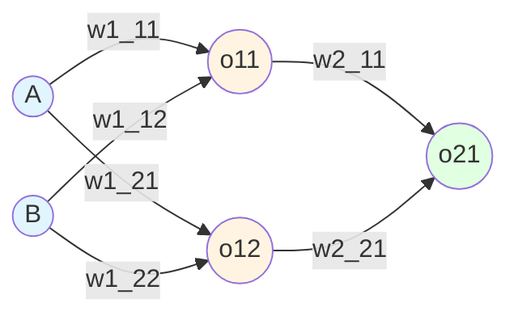
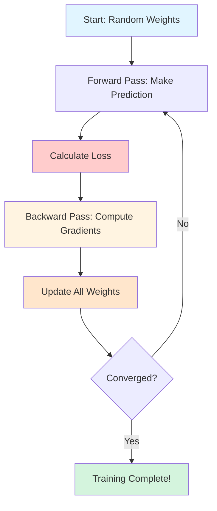

![[Pasted image 20260131184545.png]]

---

## Understanding Loss Function as a Function of Parameters

### The Neural Network



### Loss Function: A Function of All Parameters

The loss function depends on **all 9 trainable parameters**:

$$L = f(w_{1,1}^1, w_{1,2}^1, w_{2,1}^1, w_{2,2}^1, b_1^1, b_1^2, w_{1,1}^2, w_{2,1}^2, b_2^1)$$

This is a function in **9-dimensional space**. Each parameter is a dimension, and the loss value is the height in this space.

---

## The Door with 9 Knobs Analogy

### The Setup

Imagine you're standing in front of a special door that has **9 different knobs** on it. This is no ordinary door - it's a precision mechanism where each knob controls a different aspect of how the door operates.

**The Challenge:** When you open this door, it makes noise. Your goal is to adjust all 9 knobs so that when you open the door, the noise (loss) is **as quiet as possible** (minimum).

### The Complexity

**Initial State:**

- You start with all knobs in random positions
- Opening the door creates a LOUD screech (high loss)
- You have no idea which knob does what!

**The Dependencies:**

- Each knob affects the noise in a complex way
- Turning knob 1 might make the hinges tighter
- Turning knob 2 might adjust the latch pressure
- Turning knob 3 might shift the door alignment
- But here's the catch: **all knobs interact with each other!**

If you tighten the hinges (knob 1), you might need to loosen the latch (knob 2) to compensate. If you shift the alignment (knob 3), both the hinges AND the latch need readjustment. It's a delicate dance of interdependent adjustments.

### The Strategy (This is Backpropagation!)

**Step 1: Open the door and measure the noise** (Forward Propagation)

- Current setting produces 85 decibels (terrible!)

**Step 2: Figure out which knob to adjust and by how much** (Backpropagation)

- You can't just randomly spin knobs - that might make it worse!
- You need to calculate: "If I turn knob 5 clockwise by 10 degrees, how much will the noise decrease?"
- This calculation is the **gradient** - the sensitivity of noise to each knob

**Step 3: Make small adjustments** (Gradient Descent)

- Turn knob 1: +5 degrees (small step, not +90 degrees!)
- Turn knob 2: -3 degrees
- Turn knob 3: +7 degrees
- ... and so on for all 9 knobs

**Step 4: Test again and repeat** (Epochs)

- Open door again: Now 78 decibels (improvement!)
- Recalculate which adjustments to make
- Keep iterating until noise is barely audible

### Why This is Hard

**The Noise Landscape is Complex:**

- Not a simple bowl shape where "lower is always better"
- Has hills, valleys, plateaus, and saddle points
- Multiple "quiet spots" (local minima) but only one absolute quietest setting (global minimum)
- You might get stuck in a "pretty quiet" spot that's not the absolute best

**The Knobs are Interdependent:**

- In our neural network, $$w_{1,1}^1$$ affects how input A influences hidden neuron $$o_{11}$$
- But $$w_{1,1}^2$$ then determines how $$o_{11}$$ influences the output
- If $$w_{1,1}^2$$ is very small, then $$w_{1,1}^1$$ barely matters!
- This is why we need the **chain rule** - to trace through these dependencies

**Small Steps are Necessary:**

- If you turn a knob too aggressively (large learning rate), you might overshoot the sweet spot
- The door goes from loud screeching to loud banging
- Too small steps (small learning rate) and you'll spend hours making tiny adjustments

### The Breakthrough Insight

**Backpropagation tells us exactly how to adjust each knob!**

Instead of randomly trying combinations (which would take forever with 9 knobs), backpropagation:

1. Measures the current noise (loss)
2. Calculates mathematically how each knob contributed to that noise
3. Tells us the exact direction and approximate amount to turn each knob
4. We make the adjustments and try again

After many iterations, the door opens silently - we've found the optimal knob settings!

**Real-World Scale:** Modern neural networks don't have 9 knobs - they have **billions**. GPT-3 has 175 billion parameters! Imagine a door with 175 billion knobs. Without backpropagation (the algorithm that calculates gradients efficiently), training such networks would be impossible.

---

## The Concept of Gradient

### What is a Gradient?

A **gradient** is the partial derivative of the loss function with respect to each parameter. It tells us:

- **Direction:** Should we increase or decrease this parameter?
- **Magnitude:** How sensitive is the loss to changes in this parameter?

**Mathematical Definition:**

For our loss function $$L$$ depending on 9 parameters:

$$\nabla L = \begin{bmatrix} \frac{\partial L}{\partial w_{1,1}^1} \ \frac{\partial L}{\partial w_{1,2}^1} \ \frac{\partial L}{\partial w_{2,1}^1} \ \vdots \ \frac{\partial L}{\partial b_2^1} \end{bmatrix}$$

This is a **vector of 9 numbers**, one for each parameter. Each number tells us how to adjust that specific parameter.

### The Mountain Hiker Analogy (from Ian Goodfellow's "Deep Learning")

**The Setup:** You're a hiker blindfolded on a foggy mountain. Your goal is to reach the valley (minimum loss). You can't see where you're going, but you can:

1. Feel the slope under your feet
2. Determine which direction is downhill
3. Take a step in that direction

**The Gradient is Your Sense of Slope:**

**In 1D (single parameter):**

```
Height (Loss)
    ↑
    |     /\
    |    /  \
    |   /    \
    |  /      \___
    |_/___________→ Weight w
    
Gradient = slope at current position
Negative gradient = downhill direction
```

At point A: Gradient is positive (+) → Move left (decrease w) At point B: Gradient is negative (-) → Move right (increase w) At point C: Gradient is zero (0) → You're at the bottom!

**In 2D (two parameters):** Imagine a topographic map with contour lines. The gradient is a compass that always points in the direction of steepest descent.

```
         w2
         ↑
    _____|_____
   /     |     \
  /   ←--*      \  ← Gradient vector
 |      ↓       |     points downhill
  \           /
   \_________/
         → w1
```

**In 9D (our neural network):** You can't visualize it, but the math works the same way! The gradient is a 9-dimensional vector pointing toward the steepest descent in this 9-dimensional landscape.

### Why "Partial" Derivative?

When we have multiple parameters, we calculate **partial derivatives** - the rate of change with respect to ONE parameter while holding all others constant.

**The Volume Knob Analogy:**

Imagine a stereo system with multiple controls:

- Volume knob
- Bass knob
- Treble knob
- Balance knob

The sound quality (loss) depends on ALL knobs together. But when calculating $$\frac{\partial L}{\partial \text{volume}}$$, we're asking:

_"If I turn ONLY the volume knob, keeping bass, treble, and balance fixed, how does the sound quality change?"_

This is a **partial derivative** - we're isolating the effect of one parameter.

### Gradient in Backpropagation Context

**For our network:**

$$\frac{\partial L}{\partial w_{1,1}^1} = \frac{\partial L}{\partial \hat{y}} \cdot \frac{\partial \hat{y}}{\partial o_{11}} \cdot \frac{\partial o_{11}}{\partial w_{1,1}^1}$$

This tells us:

1. How loss changes with prediction ($$\frac{\partial L}{\partial \hat{y}}$$)
2. How prediction changes with hidden neuron ($$\frac{\partial \hat{y}}{\partial o_{11}}$$)
3. How hidden neuron changes with this specific weight ($$\frac{\partial o_{11}}{\partial w_{1,1}^1}$$)

**The Restaurant Kitchen Analogy:**

You're a restaurant critic (loss function) rating a dish (output). The dish quality depends on:

- Chef's skill (weights in output layer)
- Ingredient quality (weights in hidden layer)
- Original recipe (inputs)

The gradient answers: "If the sous chef (hidden layer) used slightly better ingredients, how much would my rating improve?"

Backpropagation traces this backwards:

- Final rating disappointed → (-2 stars)
- Because the sauce was bland → (trace to hidden layer)
- Because the sous chef under-seasoned → (trace to hidden layer weights)
- Adjust: Tell sous chef to add more salt next time! → (update weights)

---

## The Concept of Derivative

### Intuition: Rate of Change

A derivative measures **how fast something changes**.

**Mathematical Notation:**

$$\frac{dy}{dx}$$

Read as: "The derivative of y with respect to x" or "How y changes when x changes"

### Everyday Examples

**Speed is a Derivative:**

- Position: $$y = \text{distance traveled}$$
- Time: $$x = \text{time}$$
- Speed: $$\frac{dy}{dx} = \frac{d(\text{position})}{d(\text{time})}$$

If you're at position 10 meters at time 2 seconds, and position 30 meters at time 4 seconds: $$\text{Speed} = \frac{30 - 10}{4 - 2} = \frac{20}{2} = 10 \text{ m/s}$$

**Slope is a Derivative:** On a graph, the derivative at a point is the slope of the tangent line at that point.

```
y
↑     . (steeper slope = larger derivative)
|    /
|   /  . (gentle slope = smaller derivative)
|  /  /
| /  /
|/  /_____ (flat = zero derivative)
|_______→ x
```

### Finding the Minima

**Visualizing Loss Function (Simple 1D Case):**

```
Loss
  ↑
8 |     *
  |    / \
6 |   /   \
  |  /     \
4 | /       \
  |/         \___
2 |              *
  |________________→ weight w
     A    B    C
```

**Key Insights:**

**At Point A (left side):**

- Derivative is **negative** (slope goes down-left to up-right)
- Loss is decreasing as w increases
- **Action:** Increase w (move right)

**At Point B (minimum):**

- Derivative is **zero** (flat tangent line)
- Loss is at its lowest
- **Action:** Stop! We've found the minimum

**At Point C (right side):**

- Derivative is **positive** (slope goes up)
- Loss is increasing as w increases
- **Action:** Decrease w (move left)

**The Update Rule:** $$w_{new} = w_{old} - \eta \cdot \frac{\partial L}{\partial w}$$

- If $$\frac{\partial L}{\partial w} > 0$$ (positive derivative): Subtract it → decrease w ✓
- If $$\frac{\partial L}{\partial w} < 0$$ (negative derivative): Subtract negative → increase w ✓
- The minus sign automatically moves us toward the minimum!

### Minima in 9-Dimensional Space

**The Challenge:**

In our neural network, we have a loss function: $$L(w_{1,1}^1, w_{1,2}^1, w_{2,1}^1, w_{2,2}^1, b_1^1, b_1^2, w_{1,1}^2, w_{2,1}^2, b_2^1)$$

This is a surface in **9-dimensional space**. We can't visualize it, but mathematically:

**1D Minimum:** A point where slope = 0

```
    *
   / \
  /   \
 /     \
```

**2D Minimum:** A bowl where both directions have slope = 0

```
    Top View:
    ___________
   /           \
  |      ·      |  ← minimum at center
   \___________/
```

**9D Minimum:** A point where **all 9 partial derivatives are zero simultaneously**

$$\frac{\partial L}{\partial w_{1,1}^1} = 0, \quad \frac{\partial L}{\partial w_{1,2}^1} = 0, \quad \ldots, \quad \frac{\partial L}{\partial b_2^1} = 0$$

**How We Find It:**

We can't visualize the 9D landscape, but gradient descent works the same way:

1. **Calculate all 9 gradients** (which direction is downhill in each dimension)
2. **Take a small step** in the direction that decreases loss in ALL dimensions
3. **Repeat** until all gradients are near zero (we've reached a minimum)

**The Marble in a Bowl Analogy (from Goodfellow's "Deep Learning"):**

Imagine dropping a marble into a complex bowl with 9 dimensions. You can't see the bowl's shape, but:

- Gravity (the gradient) always pulls the marble downhill
- The marble rolls around, gradually losing energy
- Eventually, it settles at the bottom (minimum loss)

Even though we can't visualize 9 dimensions, the physics (mathematics) ensures the marble finds a minimum.

### Local vs Global Minima

**The Problem:**

Loss landscapes are rarely simple bowls. They have:

```
Loss
  ↑
  |  *     *
  | / \   / \    ← Multiple valleys
  |/   \_/   \
  |         ·  \  ← Global minimum (deepest)
  |_____________→ w
     A    B    C
```

**Local Minimum (Point A):**

- The lowest point in the immediate area
- Both left and right go up
- Gradient is zero here
- But it's not the absolute best!

**Global Minimum (Point C):**

- The absolute lowest point overall
- The true optimal solution

**The Challenge in 9D:** With 9 dimensions, there can be exponentially many local minima! Gradient descent might get stuck in a local minimum that's "pretty good" but not the absolute best.

**Why It's Often OK:** Surprisingly, for neural networks:

- Many local minima have similar loss values (nearly as good as global)
- Random initialization helps us explore different regions
- Modern techniques (momentum, adaptive learning rates) help escape poor local minima
- In practice, "good enough" is often sufficient!

---

## Backpropagation Update Intuition

### The Mathematical Formula

**Standard Form:** $$w_{new} = w_{old} - \eta \cdot \frac{\partial L}{\partial w}$$

**With Learning Rate = 1:** $$w_{new} = w_{old} - \frac{\partial L}{\partial w}$$

### Breaking Down the Formula

**Components:**

1. **$$w_{old}$$** - Current weight value
2. **$$\frac{\partial L}{\partial w}$$** - Gradient (how much loss changes with this weight)
3. **$$-$$** - Minus sign (move opposite to gradient direction)
4. **$$\eta$$** - Learning rate (step size)

### The Intuition

**Scenario 1: Positive Gradient**

Suppose $$w_{old} = 0.5$$ and $$\frac{\partial L}{\partial w} = +0.3$$

```
Loss
  ↑      /
  |     / ← Current position (w=0.5)
  |    /    Slope is positive (+0.3)
  |   /     Loss increases as w increases
  |  /      
  |_/________→ w
    0.2  0.5  0.8
         ↑    
      We are here
```

**Update:** $$w_{new} = 0.5 - 0.3 = 0.2$$

We moved **left** (decreased w) because the gradient was positive. This moves us toward lower loss!

**Scenario 2: Negative Gradient**

Suppose $$w_{old} = 0.2$$ and $$\frac{\partial L}{\partial w} = -0.4$$

```
Loss
  ↑ \
  |  \  ← Current position (w=0.2)
  |   \   Slope is negative (-0.4)
  |    \  Loss decreases as w increases
  |     \      
  |______\____→ w
    0.2  0.5  0.8
     ↑    
  We are here
```

**Update:** $$w_{new} = 0.2 - (-0.4) = 0.2 + 0.4 = 0.6$$

We moved **right** (increased w) because the gradient was negative. This also moves us toward lower loss!

### The GPS Navigation Analogy

Think of gradient descent as GPS navigation to a destination:

**Your Current Position:** $$w_{old}$$ **GPS Instruction:** $$\frac{\partial L}{\partial w}$$ (the gradient) **The Action:** $$w_{new} = w_{old} - \text{GPS instruction}$$

**Example:**

- GPS says: "Turn right" (positive gradient)
- You do the opposite: Turn left (subtract positive number)
- Why opposite? Because GPS is telling you which direction is uphill (toward MORE loss)
- You want to go downhill (toward LESS loss)
- So you always do the opposite of what the "uphill detector" says!

### Why the Negative Sign?

The gradient $$\frac{\partial L}{\partial w}$$ points in the direction of **steepest increase** in loss.

We want to **decrease** loss, so we go in the **opposite** direction.

**The Thermometer Analogy:**

Imagine you're trying to cool down a room:

- Thermometer shows: "Temperature increasing this way →"
- You want to cool down, so you adjust the opposite way: ←
- The math: $$\text{New Setting} = \text{Old Setting} - \text{Heating Direction}$$

### The Role of Learning Rate $$\eta$$

**With $$\eta < 1$$ (say, 0.01):** $$w_{new} = w_{old} - 0.01 \cdot \frac{\partial L}{\partial w}$$

**Effect:** Take **smaller steps**

**The Staircase Analogy:**

$$\eta$$ is like how many stairs you descend at once:

**Large $$\eta = 1.0$$** (descend 10 stairs per step):

- Fast progress
- Risk of missing the bottom floor
- Might overshoot and start going up the other side!

**Medium $$\eta = 0.01$$** (descend 1 stair per step):

- Steady, safe progress
- Takes longer but reliable
- Standard choice

**Small $$\eta = 0.001$$** (descend 1/10 of a stair per step):

- Very slow
- Extremely safe
- Might take forever to reach bottom

**Adaptive Learning Rates:** Modern optimizers (Adam, RMSprop) adjust $$\eta$$ automatically:

- Start with larger steps when far from minimum
- Take smaller steps as you get closer
- Like running at first, then walking, then taking tiny careful steps

---

## Convergence Intuition

### What is Convergence?

**Convergence** means the training process has reached a stable state where:

- Loss stops decreasing significantly
- Weights stop changing significantly
- The model has learned as much as it can from the data

### The Learning Curve

```
Loss
  ↑
10|*
  | \
8 |  \
  |   *
6 |    ·
  |     ·
4 |      ··
  |        ···
2 |           ·····________
  |_______________________→ Epochs
  0  10  20  30  40  50
  
  Phase 1: Rapid learning (steep descent)
  Phase 2: Steady improvement (gradual descent)  
  Phase 3: Convergence (plateau)
```

### The Three Phases of Training

**Phase 1: Rapid Learning (Epochs 1-10)**

- Huge loss reduction
- Weights changing dramatically
- Model discovering basic patterns

**Analogy:** Learning to ride a bike - first few attempts show massive improvement

**Phase 2: Refinement (Epochs 10-40)**

- Steady but slower improvement
- Weights fine-tuning
- Model discovering subtle patterns

**Analogy:** Practicing bike riding - getting better at turns, balance

**Phase 3: Convergence (Epochs 40-50+)**

- Loss barely changing
- Weights nearly stable
- Model has learned what it can

**Analogy:** Mastering bike riding - improvements are minimal, skill plateaued

### The Boulder Rolling Down Hill (from Sutton & Barto's "Reinforcement Learning")

Imagine a boulder rolling down a mountain:

**Initial State (High on Mountain):**

- High potential energy (high loss)
- Steep slopes (large gradients)
- Boulder accelerates quickly (rapid weight updates)

**Middle Journey:**

- Lower elevation (medium loss)
- Gentler slopes (medium gradients)
- Boulder rolling at steady pace (consistent updates)

**Reaching Valley (Convergence):**

- Lowest point (minimum loss)
- Flat terrain (gradients near zero)
- Boulder stops rolling (weights stabilize)

**The friction** in this analogy is the learning rate - it controls how fast the boulder rolls.

### Mathematical Convergence Criteria

**Criterion 1: Loss Threshold**

```python
if loss < 0.001:
    print("Converged!")
    break
```

**Criterion 2: Loss Change**

```python
if abs(loss_current - loss_previous) < 0.0001:
    print("Loss not changing - Converged!")
    break
```

**Criterion 3: Gradient Magnitude**

```python
if gradient_norm < 0.0001:
    print("Gradients tiny - Converged!")
    break
```

### The Coffee Cooling Analogy (from Bishop's "Pattern Recognition and Machine Learning")

Training a neural network is like watching coffee cool down:

**Initial State:**

- Coffee is boiling hot (high loss)
- Cooling rapidly (large gradients)
- Temperature dropping fast (loss decreasing quickly)

**Middle Stage:**

- Coffee is warm (medium loss)
- Cooling slowly (medium gradients)
- Temperature dropping gradually (loss decreasing slowly)

**Final State (Convergence):**

- Coffee reaches room temperature (minimum loss)
- Cooling stops (gradients approach zero)
- Temperature stable (loss plateaus)

**The room temperature** is like the irreducible error - even with perfect training, some error remains due to noise in data.

### Early Stopping: When to Stop Training

**The Problem:** How do you know when to stop training?

**Strategy 1: Fixed Epochs**

```python
train for 100 epochs
```

Simple but might overtrain or undertrain.

**Strategy 2: Validation Loss Monitoring**

```python
while validation_loss is still decreasing:
    continue training
if validation_loss increases for 5 consecutive epochs:
    stop and use best weights
```

**The Library Study Analogy:**

You're studying for an exam:

**Stage 1: Learning New Material (Training Loss Decreasing)**

- You're genuinely learning
- Understanding improves
- Practice test scores increase

**Stage 2: Mastery (Validation Loss Decreasing)**

- You can apply knowledge to new problems
- Real understanding solidified

**Stage 3: Over-studying (Validation Loss Increasing)**

- Memorizing specific practice problems
- Not generalizing to new questions
- **Time to stop!** - You're overfitting

**Early stopping** is like knowing when more studying hurts rather than helps.

### Oscillation and Instability

**Problem: Learning Rate Too Large**

```
Loss
  ↑ ·
  |  \    ·
  |   \  / \  ·
  |    \/   \/ \
  |     ·    ·  \·
  |_____________→ Epochs

Oscillating - never settling!
```

The boulder analogy: Boulder rolling so fast it bounces back and forth across the valley, never settling at the bottom.

**Solution:** Reduce learning rate or use adaptive methods.

### Divergence: When Training Fails

**Problem: Weights Exploding**

```
Loss
  ↑         ·
  |       ·
  |     ·
  |   ·
  | ·
  |·_____________→ Epochs

Loss increasing - training failing!
```

**Causes:**

- Learning rate too large
- Exploding gradients
- Numerical instability

**The Rocket Ship Analogy:** If you apply too much thrust (large learning rate), instead of gently landing in the valley (minimum), your rocket shoots past it and flies off into space (divergence)!

---

## Summary: The Complete Picture

**Backpropagation is:**

1. **A gradient calculator** - efficiently computes how each weight affects loss
2. **A credit assignment solver** - determines which weights are responsible for errors
3. **A chain rule application** - traces errors backward through the network

**The Process:**



**The Beauty:** Through iterative application of simple calculus (derivatives) and basic arithmetic (subtraction), we can train networks with billions of parameters to perform incredibly complex tasks - from understanding language to recognizing images to playing games at superhuman levels.

All because we can efficiently calculate: "How should I adjust this one weight to reduce the error?"

And we can do this for every single weight in the network, millions or billions of times, until the network learns.

