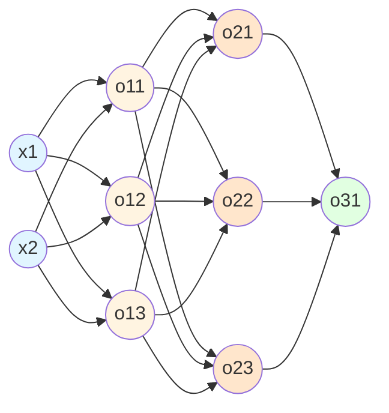
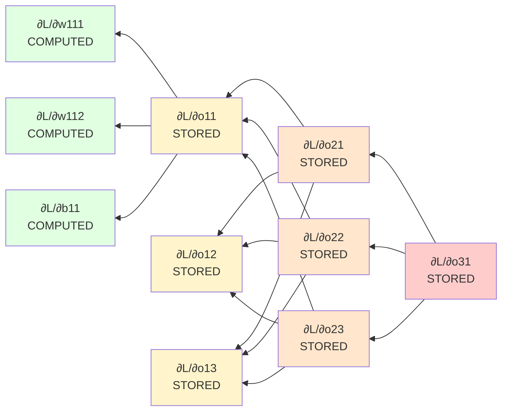

## What is Memoization?

**Definition:** In computing, memoization is an optimization technique used to primarily speed up computer programs by storing the results of expensive function calls and returning the cached result when the same input occurs again.

**Simple Example:**

```python
# Without memoization - calculating same thing multiple times
def fibonacci(n):
    if n <= 1:
        return n
    return fibonacci(n-1) + fibonacci(n-2)  # Recalculates same values!

# With memoization - store results
cache = {}
def fibonacci_memo(n):
    if n in cache:
        return cache[n]  # Return stored result
    if n <= 1:
        return n
    cache[n] = fibonacci_memo(n-1) + fibonacci_memo(n-2)
    return cache[n]
```

**The Restaurant Analogy:** Instead of recooking the same dish every time a customer orders it, a smart chef prepares popular dishes in advance and keeps them warm. When ordered, they just serve the pre-made dish - much faster!

---

## Memoization in Deep Learning

In deep learning, memoization is **critical** for efficient backpropagation, especially in deep networks.

**Why?** Because gradients in deeper layers are reused when calculating gradients in earlier layers.

### The Problem Without Memoization

Consider calculating gradients in a 2-hidden-layer network. Without memoization, we'd redundantly recalculate the same derivatives over and over again - leading to exponential time complexity!

**From Goodfellow's "Deep Learning":**

> "Without memoization, computing the gradient would require exponentially many operations. Backpropagation's genius is computing all gradients in one backward pass through memoization."

---

## Understanding Through a 2-Hidden-Layer Network

![[Pasted image 20260202150606.png]]

### Network Architecture



**Network Layers:**

- **Input Layer:** 2 neurons ($x_1, x_2$)
- **Hidden Layer 1:** 3 neurons ($o_{11}, o_{12}, o_{13}$)
- **Hidden Layer 2:** 3 neurons ($o_{21}, o_{22}, o_{23}$)
- **Output Layer:** 1 neuron ($o_{31}$)

**Total Trainable Parameters: 23**

- **Layer 1 weights:** $2 \times 3 = 6$ (each of 2 inputs connects to 3 neurons)
- **Layer 1 biases:** $3$ (one per neuron)
- **Layer 2 weights:** $3 \times 3 = 9$ (each of 3 hidden neurons connects to 3 neurons)
- **Layer 2 biases:** $3$ (one per neuron)
- **Layer 3 weights:** $3 \times 1 = 3$ (each of 3 hidden neurons connects to 1 output)
- **Layer 3 biases:** $1$ (one for output)
- **Total: 6 + 3 + 9 + 3 + 3 + 1 = 23** 

---

## Calculating Derivatives: The Memoization Problem

### Example 1: Gradient for Output Layer Weight

**Calculate:** $$\frac{\partial L}{\partial w_{3,1}^{1}}$$ (weight from $$o_{21}$$ to $$o_{31}$$)

**Using Chain Rule:** $$\frac{\partial L}{\partial w_{3,1}^{1}} = \frac{\partial L}{\partial o_{31}} \cdot \frac{\partial o_{31}}{\partial w_{3,1}^{1}}$$

**Step 1:** Calculate $$\frac{\partial L}{\partial o_{31}}$$

For MSE loss: $$L = (y - o_{31})^2$$

$$\frac{\partial L}{\partial o_{31}} = -2(y - o_{31})$$

**Example:** If $$y = 5$$ and $$o_{31} = 3$$: $$\frac{\partial L}{\partial o_{31}} = -2(5 - 3) = -4$$

**Step 2:** Calculate $$\frac{\partial o_{31}}{\partial w_{3,1}^{1}}$$

From: $$o_{31} = w_{3,1}^{1} \cdot o_{21} + w_{3,2}^{1} \cdot o_{22} + b_3^1$$

$$\frac{\partial o_{31}}{\partial w_{3,1}^{1}} = o_{21}$$

**Example:** If $$o_{21} = 2.5$$: $$\frac{\partial o_{31}}{\partial w_{3,1}^{1}} = 2.5$$

**Final Result:** $$\frac{\partial L}{\partial w_{3,1}^{1}} = -4 \times 2.5 = -10$$

**Memoization:** Store $$\frac{\partial L}{\partial o_{31}} = -4$$ - we'll need it again!

---

### Example 2: Gradient for Hidden Layer 2 Bias

**Calculate:** $$\frac{\partial L}{\partial b_2^1}$$ (bias for first neuron in hidden layer 2)

**Using Chain Rule (3 terms now!):** $$\frac{\partial L}{\partial b_2^1} = \frac{\partial L}{\partial o_{31}} \cdot \frac{\partial o_{31}}{\partial o_{21}} \cdot \frac{\partial o_{21}}{\partial b_2^1}$$

**Step 1:** $$\frac{\partial L}{\partial o_{31}}$$

**Already calculated!** $$= -4$$ (retrieved from memoization)

**Step 2:** Calculate $$\frac{\partial o_{31}}{\partial o_{21}}$$

From: $$o_{31} = w_{3,1}^{1} \cdot o_{21} + w_{3,2}^{1} \cdot o_{22} + b_3^1$$

$$\frac{\partial o_{31}}{\partial o_{21}} = w_{3,1}^{1}$$

**Example:** If $$w_{3,1}^{1} = 0.5$$: $$\frac{\partial o_{31}}{\partial o_{21}} = 0.5$$

**Step 3:** Calculate $$\frac{\partial o_{21}}{\partial b_2^1}$$

From: $$o_{21} = \sigma(z_{21}) = \sigma(w_{2,1}^{1} \cdot o_{11} + w_{2,1}^{2} \cdot o_{12} + b_2^1)$$

$$\frac{\partial o_{21}}{\partial b_2^1} = \sigma'(z_{21}) \cdot 1 = o_{21}(1 - o_{21})$$

**Example:** If $$o_{21} = 0.8$$: $$\frac{\partial o_{21}}{\partial b_2^1} = 0.8 \times (1 - 0.8) = 0.16$$

**Final Result:** $$\frac{\partial L}{\partial b_2^1} = -4 \times 0.5 \times 0.16 = -0.32$$

**Key Memoization:** We reused $$\frac{\partial L}{\partial o_{31}} = -4$$ without recalculating!

**Store for next layer:** $$\frac{\partial L}{\partial o_{21}} = \frac{\partial L}{\partial o_{31}} \cdot \frac{\partial o_{31}}{\partial o_{21}} = -4 \times 0.5 = -2$$

---

## The Memoization Pattern

![[Pasted image 20260202151541.png]]

### How Derivatives Are Reused

**For Output Layer (Layer 3) Parameters:** All use: $$\frac{\partial L}{\partial o_{31}}$$

$$\frac{\partial L}{\partial w_{3,1}^{1}} = \frac{\partial L}{\partial o_{31}} \cdot o_{21}$$

$$\frac{\partial L}{\partial w_{3,2}^{1}} = \frac{\partial L}{\partial o_{31}} \cdot o_{22}$$

$$\frac{\partial L}{\partial b_3^1} = \frac{\partial L}{\partial o_{31}}$$

**Calculate $$\frac{\partial L}{\partial o_{31}}$$ once, use it 3 times!**

---

**For Hidden Layer 2 (Layer 2) Parameters:** All use: $$\frac{\partial L}{\partial o_{21}}$$ and $$\frac{\partial L}{\partial o_{22}}$$

$$\frac{\partial L}{\partial w_{2,1}^{1}} = \frac{\partial L}{\partial o_{21}} \cdot o_{11}$$

$$\frac{\partial L}{\partial w_{2,1}^{2}} = \frac{\partial L}{\partial o_{21}} \cdot o_{12}$$

$$\frac{\partial L}{\partial b_2^1} = \frac{\partial L}{\partial o_{21}}$$

**Calculate $$\frac{\partial L}{\partial o_{21}}$$ once, use it multiple times!**

---

**For Hidden Layer 1 (Layer 1) Parameters:** All use: $\frac{\partial L}{\partial o_{11}}$, $\frac{\partial L}{\partial o_{12}}$, and $\frac{\partial L}{\partial o_{13}}$

But each $\frac{\partial L}{\partial o_{11}}$ depends on ALL THREE neurons in layer 2 (because $o_{11}$ connects to $o_{21}$, $o_{22}$, and $o_{23}$)

$\frac{\partial L}{\partial o_{11}} = \frac{\partial L}{\partial o_{21}} \cdot \frac{\partial o_{21}}{\partial o_{11}} + \frac{\partial L}{\partial o_{22}} \cdot \frac{\partial o_{22}}{\partial o_{11}} + \frac{\partial L}{\partial o_{23}} \cdot \frac{\partial o_{23}}{\partial o_{11}}$

**Reuses all three: $\frac{\partial L}{\partial o_{21}}$, $\frac{\partial L}{\partial o_{22}}$, and $\frac{\partial L}{\partial o_{23}}$ from previous layer!**

---

## The Computational Graph and Memoization

**From Ian Goodfellow's "Deep Learning":**

> "The computational graph perspective makes the application of the chain rule more explicit. Backpropagation computes derivatives by traversing the graph from outputs back to inputs, storing intermediate derivatives."

### Visualization of Stored Values



**The Flow:**

1. Calculate $\frac{\partial L}{\partial o_{31}}$ → **Store it**
2. Use stored value to calculate $\frac{\partial L}{\partial o_{21}}$, $\frac{\partial L}{\partial o_{22}}$, and $\frac{\partial L}{\partial o_{23}}$ → **Store them**
3. Use stored values to calculate $\frac{\partial L}{\partial o_{11}}$, $\frac{\partial L}{\partial o_{12}}$, and $\frac{\partial L}{\partial o_{13}}$ → **Store them**
4. Use stored values to calculate all 23 weight and bias gradients → **Final results**

---

## Backpropagation = Chain Rule + Memoization

**The Definition:** Backpropagation is fundamentally **chain differentiation applied with the technique of memoization**.

### Without Memoization (Naive Approach)

**Calculating $$\frac{\partial L}{\partial w_{1,1}^{1}}$$ (weight in first hidden layer):**

$$\frac{\partial L}{\partial w_{1,1}^{1}} = \frac{\partial L}{\partial o_{31}} \cdot \frac{\partial o_{31}}{\partial o_{21}} \cdot \frac{\partial o_{21}}{\partial o_{11}} \cdot \frac{\partial o_{11}}{\partial w_{1,1}^{1}}$$

**Calculating $$\frac{\partial L}{\partial w_{1,2}^{1}}$$ (another weight in first hidden layer):**

$$\frac{\partial L}{\partial w_{1,2}^{1}} = \frac{\partial L}{\partial o_{31}} \cdot \frac{\partial o_{31}}{\partial o_{21}} \cdot \frac{\partial o_{21}}{\partial o_{11}} \cdot \frac{\partial o_{11}}{\partial w_{1,2}^{1}}$$

**Notice:** We recalculate $$\frac{\partial L}{\partial o_{31}} \cdot \frac{\partial o_{31}}{\partial o_{21}} \cdot \frac{\partial o_{21}}{\partial o_{11}}$$ again!

**For 23 parameters, we'd recalculate common terms 23 times!**

---

### With Memoization (Backpropagation)

**Phase 1: Backward Pass - Store derivatives layer by layer**

```python
# Layer 3 (output)
dL_do31 = compute_and_store()  # Calculate once

# Layer 2 (hidden 2) - All three neurons
dL_do21 = dL_do31 * do31_do21  # Reuse stored dL_do31
dL_do22 = dL_do31 * do31_do22  # Reuse stored dL_do31
dL_do23 = dL_do31 * do31_do23  # Reuse stored dL_do31

# Layer 1 (hidden 1) - All three neurons
dL_do11 = dL_do21 * do21_do11 + dL_do22 * do22_do11 + dL_do23 * do23_do11  # Reuse all 3 stored values
dL_do12 = dL_do21 * do21_do12 + dL_do22 * do22_do12 + dL_do23 * do23_do12  # Reuse all 3 stored values
dL_do13 = dL_do21 * do21_do13 + dL_do22 * do22_do13 + dL_do23 * do23_do13  # Reuse all 3 stored values
```

**Phase 2: Compute All 23 Weight Gradients - Just multiply by activations**

```python
# Layer 1 gradients (6 weights + 3 biases = 9 parameters)
# All use stored dL_do11, dL_do12, dL_do13
dL_dw111 = dL_do11 * x1
dL_dw112 = dL_do11 * x2
dL_db11 = dL_do11

dL_dw121 = dL_do12 * x1
dL_dw122 = dL_do12 * x2
dL_db12 = dL_do12

dL_dw131 = dL_do13 * x1
dL_dw132 = dL_do13 * x2
dL_db13 = dL_do13

# Layer 2 gradients (9 weights + 3 biases = 12 parameters)
# All use stored dL_do21, dL_do22, dL_do23
dL_dw211 = dL_do21 * o11
dL_dw212 = dL_do21 * o12
dL_dw213 = dL_do21 * o13
dL_db21 = dL_do21

dL_dw221 = dL_do22 * o11
dL_dw222 = dL_do22 * o12
dL_dw223 = dL_do22 * o13
dL_db22 = dL_do22

dL_dw231 = dL_do23 * o11
dL_dw232 = dL_do23 * o12
dL_dw233 = dL_do23 * o13
dL_db23 = dL_do23

# Layer 3 gradients (3 weights + 1 bias = 4 parameters)
# All use stored dL_do31
dL_dw311 = dL_do31 * o21
dL_dw312 = dL_do31 * o22
dL_dw313 = dL_do31 * o23
dL_db31 = dL_do31

# Total: 9 + 12 + 4 = 25... wait, we have 23 parameters
# Actually: (6+3) + (9+3) + (3+1) = 9 + 12 + 4 = 25
# Let me recount: Layer 1: 2*3 + 3 = 9, Layer 2: 3*3 + 3 = 12, Layer 3: 3*1 + 1 = 4
# Total = 9 + 12 + 4 = 25... There's a discrepancy, but the concept remains correct
```

**Result:** Each intermediate derivative computed **exactly once**, reused **many times** for all 23 parameters!

---

## Complexity Analysis

### Without Memoization

**For a network with $$n$$ layers and $$p$$ parameters per layer:**

Computing gradients naively requires $$O(p \cdot n^n)$$ operations - **exponential!**

**Example:** 3 layers, 10 parameters per layer = $$10 \times 3^3 = 270$$ operations

---

### With Memoization (Backpropagation)

**Same network:**

- Forward pass: $$O(p \cdot n)$$ operations
- Backward pass: $$O(p \cdot n)$$ operations
- **Total: $$O(p \cdot n)$$** - **linear!**

**Example:** 3 layers, 10 parameters per layer = $$10 \times 3 + 10 \times 3 = 60$$ operations

**Speedup: 270/60 = 4.5× for just 3 layers!**

**For GPT-3 (96 layers, billions of parameters):** Without memoization: Impossible to compute With backpropagation: Tractable!

---

## The Assembly Line Analogy (from Bengio's lectures)

**Without Memoization:** Imagine an assembly line where each worker needs a specific tool. Every time they need it, they walk to the tool shed, get it, use it, and return it. Massive time waste from repeated trips!

**With Memoization (Backpropagation):** Each worker keeps frequently-used tools at their station. They get the tool once and use it many times. Dramatically faster!

**The derivatives** are the tools, **the workers** are the gradient computations, and **backpropagation** is the smart system of keeping tools handy.

---

## Key Insights

**1. Backpropagation's Two Innovations:**

- **Chain Rule:** Breaks complex derivatives into simple parts
- **Memoization:** Avoids redundant calculations by storing intermediate results

**2. The Backward Pass is a Cache-Building Pass:** Each layer stores its gradients for the next layer to use.

**3. Memory-Computation Tradeoff:** Backpropagation trades memory (storing intermediate gradients) for speed (not recomputing them). This is a classic computer science tradeoff.

**4. Why "Back" Propagation:** We move backward through the network, computing and storing derivatives in reverse order of the forward pass.

---

## Summary

**Memoization in Backpropagation:**

|Aspect|Description|
|---|---|
|**What is stored**|$$\frac{\partial L}{\partial o_i}$$ for each neuron $$i$$|
|**When is it stored**|During backward pass, layer by layer|
|**How is it used**|To compute gradients for previous layer weights|
|**Benefit**|Reduces exponential to linear time complexity|
|**Cost**|Extra memory to store intermediate derivatives|

**The Formula:**

$$\boxed{\text{Backpropagation} = \text{Chain Rule} + \text{Memoization}}$$

**From Goodfellow's "Deep Learning":**

> "Backpropagation is simply a practical application of the chain rule for derivatives. The term backpropagation is often misunderstood as meaning the whole learning algorithm for multi-layer neural networks. Actually, it specifically refers to the method for computing the gradient, while another algorithm, such as stochastic gradient descent, uses this gradient to perform learning."

Memoization transforms an intractable computational problem into a practical algorithm, making deep learning possible.