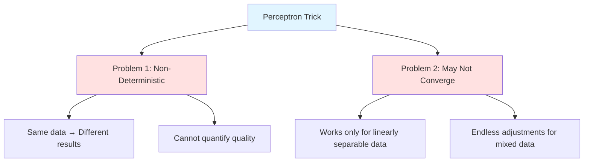
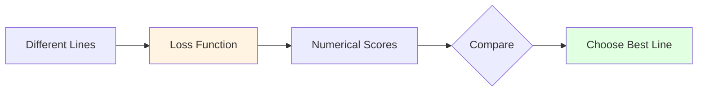
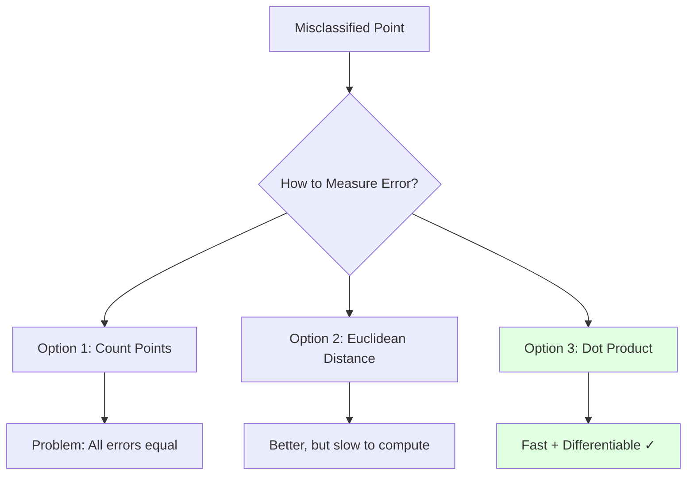
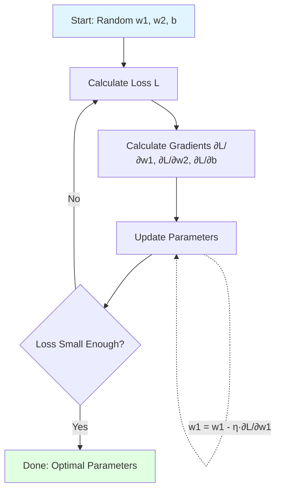
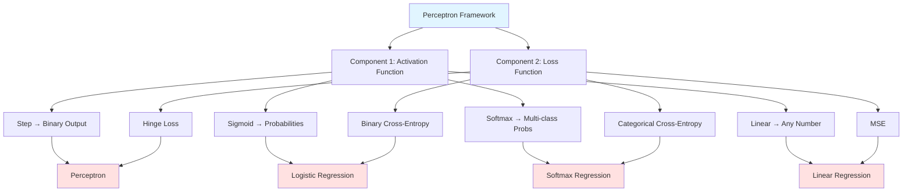

# Problems with the Perceptron Trick



## Lack of Confidence in Results

The values of $w_1$, $w_2$, and $b$ obtained from the perceptron trick are not guaranteed to be optimal for classification.

**Key observations**:

- If a point is correctly classified, the line does not move and $w_1$, $w_2$, $b$ remain the same
- If a point is misclassified, the line moves and $w_1$, $w_2$, $b$ change

**Major Flaw**: There is rarely a possibility of getting the same line after running the perceptron multiple times. This means we cannot quantify how good the result was.

**Analogy**: Imagine trying to hang a picture frame by randomly adjusting it each time someone says "it's crooked." You might eventually get it straight, but you have no way of knowing if it's the best possible position, and if you start over, you'll likely end up with a different result.

## Convergence Issues

The second problem is that the perceptron model may never converge. The perceptron trick is essentially a "jugaad" (workaround) rather than a rigorous optimization method.

**Why non-convergence happens**: If the data is not linearly separable (imagine trying to separate red and blue points that are mixed together like salt and pepper), the perceptron will keep adjusting the line forever, never settling on a final answer.

**Analogy**: It's like trying to draw a single straight line to separate cats from dogs in a room where they're all mixed together. No matter how you draw the line, some cats will be on the dog side and vice versa, so you keep redrawing endlessly.

---

# Loss Functions

To find the best possible line of classification, we use **loss functions** that help quantify the quality of our model's output.

## Definition

A **loss function** is a way to express how well or poorly a machine learning model is performing. It assigns a number to every line drawn, indicating whether that line is good or not.

![[Pasted image 20260117181718.png]]

The loss function is a function of $w_1$, $w_2$, and $b$:

$$f(w_1, w_2, b) = x$$

Where $x$ indicates the error for those specific values.

**Goal**: Minimize the value of $x$ by finding the optimal values of $w_1$, $w_2$, and $b$.

**Analogy**: Think of the loss function as a score in golf. Lower is better. Each different line (set of parameters) gives you a different score. Your goal is to find the line that gives you the lowest score (best classification).

## Why Loss Functions Matter

Without a loss function, we're flying blind. With it, we can:

1. **Compare different models** objectively
2. **Track improvement** during training
3. **Know when to stop** training (when loss stops decreasing)
4. **Debug problems** (if loss increases, something's wrong)



## Types of Loss Functions

Different problems require different loss functions:

- **0-1 Loss**: Simply counts mistakes (not differentiable, hard to optimize)
- **Hinge Loss (SVM)**: Penalizes points near the boundary
- **Log Loss**: Used when we need probability outputs
- **Mean Squared Error**: Used for regression problems

---

# Perceptron Loss Function

## Basic Formulation

$$f(w_1, w_2, b)$$

For every set of $w_1$, $w_2$, and $b$ (i.e., for every line), this loss function gives us the error.

## Simple Loss Functions

### 1. Number of Misclassified Points

The most basic loss function counts misclassified points. However, it treats all misclassified points equally, which is a limitation.

**Problem**: A point barely on the wrong side contributes the same to the loss as a point very far on the wrong side. This doesn't give the algorithm good guidance on which direction to move the line.

### 2. Perpendicular Distance (Euclidean Distance)

A better approach calculates the perpendicular distance of misclassified points from the line and sums them up.

![[Pasted image 20260117182540.png]]

**Intuition**: Points farther from the line are "more wrong" and should contribute more to the loss. This gives better guidance for optimization.

## Actual Perceptron Loss Function

The perceptron loss function is not based on Euclidean distance but on a simpler calculation.

**Example**: For line $2x + 3y + 4 = 0$

![[Pasted image 20260117182657.png]]

**Method**:

1. Take coordinates of misclassified points
2. Substitute them into the line equation
3. Calculate absolute values
4. Sum them up

This is essentially a **dot product**, which is computationally simpler than calculating distance.

![[Pasted image 20260117183016.png]]

**Why use dot product instead of distance?**

- Faster to compute (no square roots needed)
- Still captures how "wrong" a point is
- Easier to differentiate for gradient descent



## Scikit-learn Implementation (SGD Optimizer)

The loss function implemented in scikit-learn's SGD:

$$L(w_1, w_2, b) = \frac{1}{n} \sum_{i=1}^{n} L(Y_i, f(X_i)) + \alpha R(w_1, w_2)$$

The second part $\alpha R(w_1, w_2)$ is the regularization term, which we can ignore for now.

**Note on regularization**: This term prevents the model from becoming too complex. Think of it as a penalty for making the weights too large, which helps prevent overfitting.

**Simplified**:

$$L(w_1, w_2, b) = \frac{1}{n} \sum_{i=1}^{n} L(Y_i, f(X_i))$$

Where $n$ = number of rows in data

**Why divide by $n$?** To get the average loss per point. This makes the loss comparable across datasets of different sizes.

### Individual Loss Component

$$L(Y_i, f(X_i)) = \max(0, -Y_i f(X_i))$$

Where:

$$f(X_i) = w_1 x_1 + w_2 x_2 + b$$

**Breaking down the formula**:

- $Y_i$ is the true label (+1 or -1)
- $f(X_i)$ is our prediction (a number, not yet converted to +1 or -1)
- If $Y_i$ and $f(X_i)$ have the same sign, the point is classified correctly
- The $\max(0, ...)$ ensures we only penalize misclassified points

**Note**: The loss function depends on three parameters: $w_1$, $w_2$, and $b$. It changes only when we modify one or more of these values.

## Complete Mathematical Formulation

$$L = \arg\min_{w_1, w_2, b} \frac{1}{n} \sum_{i=1}^{n} \max(0, -Y_i f(X_i))$$

We use **gradient descent** to find the minimum value of this loss function.

**What does $\arg\min$ mean?** It means "find the arguments (values) that minimize." So we're looking for the specific values of $w_1$, $w_2$, and $b$ that give us the smallest possible loss.

---

# Mathematical and Geometric Intuition

![[Pasted image 20260117183910.png]]

The perceptron loss function has both mathematical and geometric interpretations:

**Mathematical**: The $\max(0, -Y_i f(X_i))$ ensures that:

- Correctly classified points contribute 0 to the loss
- Misclassified points contribute proportionally to their distance from the decision boundary

**Geometric**: The loss represents how far misclassified points are from being on the correct side of the decision boundary.

**Intuition**:

- If a green point is on the green side: loss = 0 (perfect!)
- If a green point is barely on the red side: small positive loss (needs small adjustment)
- If a green point is deep in the red side: large positive loss (needs big adjustment)

This creates a "landscape" where the algorithm can "roll downhill" toward better solutions.

---

# Gradient Descent

![[Pasted image 20260117185748.png]]

We use gradient descent to minimize the perceptron loss function.

## The Gradient Descent Analogy

Imagine you're blindfolded on a hilly terrain and want to reach the lowest point (valley). You can:

1. Feel the slope under your feet (calculate the gradient)
2. Take a small step downhill (update parameters by a small amount)
3. Repeat until you can't go any lower

That's exactly what gradient descent does with the loss function.

## Algorithm

**Initialize**: Random values of $w_1$, $w_2$, and $b$ (e.g., all set to 1)

```
for i in epochs:
    w1 = w1 - η · ∂L/∂w1
    w2 = w2 - η · ∂L/∂w2
    b = b - η · ∂L/∂b
```

Where $\eta$ is the learning rate, and we calculate the three partial derivatives.

**Understanding the update rule**:

- The partial derivative $\frac{\partial L}{\partial w_1}$ tells us which direction increases loss
- The negative sign means we go in the opposite direction (decrease loss)
- The learning rate $\eta$ controls how big a step we take

**Choosing learning rate**:

- Too large: We might overshoot the minimum (like taking huge steps and missing the valley)
- Too small: Training takes forever (like taking tiny baby steps)
- Typical values: 0.001 to 0.1



## Using Chain Rule

![[Pasted image 20260117185524.png]]

![[Pasted image 20260117185643.png]]

![[Pasted image 20260117185708.png]]

The chain rule allows us to compute the gradients of the loss function with respect to each parameter.

**Why chain rule?** Our loss function is composite: $L$ depends on $f(X_i)$, which depends on $w_1$, $w_2$, $b$. The chain rule lets us "chain" these dependencies together to find how $L$ changes when we change any parameter.

**Practical note**: In modern frameworks like TensorFlow and PyTorch, you don't need to calculate gradients manually. The framework does it automatically using automatic differentiation.

---

# Perceptron Flexibility: Other Loss Functions

The perceptron is a flexible mathematical model. By changing the activation function and loss function, we can adapt it for different tasks.

**Key insight**: The perceptron is really a framework. The same basic structure (weighted sum of inputs plus bias) can solve many different problems just by swapping out two components: the activation function and the loss function.



## Binary Classification with Probabilities

Instead of outputting 1 or -1, we can output probabilities.

**Activation Function**: Sigmoid

$$\sigma(z) = \frac{1}{1 + e^{-z}}$$

**What sigmoid does**: Squashes any number into the range (0, 1), which we can interpret as a probability.

- Input -∞ → Output ≈ 0
- Input 0 → Output = 0.5
- Input +∞ → Output ≈ 1

**Loss Function**: Binary Cross-Entropy

$$L = -Y_i \log(\hat{Y_i}) - (1 - Y_i) \log(1 - \hat{Y_i})$$

**Why this loss?** It heavily penalizes confident wrong predictions. If the true label is 1 and you predict 0.01 (very confident it's 0), the loss becomes very large. This encourages the model to be both accurate and appropriately confident.

Applying SGD on this function gives us **Logistic Regression**.

**Note**: Perceptron ≈ Logistic Regression (practically speaking)

Technically, they are the same algorithm only when:

- Activation function = Sigmoid
- Loss function = Binary Cross-Entropy

## Multiclass Classification

**Activation Function**: Softmax

$$f(z_i) = \frac{e^{z_i}}{\sum_{j=1}^{k} e^{z_j}}$$

**What softmax does**: Converts a vector of numbers into a probability distribution. All outputs sum to 1, and each represents the probability of that class.

**Example**: For 3 classes (cat, dog, bird), softmax might output [0.7, 0.2, 0.1], meaning 70% confident it's a cat.

**Loss Function**: Categorical Cross-Entropy

$$L = \sum_{i=1}^{M} Y_j \log(\hat{Y_j})$$

This gives us **Softmax Regression** for multiclass classification with probability outputs.

**Use case**: Image classification, text categorization, any problem with more than 2 classes.

## Regression

**Activation Function**: Linear (identity function)

$$f(z) = z$$

**What linear does**: Nothing. It just passes the value through unchanged. This allows the output to be any real number.

**Loss Function**: Mean Squared Error (MSE)

$$\text{MSE} = \frac{1}{n} \sum_{i=1}^{n} (Y_i - \hat{Y_i})^2$$

**Why squared error?**

- Penalizes large errors more heavily (being off by 10 is worse than being off by 5 twice)
- Always positive (no cancellation between positive and negative errors)
- Differentiable (smooth gradient for optimization)

The perceptron becomes **Linear Regression**.

**Use case**: Predicting house prices, temperature, stock prices, any continuous value.

---

# Summary Table

|Loss Function|Activation Function|Output|Model|Use Case|
|---|---|---|---|---|
|Hinge Loss|Step|1 or -1|Perceptron (Binary Classifier)|Basic binary classification|
|Log Loss (Binary Cross-Entropy)|Sigmoid|Probabilities (0 to 1)|Logistic Regression (Binary Classifier)|Binary classification with confidence scores|
|Categorical Cross-Entropy|Softmax|Probabilities|Softmax Regression (Multiclass Classification)|Multiple classes (cat/dog/bird)|
|MSE|Linear|Continuous Number|Linear Regression|Predicting numerical values|

---

# Key Takeaways for Beginners

1. **Loss functions are your compass**: They tell you if you're getting better or worse. Without them, you're just guessing.
    
2. **The perceptron is a Swiss Army knife**: Same basic tool, different attachments for different jobs. Change the activation and loss, solve different problems.
    
3. **Gradient descent is hill-climbing in reverse**: You're always trying to go downhill on the loss landscape.
    
4. **Learning rate matters**: Too fast and you'll overshoot, too slow and you'll never finish. Finding the right balance is key.
    
5. **Different problems need different tools**: Binary classification needs different loss/activation than regression. Match the tool to the task.
    
6. **Modern frameworks do the hard math**: You don't need to manually calculate gradients. Focus on understanding the concepts and choosing the right components.