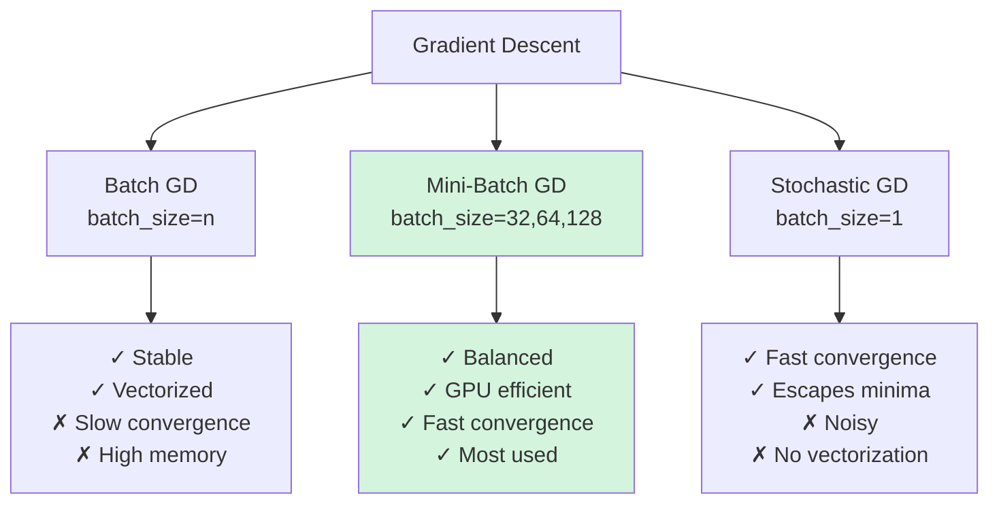

## Introduction

![[Pasted image 20260203105035.png]]

Gradient descent is a method to minimize $$J(\theta)$$ (the loss function).

**Goal:** Find parameters $$\theta$$ (weights and biases) that minimize the loss.

---

## Revisiting Backpropagation

![[Pasted image 20260203105307.png]]

**Key Insight:** The entire update rule of backpropagation IS gradient descent:

$$w_{new} = w_{old} - \eta \cdot \frac{\partial L}{\partial w}$$

Backpropagation computes the gradients ($$\frac{\partial L}{\partial w}$$), and gradient descent uses them to update weights.

---

## Three Flavours of Gradient Descent

1. **Batch Gradient Descent** (Vanilla)
2. **Stochastic Gradient Descent (SGD)**
3. **Mini-Batch Gradient Descent**

---

## 1. Batch Gradient Descent

![[Pasted image 20260203105537.png]]

### The Concept

Use the **entire dataset** to compute gradients, then make **one update** to parameters.

**From Good-fellow's "Deep Learning":**

> "Batch gradient descent processes the entire training set before taking a single gradient descent step. This provides a stable estimate of the gradient but can be slow for large datasets."

### Example Walkthrough

**Dataset:** 50 data points **Epoch 5:**

1. **Forward pass on ALL 50 points:**
    
    ```python
    y_hat = np.dot(X, w) + b  # Shape: (50,)
    ```
    
2. **Calculate loss across ALL 50 points:**
    
    ```python
    L = sum((y - y_hat)**2) / 50  # MSE over entire dataset
    ```
    
3. **Update parameters ONCE:**
    
    ```python
    w = w - eta * (dL/dw)
    b = b - eta * (dL/db)
    ```
    

### Pseudocode

```python
epochs = 10
X = dataset with 50 rows  # Entire dataset
y = actual values (50,)

for epoch in range(epochs):
    # Forward pass on ENTIRE dataset
    y_hat = np.dot(X, w) + b
    
    # Calculate loss on ENTIRE dataset
    loss = np.mean((y - y_hat)**2)
    
    # Calculate gradients using ALL 50 points
    dL_dw = (2/50) * np.dot(X.T, (y_hat - y))
    dL_db = (2/50) * np.sum(y_hat - y)
    
    # Update parameters ONCE per epoch
    w = w - eta * dL_dw
    b = b - eta * dL_db
    
    print(f"Epoch {epoch + 1}, Loss: {loss}")
```

**Key:** Number of epochs = Number of updates = 10

---

## 2. Stochastic Gradient Descent (SGD)

![[Pasted image 20260203110435.png]]

### The Concept

Use **one random data point** at a time to compute gradients and update parameters.

**From Ian Goodfellow's "Deep Learning":**

> "Stochastic gradient descent uses a single example at each iteration. The term 'stochastic' comes from the fact that the gradient is an expectation over randomly sampled data."

### Example Walkthrough

**Dataset:** 50 data points **Epoch 1:**

For each of 50 points:

1. Pick one random point: $$(x_i, y_i)$$
2. Forward pass: $$\hat{y}_i = w \cdot x_i + b$$
3. Calculate loss: $$L_i = (y_i - \hat{y}_i)^2$$
4. Update: $$w = w - \eta \cdot \frac{\partial L_i}{\partial w}$$

Repeat 50 times → 50 updates per epoch

### Pseudocode

```python
epochs = 10
X = dataset with 50 rows
y = actual values (50,)

for epoch in range(epochs):
    # Shuffle data to remove bias
    indices = np.random.permutation(50)
    X_shuffled = X[indices]
    y_shuffled = y[indices]
    
    epoch_loss = []
    
    # Loop through EACH data point
    for i in range(50):
        x_i = X_shuffled[i]  # Single point
        y_i = y_shuffled[i]  # Single label
        
        # Forward pass on SINGLE point
        y_hat_i = np.dot(x_i, w) + b
        
        # Calculate loss on SINGLE point
        loss_i = (y_i - y_hat_i)**2
        epoch_loss.append(loss_i)
        
        # Calculate gradients using SINGLE point
        dL_dw = 2 * x_i * (y_hat_i - y_i)
        dL_db = 2 * (y_hat_i - y_i)
        
        # Update parameters for EACH point
        w = w - eta * dL_dw
        b = b - eta * dL_db
    
    print(f"Epoch {epoch + 1}, Avg Loss: {np.mean(epoch_loss)}")
```

**Key:**

- Number of updates = epochs × dataset_size = 10 × 50 = 500
- Much more frequent updates than batch GD

---

![[Pasted image 20260203110404.png]]

---

## Batch vs Stochastic: Key Comparisons

### 1. Speed Per Epoch

**Question:** Given the same number of epochs, which completes faster?

**Answer:** **Batch gradient descent** (per epoch)

**Reason:**

- Batch GD: 10 epochs = 10 updates
- SGD: 10 epochs = 10 × 50 = 500 updates
- More updates = more computation time

**But:** Batch GD uses vectorization (faster per update), SGD does not.

---

### 2. Speed to Convergence

**Question:** Given the same number of epochs, which converges faster?

**Answer:** **Stochastic gradient descent**

**Explanation:**

- Batch GD makes **accurate but slow** progress (10 careful steps)
- SGD makes **noisy but frequent** progress (500 exploratory steps)
- SGD often reaches "good enough" solution faster despite noisiness

**From Sebastian Ruder's "An Overview of Gradient Descent Algorithms":**

> "SGD performs frequent updates with high variance, causing the objective function to fluctuate heavily. However, this is actually a feature - it allows SGD to jump to new and potentially better local minima."

**Typical Reality:**

- Batch GD needs fewer epochs BUT each epoch is expensive
- SGD needs more epochs BUT converges to acceptable solution faster in wall-clock time

---

### 3. Loss Curve Behavior

![[Pasted image 20260203113054.png]]

**Batch Gradient Descent:**

```
Loss
  ↑
  |＼
  | ＼
  |  ＼___
  |       ＼_____
  |_____________→ Epochs
  
  Smooth, steady decrease
```

**Stochastic Gradient Descent:**

```
Loss
  ↑  ∧ ∨
  | ∨ ∧ ∨∧
  |∨ ∧  ∨ ∧∨
  | ∧ ∨   ∨ ∧
  |___∨_____∨__→ Epochs
  
  Noisy, jagged decrease
```

**Why the Difference?**

**Batch GD:**

- Entire dataset decides direction → stable, consistent gradient
- Like 50 people voting → consensus is stable

**Stochastic GD:**

- Single random point decides direction → noisy, varying gradient
- Like 1 person voting → opinion changes constantly

**The Advantage of Noise (from Bottou's "Large-Scale Machine Learning"):**

> "The noise in SGD helps escape sharp local minima and saddle points. This stochastic nature acts as a form of regularization."

**The Jaggedness helps:**

- Escape local minima (random jumps can kick you out)
- Explore parameter space better
- Avoid getting stuck

**The Downside:**

- Never perfectly converges to exact minimum
- Oscillates around the optimal solution
- Solution is approximate, not exact

---

### 4. Vectorization and Memory

**Batch Gradient Descent:**

- ✅ Uses vectorization: `np.dot(X, w)` processes all 50 points at once
- ✅ Faster computation per update (GPU optimized)
- ❌ Requires loading entire dataset in RAM
- ❌ Impossible for datasets larger than available memory

**Stochastic Gradient Descent:**

- ❌ No vectorization: processes one point at a time
- ❌ Slower per update (no parallelization)
- ✅ Minimal memory footprint (one sample at a time)
- ✅ Works with datasets of any size

**Batch Size Interpretation:**

- `batch_size = n` (entire dataset) → Batch GD
- `batch_size = 1` → Stochastic GD
- `batch_size = 32, 64, 128...` → Mini-batch GD

---

## 3. Mini-Batch Gradient Descent

![[Pasted image 20260203113840.png]]

### The Concept

Use **small batches** of data to compute gradients and update parameters.

**Best of both worlds:** Combines vectorization efficiency with frequent updates.

**From Goodfellow's "Deep Learning":**

> "Mini-batch sizes are generally driven by the following factors: Larger batches provide a more accurate estimate of the gradient, but with less than linear returns. Multicore architectures are underutilized by extremely small batches, which motivates using some absolute minimum batch size."

### Example Walkthrough

**Dataset:** 50 data points **Batch size:** 32 **Number of batches:** $$\lceil 50/32 \rceil = 2$$ batches (32 + 18 points)

**Epoch 1:**

1. **Batch 1:** 32 points → compute gradient → update
2. **Batch 2:** 18 points → compute gradient → update

**Total updates per epoch:** 2

### Pseudocode

```python
epochs = 10
batch_size = 32
X = dataset with 50 rows
y = actual values (50,)

num_batches = int(np.ceil(50 / batch_size))  # = 2 batches

for epoch in range(epochs):
    # Shuffle data
    indices = np.random.permutation(50)
    X_shuffled = X[indices]
    y_shuffled = y[indices]
    
    epoch_loss = []
    
    # Loop through batches
    for batch_idx in range(num_batches):
        # Get batch indices
        start_idx = batch_idx * batch_size
        end_idx = min(start_idx + batch_size, 50)
        
        # Extract batch
        X_batch = X_shuffled[start_idx:end_idx]  # Shape: (32,) or (18,)
        y_batch = y_shuffled[start_idx:end_idx]
        
        # Forward pass on BATCH (vectorized)
        y_hat_batch = np.dot(X_batch, w) + b
        
        # Calculate loss on BATCH
        loss_batch = np.mean((y_batch - y_hat_batch)**2)
        epoch_loss.append(loss_batch)
        
        # Calculate gradients using BATCH
        batch_size_actual = len(X_batch)
        dL_dw = (2/batch_size_actual) * np.dot(X_batch.T, (y_hat_batch - y_batch))
        dL_db = (2/batch_size_actual) * np.sum(y_hat_batch - y_batch)
        
        # Update parameters per BATCH
        w = w - eta * dL_dw
        b = b - eta * dL_db
    
    print(f"Epoch {epoch + 1}, Avg Loss: {np.mean(epoch_loss)}")
```

**Key:** Number of updates = epochs × num_batches = 10 × 2 = 20

---

## Comparison Summary

|Aspect|Batch GD|Mini-Batch GD|Stochastic GD|
|---|---|---|---|
|**Batch Size**|n (all data)|32, 64, 128...|1|
|**Updates/Epoch**|1|n/batch_size|n|
|**Speed/Epoch**|Fast (vectorized)|Medium|Slow|
|**Convergence Speed**|Slow|Medium|Fast|
|**Loss Curve**|Smooth|Slightly noisy|Very noisy|
|**Memory Usage**|High (all data)|Medium|Low|
|**Final Solution**|Exact|Very good|Approximate|
|**GPU Efficiency**|Excellent|Good|Poor|
|**Escaping Local Minima**|Poor|Good|Excellent|

**In Practice:** **Mini-batch is the standard choice** (batch_size = 32, 64, 128, 256)

---

## Why Batch Size is Powers of 2?

**Common Batch Sizes:** 16, 32, 64, 128, 256, 512

### Reasons:

**1. Memory Alignment on GPU**

- GPUs process data in blocks of $$2^n$$
- Powers of 2 align perfectly with GPU memory architecture
- Reduces wasted memory and computation

**2. Vectorization Efficiency**

- Tensor cores and CUDA cores optimized for $$2^n$$ dimensions
- Matrix operations faster when dimensions are powers of 2

**3. Avoid Padding**

- If batch size doesn't align, hardware may auto-pad inputs
- Padding = wasted memory and computation
- Powers of 2 minimize padding needs

**Example:**

- Batch size = 32 → GPU processes efficiently
- Batch size = 30 → GPU pads to 32 anyway → wasted 2 slots

---

## Handling Incomplete Batches

**Problem:** What if dataset size doesn't divide evenly by batch size?

**Example:**

- Dataset: 400 rows
- Batch size: 150

$$\text{Number of batches} = \lceil 400/150 \rceil = 3$$

**Batch Distribution:**

1. Batch 1: 150 samples
2. Batch 2: 150 samples
3. Batch 3: 100 samples (remaining)

**Solutions:**

**Option 1: Keep last batch smaller** (Most common)

```python
num_batches = np.ceil(n / batch_size)
# Last batch has fewer samples
```

**Option 2: Drop last incomplete batch**

```python
num_batches = n // batch_size
# Ignore last 100 samples
# Used when last batch is too small
```

**Option 3: Pad last batch**

```python
# Duplicate random samples to fill last batch to 150
# Less common, can introduce bias
```

**In Keras/PyTorch:** `drop_last=True/False` parameter controls this

---

## Visual Summary



---

## Practical Recommendations

**From Andrew Ng's Deep Learning Specialization:**

**1. Start with Mini-Batch**

- Default batch size: 64 or 128
- For small datasets (<2000 samples): Use batch GD
- For large datasets: Use mini-batch

**2. Tune Batch Size**

- Larger batches: More stable, but slower convergence and poor generalization
- Smaller batches: Noisy, but faster convergence and better generalization
- Sweet spot: 32-128 for most problems

**3. Monitor Both**

- Training loss (what optimizer sees)
- Validation loss (how well model generalizes)
- If validation loss increases while training decreases → reduce batch size

**4. Combine with Other Techniques**

- Learning rate schedules
- Momentum (smooths SGD updates)
- Adam optimizer (adaptive learning rates per parameter)

---

## Key Takeaway

**Mini-batch gradient descent** combines the best aspects of both extremes:

- Vectorization efficiency of batch GD
- Frequent updates of stochastic GD
- Manageable memory footprint
- Good convergence properties

This is why virtually all modern deep learning uses mini-batch gradient descent with batch sizes between 32-256.