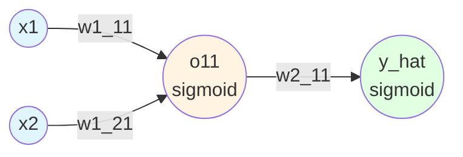

![[Pasted image 20260203115725.png]]

## Understanding the Problem

### The Core Issue

**Think of it this way:**

$$0.1 \times 0.1 \times 0.1 \times 0.1 = 0.0001$$

A very small number! When you multiply many small numbers together, the result **vanishes** to nearly zero.

### Key Characteristics

1. **Found in deep neural networks only** - The more layers, the worse it gets
2. **Associated with specific activation functions** - Sigmoid and Tanh are main culprits
3. **Causes training to stall** - Weights stop updating effectively

---

## Revisiting Backpropagation

### The Update Rule

$$w_{new} = w_{old} - \eta \cdot \frac{\partial L}{\partial w}$$

We calculate the derivative of loss with respect to each weight.

### Neural Network Example



**Architecture:**

- Input Layer: 2 neurons ($$x_1, x_2$$)
- Hidden Layer: 1 neuron ($$o_{11}$$) with sigmoid activation
- Output Layer: 1 neuron ($$\hat{y}$$) with sigmoid activation

---

## The Mathematics of Vanishing

### Chain Rule Breakdown

$$\frac{\partial L}{\partial w_{1,1}^1} = \frac{\partial L}{\partial \hat{y}} \cdot \frac{\partial \hat{y}}{\partial z_2} \cdot \frac{\partial z_2}{\partial o_{11}} \cdot \frac{\partial o_{11}}{\partial w_{1,1}^1}$$

Where:

- $$\frac{\partial L}{\partial \hat{y}}$$ - How loss changes with prediction
- $$\frac{\partial \hat{y}}{\partial z_2}$$ - Sigmoid derivative at output layer
- $$\frac{\partial z_2}{\partial o_{11}}$$ - Weight from hidden to output
- $$\frac{\partial o_{11}}{\partial w_{1,1}^1}$$ - Sigmoid derivative at hidden layer × input

### The Problem

**Each term can be between 0 and 1:**

Let's say:

- $$\frac{\partial L}{\partial \hat{y}} = 0.5$$
- $$\frac{\partial \hat{y}}{\partial z_2} = 0.2$$ (sigmoid derivative, max = 0.25)
- $$\frac{\partial z_2}{\partial o_{11}} = 0.3$$
- $$\frac{\partial o_{11}}{\partial w_{1,1}^1} = 0.4$$ (sigmoid derivative × input)

**Result:** $$\frac{\partial L}{\partial w_{1,1}^1} = 0.5 \times 0.2 \times 0.3 \times 0.4 = 0.012$$

### The Update

**Starting weight:** $$w_0 = 1.0$$

**Update (with $$\eta = 1$$):** $$w_{new} = 1.0 - 1.0 \times 0.012 = 0.988$$

**Change:** Only $$0.012$$ - this is **vanishingly small!**

After training: $$w = 0.99999...$$ (barely changed from 1.0)

---

## Why Deep Networks Suffer More

### 2-Layer Network (Our Example)

$$\frac{\partial L}{\partial w_1} = \text{4 terms multiplied}$$

If each ≈ 0.2: $$0.2^4 = 0.0016$$ (small but manageable)

### 10-Layer Deep Network

$$\frac{\partial L}{\partial w_1} = \text{20+ terms multiplied}$$

If each ≈ 0.2: $$0.2^{20} \approx 10^{-14}$$ (essentially zero!)

**From Goodfellow's "Deep Learning":**

> "As the network depth increases, gradients of the loss function with respect to parameters in early layers become vanishingly small. This makes learning in early layers extremely slow or completely stalled."

### Visualization

```
Layer 10 (output):    ∂L/∂w = 0.01       (small)
Layer 9:              ∂L/∂w = 0.001      (smaller)
Layer 8:              ∂L/∂w = 0.0001     (tiny)
...
Layer 2:              ∂L/∂w = 10^-12     (vanished!)
Layer 1 (input):      ∂L/∂w = 10^-15     (gone!)
```

Early layers stop learning → network can't train properly.

---

## Historical Context: The AI Winter

**1980s-1990s: The Dark Ages**

The vanishing gradient problem was a **major reason** for the first AI winter:

1. **Only sigmoid and tanh existed** as activation functions
2. **Researchers tried to build deep networks** (5+ layers)
3. **Training completely failed** - networks wouldn't learn
4. **No one understood why** - the math seemed correct
5. **Funding dried up** - deep learning seemed fundamentally broken

**The Problem with Sigmoid and `tan(h)`:**

Both squash values between 0 and 1 (or -1 and 1 for tanh).

![[Pasted image 20260203121000.png]]

**Sigmoid:** $$\sigma(x) = \frac{1}{1 + e^{-x}}$$

- Output range: (0, 1)
- **Derivative max: 0.25** at $$x = 0$$
- For large |x|: derivative ≈ 0

![[Pasted image 20260203121136.png]]

**`tan(h)`:** $$\tanh(x) = \frac{e^x - e^{-x}}{e^x + e^{-x}}$$

- Output range: (-1, 1)
- **Derivative max: 1.0** at $$x = 0$$
- For large |x|: derivative ≈ 0

**The Saturation Problem:**

When inputs are large (positive or negative), both functions "saturate" - their outputs barely change, making derivatives tiny.

```
Sigmoid Derivative:
   0.25|    ∧
       |   / \
       |  /   \
       | /     \
   0   |/       \___
       |_____________
         -5  0  5
         
  Only significant in narrow range!
```

In a 10-layer network with sigmoid: $$0.25^{10} = 0.00000095$$ - gradient has vanished!

---

## How to Identify Vanishing Gradient Problem

### Method 1: Monitor Training Loss

**Healthy Training:**

```
Epoch 1: Loss = 2.5
Epoch 2: Loss = 2.1
Epoch 3: Loss = 1.8
Epoch 4: Loss = 1.5
...
```

**Vanishing Gradient:**

```
Epoch 1: Loss = 2.5
Epoch 2: Loss = 2.5
Epoch 3: Loss = 2.5
Epoch 4: Loss = 2.5
...
```

**No change in loss = gradients are too small to update weights**

### Method 2: Plot Weight Values

**Create epoch vs. weight value graphs:**

```python
import matplotlib.pyplot as plt

epochs = range(100)
weight_history = []  # Track a specific weight

for epoch in epochs:
    # ... training ...
    weight_history.append(model.layer1.weight[0, 0])

plt.plot(epochs, weight_history)
plt.xlabel('Epoch')
plt.ylabel('Weight Value')
plt.title('Weight w1_11 over Training')
plt.show()
```

**Healthy:**

```
Weight
  1.5|        ____
     |      _/
  1.0|    /
     |  _/
  0.5|_/
     |_____________
       0  50  100  Epoch
     
  Weight changes - learning!
```

**Vanishing Gradient:**

```
Weight
  1.0|________________
     |
  0.5|
     |
  0  |_____________
       0  50  100  Epoch
     
  Weight constant - not learning!
```

**If the weight plot is flat/constant → vanishing gradient problem!**

---

## Solutions to Vanishing Gradient Problem

### 1. Reduce Model Complexity

**Approach:** Use a shallow neural network (fewer layers)

**Logic:**

- Fewer layers = fewer terms in gradient product
- $$0.2^4$$ (4 layers) vs $$0.2^{20}$$ (20 layers)
- Gradients stay larger

**Why This Works:** With only 2-3 layers, gradients don't vanish as much.

**Why This Sucks:**

- Deep networks learn complex patterns better
- Shallow networks = limited representation power
- You're handicapping your model!

**From Bengio's "Learning Deep Architectures for AI":**

> "Shallow architectures can be quite inefficient in terms of the number of computational elements required to represent some functions."

**Verdict:** Not practical for modern problems. We WANT depth!

---

### 2. Use Different Activation Function: ReLU

**ReLU (Rectified Linear Unit):**

$$f(x) = \max(0, x) = \begin{cases} x & \text{if } x > 0 \ 0 & \text{if } x \leq 0 \end{cases}$$

![[Pasted image 20260203123455.png]]

**Properties:**

- **Not squished** between 0 and 1
- For $$x > 0$$: output = $$x$$ (linear, not saturating)
- For $$x \leq 0$$: output = 0

**Derivative:** $$f'(x) = \begin{cases} 1 & \text{if } x > 0 \ 0 & \text{if } x \leq 0 \end{cases}$$

**Why ReLU Solves Vanishing Gradient:**

**Sigmoid chain:** $$0.2 \times 0.2 \times 0.2 = 0.008$$ (vanishes)

**ReLU chain:** $$1 \times 1 \times 1 = 1$$ (doesn't vanish!)

For positive inputs, gradient is exactly 1 - no vanishing!

**From Andrew Ng's Deep Learning Course:**

> "ReLU has become the default activation function for hidden layers. It doesn't saturate for positive values, which helps mitigate the vanishing gradient problem."

---

### The Dying ReLU Problem

**New Problem:** If activation = 0, derivative = 0 → weight never updates!

**Example:**

```
z = -5 (negative)
a = ReLU(-5) = 0
∂a/∂z = 0

Weight update: w_new = w_old - η × 0 = w_old
(NO UPDATE!)
```

**When This Happens:**

- Neuron outputs 0 for all inputs
- Gradient is always 0
- Neuron is "dead" - never learns again

**Causes:**

- Poor weight initialization (too negative)
- Learning rate too high (weights jump to negative values)
- Once a ReLU neuron dies, it stays dead!

---

### Solution: Leaky ReLU

**Formula:** $$f(x) = \max(0.01x, x) = \begin{cases} x & \text{if } x > 0 \ 0.01x & \text{if } x \leq 0 \end{cases}$$

**Derivative:** $$f'(x) = \begin{cases} 1 & \text{if } x > 0 \ 0.01 & \text{if } x \leq 0 \end{cases}$$

**Visualization:**

```
f(x)
  ↑
  |        /
  |       /
  |      /
  |     /
  |    /_____ (slope = 0.01, not flat!)
  |___/______→ x
     0
```

![[Pasted image 20260203124900.png]]

**Why It's Better:**

- For $$x > 0$$: derivative = 1 (like ReLU)
- For $$x < 0$$: derivative = 0.01 (small but NOT zero!)
- **Neuron can't die** - always has small gradient to recover

**Variants:**

- **Leaky ReLU:** Fixed slope (0.01)
- **PReLU (Parametric ReLU):** Learnable slope (parameter α)
- **ELU (Exponential Linear Unit):** Smooth exponential for negatives

**From He et al. "Delving Deep into Rectifiers":**

> "Parametric ReLU improves model fitting with negligible extra computational cost and little overfitting risk."

---

### 3. Proper Weight Initialization

**The Problem:** Random initialization can start weights in bad regions

**Bad Initialization:**

- Too large → activations saturate → gradients vanish
- Too small → activations near zero → gradients vanish
- All same → symmetry problem

**Solutions:**

**Xavier/Glorot Initialization:** $$w \sim \mathcal{N}\left(0, \frac{2}{n_{in} + n_{out}}\right)$$

Where $$n_{in}$$ = input neurons, $$n_{out}$$ = output neurons

**Best for:** Sigmoid, Tanh

**He Initialization:** $$w \sim \mathcal{N}\left(0, \frac{2}{n_{in}}\right)$$

**Best for:** ReLU and variants

**Why It Works:** Keeps variance of activations roughly constant across layers → prevents gradients from vanishing OR exploding.

**From He et al. "Delving Deep into Rectifiers":**

> "Proper initialization can robustly lead to convergence of very deep models."

---

### 4. Batch Normalization

**Concept:** Add normalization layers between network layers

**What It Does:**

```python
# After linear transformation, before activation:
z = wx + b
z_normalized = (z - mean(z)) / std(z)  # Normalize
z_scaled = γ × z_normalized + β        # Scale and shift
activation = ReLU(z_scaled)
```

**Benefits:**

- Keeps activations in reasonable range
- Prevents saturation
- Allows higher learning rates
- Acts as regularization

**From Ioffe & Szegedy's "Batch Normalization" paper:**

> "Batch Normalization allows us to use much higher learning rates and be less careful about initialization. It also acts as a regularizer, in some cases eliminating the need for Dropout."

**Drawback:** Adds computation and complexity

---

### 5. Residual Networks (ResNet)

**Concept:** Skip connections that bypass layers

**Standard Network:**

```
x → Layer 1 → Layer 2 → Layer 3 → y
```

**Residual Network:**

```
x → Layer 1 → Layer 2 → Layer 3 → y
|_____________↗ (skip connection adds x)
```

**Mathematical:** $$y = F(x) + x$$

Instead of learning $$y = F(x)$$, learn the residual $$F(x) = y - x$$

**Gradient Flow:** $$\frac{\partial L}{\partial x} = \frac{\partial L}{\partial y} \cdot \left(\frac{\partial F}{\partial x} + 1\right)$$

The "+1" ensures gradient can always flow backward!

**Why It Works:**

- Gradients can skip problematic layers
- Even if $$\frac{\partial F}{\partial x} \approx 0$$, the "+1" term preserves gradient
- Enables networks with 100+ layers (ResNet-152)

**From He et al. "Deep Residual Learning":**

> "The degradation problem suggests that the solvers might have difficulties in approximating identity mappings by multiple nonlinear layers. With the residual learning reformulation, if identity mappings are optimal, the solvers may simply drive the weights of the multiple nonlinear layers toward zero to approach identity mappings."

**ResNet Architecture:**

```mermaid
graph LR
    X[Input x] --> L1[Layer 1]
    L1 --> L2[Layer 2]
    L2 --> Add[⊕]
    X -.skip.-> Add
    Add --> Output[F(x) + x]
    
    style X fill:#e1f5ff
    style Add fill:#ffe6cc
    style Output fill:#e1ffe1
```

**Impact:** ResNets won ImageNet 2015 and revolutionized deep learning!

---

## Summary Table

|Solution|Effectiveness|Complexity|Modern Usage|
|---|---|---|---|
|**Reduce Depth**|Low|Low|Rarely (limits capacity)|
|**ReLU Family**|High|Low|Very Common (default choice)|
|**Weight Init**|Medium|Low|Always (free improvement)|
|**Batch Norm**|High|Medium|Very Common (standard practice)|
|**ResNets**|Very High|High|Common (when depth needed)|

---

## Modern Best Practices

**From Goodfellow's "Deep Learning":**

**For Most Problems:**

1. Use **ReLU or Leaky ReLU** activation
2. Apply **He initialization** for weights
3. Add **Batch Normalization** after linear layers
4. For very deep networks (50+ layers): Use **ResNet architecture**

**Result:** Can train networks with 100+ layers without vanishing gradients!

---

## Key Takeaway

The vanishing gradient problem nearly killed deep learning in the 1980s-90s. Its solution required:

- Better activation functions (ReLU)
- Smarter initialization (Xavier/He)
- Architectural innovations (BatchNorm, ResNets)

These solutions transformed deep learning from "fundamentally broken" to the foundation of modern AI.

---

## Exploding Gradient Problem

### The Opposite Problem

While vanishing gradients make weights too small to update, **exploding gradients** make them too large!

**More commonly seen in:** Recurrent Neural Networks (RNNs)

### The Mathematics

**The Explosion:** $10 \times 10 \times 10 \times 10 = 10,000$

When all derivatives are **greater than 1**, the product explodes!

### Example

**Chain of derivatives:** Each term ≈ 10

$\frac{\partial L}{\partial w_1} = 10 \times 10 \times 10 \times 10 = 10,000$

**Weight update (with $\eta = 1$):**

**Initial weight:** $w_0 = 1$

**Update:** $w_{new} = w_{old} - \eta \cdot \frac{\partial L}{\partial w}$ $w_{new} = 1 - 1 \times 10,000 = -9,999$

**Next iteration:** Weight becomes even more extreme → $10^6$, $10^9$...

### The Consequences

**Unstable Training:**

```
Epoch 1: Loss = 2.5
Epoch 2: Loss = 1.8
Epoch 3: Loss = 156.3    ← Explosion!
Epoch 4: Loss = NaN      ← Complete failure
```

**What Happens:**

- Weights become extremely large (or $\pm \infty$)
- Model outputs become NaN (Not a Number)
- Training completely fails
- Model behaves randomly

**From Pascanu et al. "On the Difficulty of Training RNNs":**

> "Exploding gradients can make learning unstable. In the worst case, they can cause the training process to diverge, resulting in NaN values."

### Why RNNs Suffer More

RNNs apply the **same weight matrix** repeatedly across time steps:

$h_t = W \cdot h_{t-1}$

For $T$ time steps: $h_T = W^T \cdot h_0$

If largest eigenvalue of $W > 1$: gradients explode exponentially!

### Solution: Gradient Clipping

**Concept:** Cap gradients at a maximum threshold

**Implementation:**

```python
# Calculate gradients normally
gradients = compute_gradients(loss)

# Clip gradients
threshold = 5.0  # Maximum allowed gradient norm
grad_norm = sqrt(sum(g^2 for g in gradients))

if grad_norm > threshold:
    gradients = (threshold / grad_norm) * gradients

# Update weights with clipped gradients
update_weights(gradients)
```

**Mathematical Form:**

$\tilde{g} = \begin{cases} g & \text{if } |g| \leq \text{threshold} \ \frac{\text{threshold}}{|g|} \cdot g & \text{if } |g| > \text{threshold} \end{cases}$

**What It Does:**

- If gradient norm ≤ threshold: use gradient as-is
- If gradient norm > threshold: scale down to threshold
- Preserves gradient direction, only limits magnitude

**Example:**

```
Original gradient: [100, 200, 50]
Norm = sqrt(100² + 200² + 50²) = 229.1
Threshold = 5.0

Clipped gradient = (5.0 / 229.1) × [100, 200, 50]
                  = [2.18, 4.37, 1.09]
```

**From Goodfellow's "Deep Learning":**

> "Gradient clipping is a simple but effective technique for dealing with exploding gradients. It involves clipping the gradients to a maximum norm."

### Comparison Table

|Problem|Cause|Effect|Common In|Solution|
|---|---|---|---|---|
|**Vanishing**|Derivatives < 1|Weights barely update|Deep feedforward nets|ReLU, BatchNorm, ResNets|
|**Exploding**|Derivatives > 1|Weights update too much|RNNs, very deep nets|Gradient clipping, LSTM|

### Modern RNN Solutions

**Besides Gradient Clipping:**

**1. LSTM (Long Short-Term Memory)**

- Special gating mechanisms prevent gradient explosion/vanishing
- Cell state acts as gradient highway

**2. GRU (Gated Recurrent Unit)**

- Simplified version of LSTM
- Fewer parameters, similar benefits

**3. Proper Weight Initialization**

- Initialize recurrent weights to identity matrix
- Helps prevent early explosion

