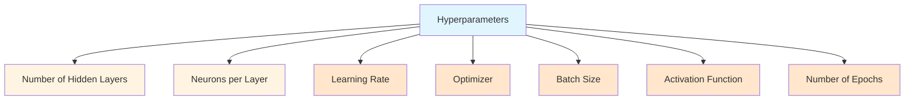
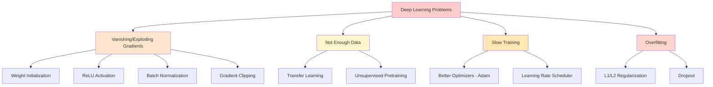
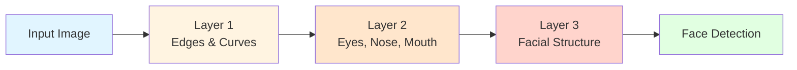
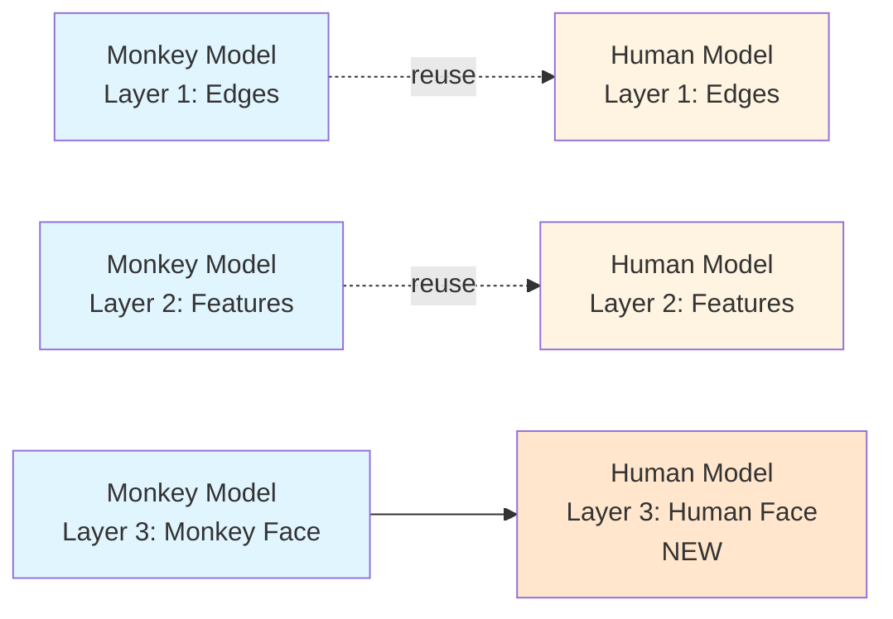

# Fine-Tuning Deep Neural Networks

## Two Main Approaches to Improve Performance

### 1. Fine-Tuning Hyperparameters



**Key Hyperparameters:**

- Number of hidden layers
- Number of neurons per layer
- Learning rate
- Optimizer
- Batch size
- Activation function
- Number of epochs

### 2. Solving Common Problems



---

## Fine-Tuning Hyperparameters

### 1. Number of Hidden Layers

#### Single Hidden Layer Approach

**Possible but not optimal:**

- 1 hidden layer with many neurons
- Has potential to identify patterns
- Universal Approximation Theorem: Single hidden layer can approximate any function

**Why it's not great:** Based on practical experience, this approach underperforms.

#### Multiple Hidden Layers Approach (Recommended)

**Better approach:**

- 3+ hidden layers with fewer neurons per layer
- Gives better results in most scenarios

**From Goodfellow's "Deep Learning":**

> "Deeper models can represent more complex functions using fewer units per layer and parameters overall. The use of depth helps learning by allowing the composition of simple features into complex features."

---

#### Why Deep Networks Work Better: Representation Learning

Deep learning uses **hierarchical feature learning** - primitive patterns identified in initial layers, combined into complex patterns in later layers.

**Example: Face Recognition**



**Layer 1 (Initial):** Detects primitive features

- Edges
- Curves
- Lines
- Gradients

**Layer 2 (Middle):** Combines primitives into shapes

- Eyes (combination of edges and curves)
- Nose (specific shape patterns)
- Mouth (curved lines)

**Layer 3 (Final):** Combines shapes into complete object

- Facial structure
- Complete face recognition

**Key Insight:** More hidden layers (depth) > More neurons per layer (width)

---

#### When to Stop Adding Layers?

**Signal to stop:** When model starts **overfitting**

**Strategy:**

```
Start: 2 layers → Val accuracy: 85%
Add 1 layer: 3 layers → Val accuracy: 88%
Add 1 layer: 4 layers → Val accuracy: 90%
Add 1 layer: 5 layers → Val accuracy: 89% ← Overfitting!
Stop at 4 layers
```

Monitor validation performance - when it starts degrading, you've gone too deep.

---

#### Transfer Learning Benefit

**Concept:** Reuse learned features from one model in another

**Example:**

**Existing Model:** Monkey face detection **New Task:** Human face detection

**Strategy:**



**How it works:**

1. Take pre-trained monkey detection model
2. **Freeze** initial layers (edges, basic features)
3. **Retrain** only final layers for human faces
4. Much faster training, needs less data

**From Andrew Ng's Transfer Learning lecture:**

> "Transfer learning allows you to use knowledge from one task to improve performance on a related task. The earlier layers learn general features, which transfer across tasks."

**Note:** Transfer learning will be covered in detail during CNNs.

---

### 2. Number of Neurons Per Layer

#### Input Layer

**Already determined by data:**

- Number of neurons = Number of features/columns in dataset
- Not a tunable hyperparameter

#### Output Layer

**Determined by problem type:**

|Problem Type|Output Neurons|
|---|---|
|Binary Classification|1 (sigmoid)|
|Regression|1 (linear)|
|Multi-class (5 classes)|5 (softmax)|
|Multi-label|Multiple (sigmoid each)|

#### Hidden Layers

**No hard and fast rule** - based on engineer's experience

---

#### Classical Approach: Pyramid Structure

**Concept:** Decrease neurons as you move toward output

```
Input Layer:     [784 neurons]
Hidden Layer 1:   [512 neurons]  ⎤
Hidden Layer 2:   [256 neurons]  ⎥ Pyramid
Hidden Layer 3:   [128 neurons]  ⎥ Structure
Hidden Layer 4:   [64 neurons]   ⎦
Output Layer:     [10 neurons]
```

**Reasoning:**

- Input has raw features (many dimensions)
- Hidden layers compress information
- Output needs fewer neurons for final decision

---

#### Modern Approach: Rectangle Structure

**Concept:** Keep neurons roughly constant across layers

```
Input Layer:     [784 neurons]
Hidden Layer 1:   [256 neurons]  ⎤
Hidden Layer 2:   [256 neurons]  ⎥ Rectangle
Hidden Layer 3:   [256 neurons]  ⎥ Structure
Hidden Layer 4:   [256 neurons]  ⎦
Output Layer:     [10 neurons]
```

**Reality:** No significant performance difference between pyramid and rectangle!

**From Bengio's "Practical Recommendations for Gradient-Based Training":**

> "The choice between pyramid and constant layer sizes is often less important than having sufficient capacity overall."

---

#### The Golden Rule: Sufficient Neurons

**Critical Insight:** Number of neurons must be **more than what is required**

**Too few neurons:**

- Model underfits
- Cannot learn complex patterns
- Poor performance

**Sufficient neurons:**

- Model has capacity to learn
- Can represent complex functions
- Good performance

**From the Universal Approximation Theorem:** A neural network with sufficient neurons in one hidden layer can approximate any continuous function. But in practice, deep networks with moderate width work better.

**Practical Guideline:**

- Start with moderate width (64, 128, 256 neurons)
- Increase if underfitting
- Add depth before adding extreme width

---

### 3. Learning Rate

**Will be studied in detail under "Slow Training" section**

**Quick Overview:**

- Too small → Slow training
- Too large → Incorrect results, divergence
- Critical hyperparameter for convergence

---

### 4. Optimizer

**Will be studied in detail under "Slow Training" section**

**Quick Overview:**

- Don't use vanilla gradient descent
- Modern optimizers (Adam, RMSprop) converge faster
- Automatically adjust learning rates

---

### 5. Activation Function

**Will be studied in detail under "Vanishing/Exploding Gradients" section**

**Quick Overview:**

- Sigmoid/Tanh → Vanishing gradients
- ReLU family → Solves vanishing gradients
- Choice affects training stability

---

### 6. Batch Size

**Recall:** Three types of gradient descent

- **Batch GD:** Use entire dataset (batch_size = n)
- **Stochastic GD:** Use single sample (batch_size = 1)
- **Mini-batch GD:** Use small batches (batch_size = 32, 64, 128...)

#### The Debate: Small vs Large Batch Size

**Small Batch Size (8-32)**

**Pros:**

- Better generalization (results on new data)
- Escapes sharp local minima
- More regularization effect

**Cons:**

- Slower training
- Noisy gradient estimates
- Requires more epochs

**Large Batch Size (1024-8192)**

**Pros:**

- Faster training (better GPU utilization)
- Stable gradient estimates
- Fewer iterations

**Cons:**

- Poor generalization
- Gets stuck in sharp minima
- Requires massive GPU RAM
- Not great on new data

**From Keskar et al. "On Large-Batch Training for Deep Learning":**

> "Large-batch methods tend to converge to sharp minimizers of the training function. These minimizers are characterized by large positive eigenvalues in the Hessian and often generalize less well."

---

#### The Compromise: Learning Rate Warmup

**Strategy:** Vary learning rate during training

**Warmup Schedule:**

```python
# Initial epochs: Low learning rate
epochs 1-10:   lr = 0.0001
epochs 11-20:  lr = 0.001
epochs 21-50:  lr = 0.01
epochs 51+:    lr = 0.001 (decay)
```

**Why it works:**

- Initial epochs: Explore parameter space gently (low LR)
- Middle epochs: Make significant progress (high LR)
- Final epochs: Fine-tune solution (decay LR)

**Benefit:** Can use large batch sizes with good generalization!

**From Goyal et al. "Accurate, Large Minibatch SGD":**

> "We use a learning rate warmup scheme: we start from a small learning rate and increase it gradually to the target learning rate. This helps stabilize training with large batch sizes."

---

#### CampusX Recommendation

**Approach 1 (Try First):**

- Use learning rate warmup
- Allows large batch size (faster training)
- Can achieve good generalization

**Approach 2 (Fallback - Proven):**

- Use small batch size (32-64)
- Slower but reliable results
- Always delivers good generalization

**Strategy:**

```
1. Try warmup + large batch
2. If results unsatisfactory → Switch to small batch
3. Small batch always works (proven technique)
```

---

### 7. Number of Epochs

**The Question:** How many epochs until training should stop?

**Common Choices:**

- 100 epochs
- 500 epochs
- 1000 epochs

**Problem:** How do you know when to stop?

---

#### Solution: Early Stopping

**Concept:** Automatically stop when performance plateaus

**How Keras Implements:**

```python
from tensorflow.keras.callbacks import EarlyStopping

early_stop = EarlyStopping(
    monitor='val_loss',      # Watch validation loss
    patience=10,             # Wait 10 epochs for improvement
    restore_best_weights=True  # Restore best model
)

model.fit(X, y, epochs=1000, callbacks=[early_stop])
```

**What it does:**

1. Monitors validation loss every epoch
2. If no improvement for `patience` epochs → Stop training
3. Restores weights from best epoch

**Example:**

```
Epoch 50: val_loss = 0.25 (best so far)
Epoch 51: val_loss = 0.26
Epoch 52: val_loss = 0.27
...
Epoch 60: val_loss = 0.28 (10 epochs without improvement)
→ Stop training, restore epoch 50 weights
```

**From Prechelt's "Early Stopping - But When?":**

> "Early stopping is a form of regularization. It prevents overfitting by stopping training when validation error starts to increase."

**Implementation:** Uses Keras **Callbacks** feature

**Benefits:**

- No need to guess epoch count
- Prevents overfitting
- Saves training time
- Always gets best model

---

## Problems with Deep Neural Networks

### 1. Vanishing and Exploding Gradients

**Solutions:**

**Weight Initialization:**

- Xavier/Glorot initialization
- He initialization
- Prevents gradients from vanishing/exploding early

**Activation Function:**

- Change from Tanh/Sigmoid → ReLU
- ReLU doesn't saturate for positive values
- Prevents vanishing gradients

**Batch Normalization:**

- Newer technique
- Normalizes activations between layers
- Keeps gradients in reasonable range

**Gradient Clipping:**

- Specifically for exploding gradients
- Caps gradient magnitude at threshold
- Prevents NaN/Inf values

**Summary Table:**

|Technique|Vanishing|Exploding|
|---|---|---|
|Weight Initialization|✓|✓|
|ReLU Activation|✓|-|
|Batch Normalization|✓|✓|
|Gradient Clipping|-|✓|

---

### 2. Not Enough Data

Deep learning is **data hungry** - typically needs thousands to millions of examples.

**Solutions:**

#### Transfer Learning

**Concept:** Use someone else's pre-trained model

**How it works:**

1. Take model trained on large dataset (e.g., ImageNet)
2. Reuse learned features
3. Fine-tune on your small dataset

**Example:**

```
Your dataset: 1,000 cat images
Pre-trained model: Trained on 1M images (ImageNet)

Strategy:
1. Load pre-trained model
2. Freeze early layers (edge detectors)
3. Train only final layers on your 1,000 cats
4. Much better than training from scratch!
```

**From Yosinski et al. "How Transferable are Features in Deep Neural Networks?":**

> "Features learned in lower layers are general and transfer well across tasks. Higher layers are more task-specific."

---

#### Unsupervised Pretraining

**Concept:** Learn from unlabeled data first

**Process:**

```
Step 1: Unsupervised learning on unlabeled data
        → Learn general representations
        
Step 2: Supervised fine-tuning on labeled data
        → Adapt to specific task
```

**Example:**

- Unlabeled: 100,000 images (no labels)
- Labeled: 1,000 images (with labels)

Train autoencoder on 100K images → Use learned features → Fine-tune on 1K labeled images

**Techniques:**

- Autoencoders
- Restricted Boltzmann Machines (RBMs)
- Self-supervised learning

---

### 3. Slow Training

**Solutions:**

#### Different Optimizers

**Don't use vanilla gradient descent!**

**Modern Optimizers:**

**Adam (Adaptive Moment Estimation):**

- Most popular choice
- Adaptive learning rates per parameter
- Combines momentum + RMSprop
- Fast convergence

**RMSprop:**

- Adaptive learning rates
- Good for RNNs

**SGD with Momentum:**

- Accelerates convergence
- Smooths updates

**From Kingma & Ba's "Adam" paper:**

> "Adam combines the advantages of two popular extensions of stochastic gradient descent: AdaGrad and RMSProp. It computes adaptive learning rates for each parameter."

**Comparison:**

|Optimizer|Speed|Stability|Typical Use|
|---|---|---|---|
|Vanilla SGD|Slow|Stable|Rarely used|
|SGD + Momentum|Medium|Stable|Good baseline|
|RMSprop|Fast|Medium|RNNs|
|Adam|Fast|Good|Default choice|

---

#### Learning Rate Scheduler

**Concept:** Vary learning rate during training

**Common Schedules:**

**Step Decay:**

```python
Epochs 0-30:   lr = 0.1
Epochs 31-60:  lr = 0.01
Epochs 61-90:  lr = 0.001
```

**Exponential Decay:**

```python
lr = initial_lr * exp(-decay_rate * epoch)
```

**Cosine Annealing:**

```python
lr = min_lr + 0.5 * (max_lr - min_lr) * (1 + cos(epoch/total * π))
```

**Keras Implementation:**

```python
from tensorflow.keras.callbacks import ReduceLROnPlateau

lr_scheduler = ReduceLROnPlateau(
    monitor='val_loss',
    factor=0.5,        # Reduce LR by half
    patience=5,        # If no improvement for 5 epochs
    min_lr=1e-7
)

model.fit(X, y, callbacks=[lr_scheduler])
```

**Benefits:**

- Start with large LR (fast initial progress)
- Reduce LR (fine-tune solution)
- Escape plateaus
- Better final performance

---

### 4. Overfitting

Model performs well on training data but poorly on new data.

**Solutions:**

#### L1 and L2 Regularization

**L2 Regularization (Weight Decay):**

$$L_{total} = L_{original} + \lambda \sum_{i} w_i^2$$

**Effect:** Penalizes large weights, encourages smaller weights

**Keras Implementation:**

```python
from tensorflow.keras import regularizers

model.add(Dense(64, 
    kernel_regularizer=regularizers.l2(0.01)  # λ = 0.01
))
```

**L1 Regularization:**

$$L_{total} = L_{original} + \lambda \sum_{i} |w_i|$$

**Effect:** Encourages sparsity (many weights → 0)

**Comparison:**

|Type|Penalty|Effect|Use Case|
|---|---|---|---|
|L1|$$\sum \|w\|$$|Sparse weights|Feature selection|
|L2|$$\sum w^2$$|Small weights|General regularization|

---

#### Dropout

**Concept:** Randomly "drop" neurons during training

**How it works:**

```
Training:
Layer with 100 neurons
→ Randomly deactivate 50 neurons (50% dropout)
→ Train with remaining 50
→ Next iteration: Different 50 neurons dropped

Testing:
All 100 neurons active (scaled appropriately)
```

**Keras Implementation:**

```python
from tensorflow.keras.layers import Dropout

model.add(Dense(128, activation='relu'))
model.add(Dropout(0.5))  # Drop 50% of neurons
model.add(Dense(64, activation='relu'))
model.add(Dropout(0.3))  # Drop 30% of neurons
```

**Why it works:**

- Prevents co-adaptation of neurons
- Forces network to learn redundant representations
- Acts like ensemble of networks

**From Srivastava et al. "Dropout" paper:**

> "Dropout prevents overfitting and provides a way of approximately combining exponentially many different neural network architectures efficiently."

**Typical Dropout Rates:**

- 0.2-0.3 for shallow layers
- 0.5 for deep layers
- Never use on output layer

---

## Summary: Quick Reference

**Fine-Tuning Checklist:**

|Hyperparameter|Recommendation|
|---|---|
|Hidden Layers|3-5 layers, stop when overfitting|
|Neurons/Layer|Sufficient capacity, pyramid or rectangle|
|Learning Rate|Use with scheduler/warmup|
|Optimizer|Adam (default choice)|
|Batch Size|32-64 (or large with warmup)|
|Activation|ReLU family|
|Epochs|Use early stopping|

**Problem-Solution Map:**

|Problem|Solutions|
|---|---|
|Vanishing/Exploding|Weight init, ReLU, BatchNorm, Clipping|
|Not Enough Data|Transfer learning, Unsupervised pretraining|
|Slow Training|Adam optimizer, LR scheduler|
|Overfitting|L1/L2 regularization, Dropout, Early stopping|

