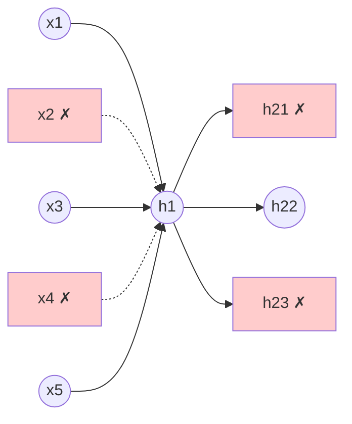
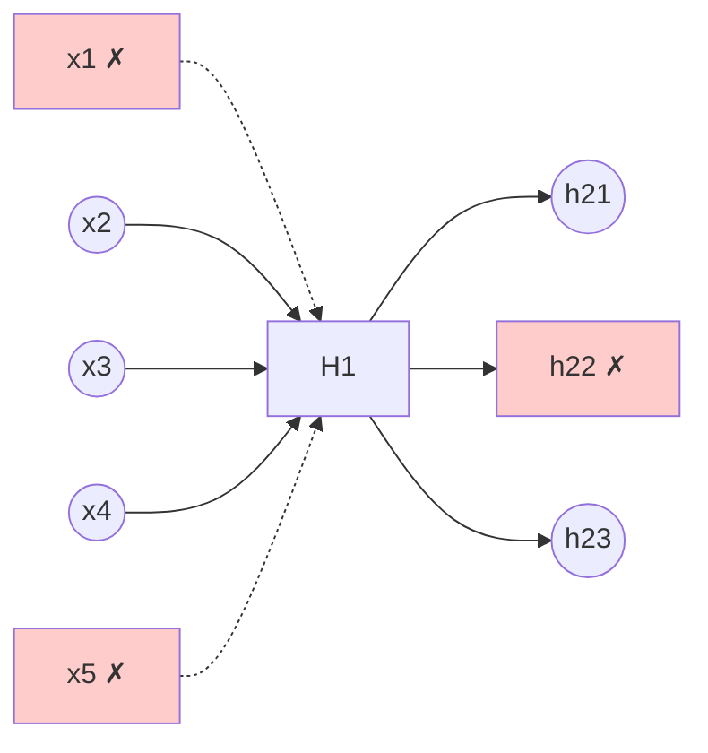

## Reference Paper

**"Dropout: A Simple Way to Prevent Neural Networks from Overfitting"**

- **Authors:** Nitish Srivastava, Geoffrey Hinton, Alex Krizhevsky, Ilya Sutskever, Ruslan Salakhutdinov
- **Published:** Journal of Machine Learning Research (JMLR), 2014
- **Link:** https://jmlr.org/papers/volume15/srivastava14a/srivastava14a.pdf

---

## The Problem of Overfitting

### What is Overfitting?

**Overfitting** occurs when a model learns the training data **too well** - including its noise and peculiarities - rather than learning the underlying patterns. The model performs excellently on training data but poorly on new, unseen data.

**Signs of Overfitting:**

- High training accuracy (95%+)
- Low test accuracy (70%)
- Large gap between training and validation performance
- Model memorizes instead of generalizes

---

![[Pasted image 20260205103722.png]]

### Visual Understanding

**In the image above:**

**Green Line (Overfit Model):**

- Perfectly captures every training point
- Overly complex decision boundary
- Follows noise in the data
- Will perform poorly on new data

**Black Line (Good Model):**

- Captures general pattern
- Simple, smooth decision boundary
- Ignores noise
- Will generalize well to new data

**Key Insight:** Remove training data and add new points → green boundary fails, black boundary succeeds.

---

### Why Neural Networks Overfit Easily

**Neural networks are inherently prone to overfitting:**

1. **High Complexity**
    
    - Multiple layers (can be 50-100+)
    - Each layer has multiple nodes (100-1000+)
    - Millions to billions of parameters
2. **Huge Capacity**
    
    - Can memorize entire datasets
    - Learn spurious correlations
    - Fit random noise perfectly

**From the Dropout paper:**

> "With unlimited computation, the best way to 'regularize' a fixed-sized model is to average the predictions of all possible settings of the parameters, weighting each setting by its posterior probability. This is computationally infeasible for neural networks."

---

## Solutions to Overfitting

### 1. Add More Data

**More varied data → Less overfitting**

- Exposes model to different patterns
- Reduces memorization
- Most effective but often expensive/impossible

### 2. Reduce Network Complexity

**Fewer layers/neurons → Less capacity to overfit**

- Simpler architecture
- Fewer parameters
- But: May lose representational power

### 3. Early Stopping

**Stop training when validation performance plateaus**

- Monitor validation loss
- Prevent overtraining
- Simple and effective

### 4. Regularization (L1/L2)

**Penalize large weights**

- L1: Lasso (sparse weights)
- L2: Ridge (small weights)
- Adds penalty term to loss function

### 5. Dropout (Our Focus)

**Randomly deactivate neurons during training**

- Most popular technique
- Surprisingly effective
- Easy to implement

---

## The Concept of Dropout

![[Pasted image 20260205104235.png]]

### Architecture Example

**Full Network (Left):**

- Input Layer: 5 features
- Hidden Layer 1: 5 nodes
- Hidden Layer 2: 5 nodes
- Output Layer: 1 node
- **Fully connected** - every neuron connects to every neuron in next layer

### How Dropout Works

**Basic Concept:** Randomly drop (deactivate) nodes in input and hidden layers during training.

**Example Training with 10 Epochs:**

**Epoch 1:**



- **Dropped:** x2, x4 (input), h21, h23 (hidden)
- **Active:** x1, x3, x5, h22
- Weights/biases of dropped nodes: **not updated**

**Epoch 2:**



- **Dropped:** Different set of neurons
- **Active:** Different network configuration
- **Result:** Training a different sub-network!

**Key Insight:** Over 10 epochs, you're effectively training **10 different neural networks**!

---

### Mathematical Definition

**From the Dropout paper:**

With dropout rate $$p$$:

**Training:** For each training example, for each layer: $$r_j \sim \text{Bernoulli}(p)$$ $$\tilde{y} = r \ast y$$

Where:

- $$r_j$$ = Random binary mask (0 or 1)
- $$p$$ = Probability of keeping a unit
- $$\tilde{y}$$ = Dropped-out outputs

**Example:** If $$p = 0.5$$, each neuron has 50% chance of being dropped.

---

## Why Dropout Works

### Reason 1: Reduces Network Complexity

**Complex network:**

- Many nodes → many possibilities
- High capacity to memorize
- Overfitting likely

**With dropout:**

- Fewer active nodes per epoch
- Reduced possibilities
- Less capacity to memorize
- **Forces learning of robust features**

### Reason 2: Prevents Co-adaptation

**The Problem:** Neurons become too dependent on each other

- Neuron A always relies on Neuron B
- Neuron B specializes for Neuron A
- Co-adapted neurons can't work independently

**From the Dropout paper:**

> "This prevents units from co-adapting too much. The idea is that a hidden unit cannot rely on other hidden units being present. Therefore, it is forced to learn more robust features that are useful in conjunction with many different random subsets of the other neurons."

**With dropout:**

- Neuron A can't rely on Neuron B (B might be dropped!)
- Each neuron must learn useful features **independently**
- Network becomes more robust

---

## The Company Analogy

**Imagine a company with different employees:**

- Programmers
- Testers
- Marketers
- CEOs
- Management
- Peons

**New Policy:** Random 50% attendance daily

- Employees randomly receive "work from home" or "come to office" email
- Different employees present each day

**Expected Impact:** Productivity loss?

**Actual Impact:**

- **Engineer** who over-relied on testing team → learns to test own code
- **Manager** who always delegated → learns to do tasks independently
- **Marketer** who depended on designer → learns basic design
- **Everyone becomes more self-sufficient**

**Result:** More resilient, versatile team!

**Same with Dropout:**

- Neurons can't rely on specific other neurons
- Each learns to work independently
- Network becomes more robust

---

## Dropout Rate (p)

### Defining Dropout Rate

**For each layer, define dropout rate $$p$$:**

$$p = 0.5$$ → Drop 50% of neurons randomly each epoch

**Can be different per layer:**

- Input layer: $$p = 0.2$$ (drop 20%)
- Hidden layer 1: $$p = 0.5$$ (drop 50%)
- Hidden layer 2: $$p = 0.5$$ (drop 50%)
- Output layer: $$p = 0$$ (never drop output!)

**From the paper:**

> "A good value of p for hidden units is 0.5 and for input units is close to 1 (typically 0.8-1.0)."

### Visual Example

**Original Network:** 100 neurons per layer

**With $$p = 0.5$$:**

```
Training Epoch 1:
[███████████████████████░░░░░░░░░░░░░░░░░░░░░░░░] 50 active, 50 dropped

Training Epoch 2:
[░░░░░░░░░░░███████████████████████░░░░░░░░░░░░] Different 50 active

Training Epoch 3:
[░░░░░░░░░░░░░░░░░░░███████████████████████████] Different 50 active
```

**Each epoch = Different sub-network!**

---

## Connection to Random Forest

### Brief: What is Random Forest?

**Random Forest (Machine Learning):**

- **Ensemble method** using multiple decision trees
- Each tree trained on random subset of:
    - Data (row sampling)
    - Features (column sampling)
- Final prediction: **Average** of all trees

**Why it works:**

- Individual trees overfit
- Averaging reduces variance
- Ensemble is more robust

---

### Dropout as Neural Network Ensemble

**From the Dropout paper:**

> "Dropout can be seen as a way of doing model averaging with neural networks. Training a neural network with dropout can be seen as training a collection of $$2^n$$ thinned networks with extensive weight sharing."

**Similarity to Random Forest:**

|Aspect|Random Forest|Dropout|
|---|---|---|
|**Base Model**|Decision Tree|Sub-network|
|**Number of Models**|100-1000 trees|$$2^n$$ sub-networks|
|**Training Strategy**|Random data/features|Random neurons|
|**Prediction**|Average all trees|Scale weights by (1-p)|
|**Effect**|Reduces variance|Prevents overfitting|

**Key Difference:**

- Random Forest: Train separate models independently
- Dropout: All sub-networks **share weights** (more efficient!)

**Common Interview Question:**

> "How are dropouts similar to random forest?"

**Answer:** Both are ensemble methods that train multiple models on random subsets, then combine predictions. Dropout trains exponentially many sub-networks with shared weights, while Random Forest trains independent trees. Both reduce overfitting through ensemble averaging.

---

## Dropout During Training vs Testing

### Training Phase

**Dropout is ACTIVE:**

- Randomly drop neurons each batch/epoch
- Train on different sub-networks
- Weights updated only for active neurons

```python
# During training
for epoch in epochs:
    for batch in batches:
        mask = random_binary_mask(p=0.5)  # Random dropout
        output = forward_pass(input * mask)
        backprop(output)
```

### Testing/Prediction Phase

**Dropout is TURNED OFF:**

- All neurons active
- No random dropping
- But: Need to scale weights!

![[Pasted image 20260205110936.png]]

---

## Weight Scaling at Test Time

### The Problem

**Training:** Neuron receives input from 100 neurons (on average) **Testing:** Neuron receives input from 200 neurons (all active) **Result:** Outputs are doubled → predictions wrong!

### The Solution: Scale Weights

**During testing, multiply weights by $$(1-p)$$:**

$$w_{test} = w_{train} \times (1 - p)$$

### Why This Works

**Probability-based reasoning:**

With dropout rate $$p = 0.25$$:

- Probability of neuron being **dropped** = 0.25
- Probability of neuron being **kept** = $$1 - p = 0.75$$

**During training (100 epochs):**

- Neuron present: 75 epochs
- Neuron absent: 25 epochs
- **Average contribution:** $$w \times 0.75$$

**During testing:**

- Neuron always present
- Contribution: $$w \times 1.0$$
- **To match training average:** Scale by 0.75

**From the paper:**

> "At test time, the weights are scaled by the probability of keeping a unit during training. This ensures that the expected output of a unit at test time is the same as the expected output at training time."

### Example

**Training:** $$p = 0.5$$ (keep 50%)

- Weight learned: $$w = 2.0$$
- Average training contribution: $$2.0 \times 0.5 = 1.0$$

**Testing:**

- All units active
- Scale weight: $$w_{test} = 2.0 \times (1 - 0.5) = 1.0$$
- Testing contribution: $$1.0 \times 1.0 = 1.0$$ ✓ (matches!)

---

## Implementation in Keras

### Manual Implementation (Not Needed!)

**Keras handles everything automatically!**

You don't need to:

- ❌ Manually create dropout masks
- ❌ Manually scale weights at test time
- ❌ Write dropout logic

**Keras does it all for you:**

```python
from tensorflow.keras.layers import Dropout

model = Sequential([
    Dense(128, activation='relu', input_dim=10),
    Dropout(0.5),  # That's it! 50% dropout
    
    Dense(64, activation='relu'),
    Dropout(0.3),  # 30% dropout
    
    Dense(1, activation='sigmoid')
    # No dropout on output layer!
])

# Training: Dropout active automatically
model.fit(X_train, y_train, epochs=100)

# Testing: Dropout turned off automatically
predictions = model.predict(X_test)
```

**What Keras does internally:**

**Training mode (`model.fit`):**

```python
# Keras automatically:
# 1. Generates random mask
# 2. Applies mask to neurons
# 3. Scales by 1/p during forward pass (inverted dropout)
```

**Testing mode (`model.predict`, `model.evaluate`):**

```python
# Keras automatically:
# 1. Turns off dropout
# 2. Uses all neurons
# 3. No weight scaling needed (due to inverted dropout)
```

### Inverted Dropout (Keras Implementation)

**Modern approach:** Scale **during training** instead of testing!

**Formula:** $$\tilde{y} = \frac{r \ast y}{1-p}$$

**Benefits:**

- No modification needed at test time
- Faster inference
- Cleaner code

**Keras uses inverted dropout by default**, so you don't need to worry about weight scaling!

---

## Practical Usage

### Example: Image Classification

```python
from tensorflow.keras import Sequential
from tensorflow.keras.layers import Dense, Dropout, Conv2D, Flatten

model = Sequential([
    Conv2D(32, (3,3), activation='relu', input_shape=(28,28,1)),
    Conv2D(64, (3,3), activation='relu'),
    Flatten(),
    
    Dense(128, activation='relu'),
    Dropout(0.5),  # Drop 50% after first dense layer
    
    Dense(64, activation='relu'),
    Dropout(0.3),  # Drop 30% after second dense layer
    
    Dense(10, activation='softmax')  # No dropout on output
])

model.compile(
    optimizer='adam',
    loss='categorical_crossentropy',
    metrics=['accuracy']
)

# Dropout active during training
history = model.fit(X_train, y_train, epochs=50)

# Dropout automatically off during evaluation
test_loss, test_acc = model.evaluate(X_test, y_test)

# Dropout automatically off during prediction
predictions = model.predict(X_new)
```

**That's all you need!** Keras handles the rest.

---

## Dropout Rate Guidelines

**From the paper and practical experience:**

### Input Layer

- **Recommended:** $$p = 0.1$$ to $$0.2$$ (drop 10-20%)
- **Reasoning:** Don't want to lose too much input information
- **Example:** For 100 input features, drop 10-20

### Hidden Layers

- **Recommended:** $$p = 0.5$$ (drop 50%)
- **Reasoning:** Hidden layers learn redundant representations
- **Most common:** Default to 0.5 for dense layers

### Output Layer

- **Recommended:** $$p = 0$$ (no dropout!)
- **Reasoning:** Need all information for final prediction
- **Never drop output neurons**

### Convolutional Layers

- **Recommended:** $$p = 0.1$$ to $$0.3$$ (drop 10-30%)
- **Reasoning:** Spatial relationships important
- **Use sparingly:** Conv layers less prone to overfitting

---

## When to Use Dropout

### Use Dropout When:

✅ Large neural networks (overfitting risk) ✅ Limited training data ✅ You observe overfitting (train acc >> test acc) ✅ Fully connected (dense) layers ✅ Want model ensemble effect

### Don't Use Dropout When:

❌ Small networks (underfitting risk) ❌ Already regularized enough (L2, BatchNorm) ❌ Convolutional layers (use sparingly) ❌ Recurrent layers (use special variants) ❌ Model underfitting (need more capacity)

---

## Results from the Paper

**From Srivastava et al. (2014):**

### MNIST (Handwritten Digits)

- **Without Dropout:** 1.60% error
- **With Dropout:** **1.05% error**
- **Improvement:** 34% error reduction

### CIFAR-10 (Image Classification)

- **Without Dropout:** 16.6% error
- **With Dropout:** **12.6% error**
- **Improvement:** 24% error reduction

### ImageNet (Large-Scale Images)

- **Without Dropout:** 45.8% error
- **With Dropout:** **36.7% error**
- **Improvement:** 20% error reduction

**Quote from paper:**

> "Dropout provides a computationally inexpensive but powerful method of regularizing a broad family of models. We have shown that dropout improves the performance of neural networks on supervised learning tasks in vision, speech recognition, document classification and computational biology."

---

## Comparison with Other Regularization

|Technique|How it Works|Pros|Cons|
|---|---|---|---|
|**L2 Regularization**|Penalize large weights|Simple, always applicable|Less effective for deep nets|
|**L1 Regularization**|Sparse weights|Feature selection|Can be too aggressive|
|**Early Stopping**|Stop when val loss increases|Simple, fast|Might stop too early|
|**Data Augmentation**|Generate more training data|Very effective|Domain-specific|
|**Dropout**|Random neuron dropping|Powerful, ensemble effect|Slower training|
|**Batch Normalization**|Normalize layer inputs|Faster training, regularizes|Complex interactions|

**Dropout's Advantage:** Can be combined with all other techniques!

---

## Advanced: Dropout Variants

### 1. DropConnect

- Drop **connections** instead of neurons
- More fine-grained

### 2. Spatial Dropout

- Drop entire feature maps in CNNs
- Preserves spatial structure

### 3. Variational Dropout

- Same dropout mask across time steps (RNNs)
- Better for sequential data

**Keras provides:**

```python
from tensorflow.keras.layers import SpatialDropout2D

# For CNNs
SpatialDropout2D(0.2)  # Drop entire feature maps
```

---

## Summary

### What is Dropout?

- Randomly deactivate neurons during training
- Creates ensemble of sub-networks
- Prevents overfitting effectively

### How it Works?

- **Training:** Drop neurons with probability $p$
- **Testing:** Use all neurons (Keras handles scaling automatically)
- Forces neurons to learn robust, independent features

### Why it Works?

- Reduces network complexity
- Prevents co-adaptation of neurons
- Ensemble averaging effect
- Similar to Random Forest

### Implementation Guidelines

**Simple:** Just add `Dropout(p)` layer in Keras

```python
model.add(Dropout(0.3))  # Drop 30% of neurons
```

**Automatic:** Keras handles train/test mode switching

**No manual work:** Weight scaling done internally

**Choosing Dropout Rate (p):**

- **General Rule:** Keep $p$ between **0.2 and 0.5**
- **Large $p$ (> 0.5):** Causes underfitting (too many neurons dropped)
- **If Overfitting:** Increase $p$ value (drop more neurons)
- **If Underfitting:** Decrease $p$ value (drop fewer neurons)

**Architecture-Specific Recommendations:**

|Network Type|Optimal Dropout Rate|Notes|
|---|---|---|
|**CNNs**|40-50% (0.4-0.5)|Often after fully connected layers|
|**RNNs**|20-50% (0.2-0.5)|Use recurrent dropout variants|
|**ANNs (Dense)**|10-50% (0.1-0.5)|Most common: 0.5 for hidden layers|

**Special Note:** In certain neural network architectures, dropouts are added **after the last hidden layer** (before output) for additional regularization.

---

## Drawbacks of Dropout

### 1. Delayed Convergence

**Problem:** Dropout causes **slower training** and delays convergence

**Why?**

- Each epoch trains on different sub-network
- Weights update less consistently
- Takes more epochs to reach optimal solution

**Impact:**

```
Without Dropout:
Converges in 50 epochs

With Dropout:
Converges in 100-150 epochs (2-3x slower)
```

**Trade-off:** Slower training BUT better generalization

---

### 2. Variable Loss Function (Biggest Problem)

**Problem:** Loss function value **keeps varying** during training

**Why?**

- Different neurons active each batch/epoch
- Different sub-network evaluated each time
- Loss computed on different architectures

**Impact on Training:**

**Without Dropout:**

```
Epoch 1: Loss = 0.50
Epoch 2: Loss = 0.45
Epoch 3: Loss = 0.42
Epoch 4: Loss = 0.39
...
Smooth, monotonic decrease
```

**With Dropout:**

```
Epoch 1: Loss = 0.50
Epoch 2: Loss = 0.48
Epoch 3: Loss = 0.51  ← Increased!
Epoch 4: Loss = 0.46
Epoch 5: Loss = 0.49  ← Fluctuates
...
Noisy, non-monotonic
```

**Consequence: Gradient Calculation Difficulty**

- Loss surface changes every iteration
- Gradients less reliable
- Optimization becomes noisy
- Makes convergence monitoring difficult

**Practical Workaround:**

- Monitor validation loss (more stable)
- Use moving averages
- Increase patience for early stopping
- Trust the process - final result is better!

**From the paper:**

> "Training with dropout is slower than training without dropout because gradients must be computed for multiple thinned networks."

---

## Key Takeaway

**From the paper:**

> "Dropout is a technique for addressing overfitting. The key idea is to randomly drop units (along with their connections) from the neural network during training. This prevents units from co-adapting too much."

Dropout is one of the most important regularization techniques in deep learning - simple to implement, powerful in effect, and widely applicable!

**Final Advice:**

- Start with $p = 0.5$ for hidden layers
- Monitor both training and validation loss
- Be patient - dropout needs more epochs
- Accept noisy loss curves - it's working as intended
- The slower training is worth the better generalization!