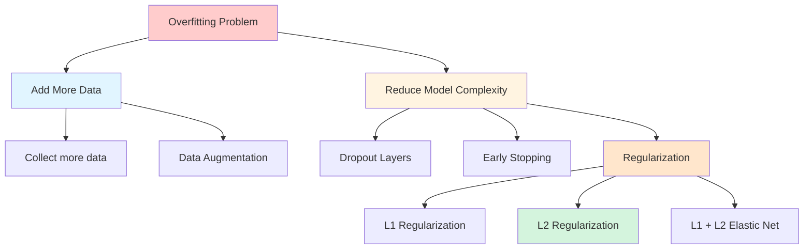
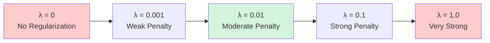

## What is Regularization?

**Regularization** is a technique used to **reduce model overfitting** by penalizing model complexity.

**From Goodfellow's "Deep Learning":**

> "Regularization is any modification we make to a learning algorithm that is intended to reduce its generalization error but not its training error."

---

## The Overfitting Problem

![[Pasted image 20260209095956.png]]

### Visual Understanding

**Training Phase:**

- Model optimizes itself for training data
- Captures every detail and pattern
- Decision boundary becomes complex
- High training accuracy (95%+)

**Testing Phase:**

- Model performs poorly on unseen data
- Learned training data **too well**
- Failed to learn general patterns
- Low test accuracy (70%)

**The Gap:**

```
Training Accuracy: 95% ✓
Test Accuracy:     70% ✗
Gap:              25%  ← Overfitting!
```

---

## Root Cause: Model Complexity

### The Complexity Problem

**Complex neural network:**

- Many nodes/neurons
- Every node connected to others
- High capacity to memorize
- Captures every small detail

**Result:** Model draws intricate decision boundaries that fit training noise perfectly but fail on new data.

**From Bishop's "Pattern Recognition and Machine Learning":**

> "The more flexible the model, the greater the tendency to overfit. Regularization techniques limit the effective complexity of the model."

---

## Neurons and Decision Boundaries

### Single Neuron

![[Pasted image 20260209100446.png]]

**1 Neuron:**

- Creates **linear model**
- Single straight line
- Simple decision boundary
- Cannot overfit much

### Increasing Neurons

![[Pasted image 20260209100754.png]]

**10 Neurons:**

- Line starts to **curve**
- More flexibility
- Can capture non-linear patterns

![[Pasted image 20260209100704.png]]

**50 Neurons:**

- More curves
- Increased complexity

![[Pasted image 20260209100717.png]]

**100 Neurons:**

- Complex curves
- Detailed patterns

![[Pasted image 20260209100731.png]]

**1025 Neurons:**

- Extremely complex boundary
- Captures every tiny detail
- **Overfitted!**

---

### Neurons vs Complexity Table

|Number of Neurons|Decision Boundary|Capability|Risk|
|---|---|---|---|
|1 neuron|1 straight line|Limited|Underfitting|
|2 neurons|2 lines|Low|Low overfitting|
|10 neurons|10 curves|Moderate|Moderate|
|100 neurons|100 curves|High|High overfitting|
|1000 neurons|1000 curves|Very High|Very high overfitting|

**Key Insight:** More neurons = More lines = More complexity = Higher overfitting risk

---

## Solutions to Overfitting



### 1. Add More Data

**Direct Approach:**

- Collect more training examples
- Exposes model to more variation
- Most effective but expensive

**Data Augmentation:**

- Generate synthetic data from existing data
- Image: rotation, flipping, cropping
- Text: synonym replacement, back-translation
- Audio: pitch shifting, time stretching

### 2. Reduce Model Complexity

**Dropout Layers:**

- Randomly drop neurons during training
- Forces robust feature learning

**Early Stopping:**

- Stop training when validation loss increases
- Prevents overtraining

**Regularization:**

- Add penalty term to loss function
- Discourages large weights
- Our focus today!

---

## Understanding Regularization

### The Cost Function

**Original Cost Function (No Regularization):**

For $$n$$ training examples:

$$C = \frac{1}{n} \sum_{i=1}^{n} L(y_i, \hat{y}_i)$$

Where:

- $$L$$ = Loss function (MSE for regression, Binary Cross-Entropy for classification)
- $$y_i$$ = Actual value
- $$\hat{y}_i$$ = Predicted value

### Adding Regularization

**Regularized Cost Function:**

$$C = \frac{1}{n} \sum_{i=1}^{n} L(y_i, \hat{y}_i) + \text{Penalty Term}$$

Or simply:

$$C = L + P$$

Where $$P$$ = Penalty term that penalizes complexity

---

## L2 Regularization (Ridge)

### The Formula

**L2 Regularized Cost Function:**

$$C = \frac{1}{n} \sum_{i=1}^{n} L(y_i, \hat{y}_i) + \frac{\lambda}{2n} \sum_{i=1}^{k} w_i^2$$

**In deep learning notation:**

$$C = \frac{1}{n} \sum_{i=1}^{n} L(y_i, \hat{y}_i) + \frac{\lambda}{2n} \sum_{l=1}^{L} \sum_{i=1}^{n_l} \sum_{j=1}^{n_{l-1}} (w_{ij}^{(l)})^2$$

Where:

- $$\lambda$$ = Regularization hyperparameter (controls penalty strength)
- $$w_{ij}^{(l)}$$ = Weight connecting neuron $$j$$ in layer $$l-1$$ to neuron $$i$$ in layer $$l$$
- $$L$$ = Total number of layers
- $$n_l$$ = Number of neurons in layer $$l$$

**Simplified:**

$$C = L + \frac{\lambda}{2n} |W|^2$$

**What it does:** Adds sum of **squares** of all weights to the loss

**Common notation:** $$|W|_2^2$$ or $$|W|^2$$ (L2 norm squared)

---

### The Penalty Term

**L2 Penalty:**

$$P = \frac{\lambda}{2n} \sum_{i=1}^{k} w_i^2$$

**Components:**

- $$\lambda$$ (lambda): Regularization strength
    - $$\lambda = 0$$ → No regularization
    - $$\lambda = 0.01$$ → Small penalty
    - $$\lambda = 1.0$$ → Large penalty
- $$w_i^2$$: Square of each weight
- $$\frac{1}{2n}$$: Normalization factor

**Effect:** As $$\lambda$$ increases, penalty increases, forcing weights toward zero

---

### Why Weights Approach Zero: Mathematical Intuition

**Original Backpropagation Update:**

$$w_{new} = w_{old} - \eta \frac{\partial L}{\partial w_{old}}$$

**With L2 Regularization:**

New loss function:

$$L' = L + \frac{\lambda}{2n} \sum w_i^2$$

Calculate gradient:

$$\frac{\partial L'}{\partial w_{old}} = \frac{\partial L}{\partial w_{old}} + \frac{\lambda}{n} w_{old}$$

**Substitute into update rule:**

$$w_{new} = w_{old} - \eta \left(\frac{\partial L}{\partial w_{old}} + \frac{\lambda}{n} w_{old}\right)$$

$$w_{new} = w_{old} - \eta \frac{\partial L}{\partial w_{old}} - \eta \frac{\lambda}{n} w_{old}$$

$$w_{new} = w_{old}\left(1 - \eta \frac{\lambda}{n}\right) - \eta \frac{\partial L}{\partial w_{old}}$$

**Key Term:** $$\left(1 - \eta \frac{\lambda}{n}\right)$$

**Analysis:**

- This term is **less than 1**
- Every epoch, $$w_{old}$$ is multiplied by value < 1
- **Weights decay** toward zero over epochs!

**Example:**

```
If η = 0.01, λ = 1, n = 100:
Decay factor = 1 - (0.01 × 1/100) = 0.9999

Epoch 1: w = 1.0
Epoch 2: w = 1.0 × 0.9999 = 0.9999
Epoch 3: w = 0.9999 × 0.9999 = 0.9998
...
After many epochs: w → smaller values
```

---

### Weight Decay Terminology

**L2 Regularization = Weight Decay**

**Why the name?** As shown above, the term $$\left(1 - \eta \frac{\lambda}{n}\right)$$ causes weights to **decay** toward zero each epoch.

**From Goodfellow's "Deep Learning":**

> "L2 regularization is also known as weight decay. The name comes from the effect of the regularizer on the gradient descent update, where it causes the weights to decay toward zero by a constant factor on each step."

**Technical Note:**

- Strictly speaking, weight decay and L2 regularization are slightly different in adaptive optimizers (Adam, RMSprop)
- For SGD with momentum: They're **equivalent**
- For practical purposes: Terms used interchangeably

---

### The Pruning Analogy

**Think of neural network as a tree:**

**No Regularization:**

- Tree grows wild with many branches
- Some branches useful, many redundant
- Overgrown, hard to maintain

**With L2 Regularization:**

- Penalty discourages excessive branching
- Weak branches (small weights) trimmed
- Strong branches (important weights) remain
- Cleaner, more maintainable tree

**Result:** Simpler model that generalizes better!

---

## L1 Regularization (Lasso)

### The Formula

**L1 Regularized Cost Function:**

$$C = \frac{1}{n} \sum_{i=1}^{n} L(y_i, \hat{y}_i) + \frac{\lambda}{n} \sum_{i=1}^{k} |w_i|$$

**In deep learning notation:**

$$C = \frac{1}{n} \sum_{i=1}^{n} L(y_i, \hat{y}_i) + \frac{\lambda}{n} \sum_{l=1}^{L} \sum_{i=1}^{n_l} \sum_{j=1}^{n_{l-1}} |w_{ij}^{(l)}|$$

**Simplified:**

$$C = L + \frac{\lambda}{n} |W|_1$$

**What it does:** Adds sum of **absolute values** of all weights to the loss

**Key Difference from L2:** Absolute value ($$|w|$$) instead of square ($$w^2$$)

---

### L1 Penalty Term

**L1 Penalty:**

$$P = \frac{\lambda}{n} \sum_{i=1}^{k} |w_i|$$

**Gradient:**

$$\frac{\partial}{\partial w} |w| = \begin{cases} +1 & \text{if } w > 0 \ -1 & \text{if } w < 0 \ \text{undefined} & \text{if } w = 0 \end{cases}$$

**Update Rule:**

$$w_{new} = w_{old} - \eta \left(\frac{\partial L}{\partial w_{old}} + \frac{\lambda}{n} \cdot \text{sign}(w_{old})\right)$$

Where $$\text{sign}(w)$$ = +1 if $$w > 0$$, -1 if $$w < 0$$

---

### L1 Effect: Sparsity

**Key Property:** L1 drives weights to **exactly zero**

**Why?**

- Gradient is constant (±1), not proportional to weight
- Small weights get same penalty as large weights
- Many weights become exactly 0

**Example:**

```
Weight = 0.001
L1 penalty = λ × |0.001| = constant
L2 penalty = λ × (0.001)² = tiny

L1 pushes even small weights to zero!
```

**Result:** **Sparse networks** - many weights = 0

**Benefit:** Automatic **feature selection** - zero weights = unused features

---

### The Library Analogy

**Imagine organizing a library:**

**L1 Regularization (Lasso):**

- Strict librarian
- "If book rarely used → Remove it completely"
- Many books discarded (weights → 0)
- Sparse collection (sparse network)
- Easy to navigate (feature selection)

**L2 Regularization (Ridge):**

- Gentle librarian
- "Keep all books, but push less important ones to back"
- All books kept (no zero weights)
- Organized by importance (small weights)
- Dense collection (dense network)

---

## L1 vs L2 Comparison

### Summary Table

|Aspect|L1 (Lasso)|L2 (Ridge)|
|---|---|---|
|**Formula**|$$\sum \|w_i\|$$|$$\sum w_i^2$$|
|**Penalty Type**|Absolute value|Squared value|
|**Effect on Weights**|Drives to exactly zero|Shrinks toward zero|
|**Sparsity**|Sparse (many zeros)|Dense (no zeros)|
|**Feature Selection**|Yes (automatic)|No|
|**Gradient**|Constant (±1)|Proportional to weight|
|**Common Use**|Feature selection|General regularization|
|**Computational**|Slower (non-differentiable at 0)|Faster (smooth)|
|**Best For**|High-dimensional data|Most cases|

### Visual Comparison

**Constraint Regions:**

```
L1 (Diamond shape):          L2 (Circle):
      
      w2                         w2
       ↑                          ↑
       |  /\                      |   ___
       | /  \                     |  /   \
       |/    \                    | |  ·  |
    ---*------\--- w1          ---*-------\--- w1
       |\    /                    | \___/
       | \  /                     |
       |  \/                      |

    Corners touch axis         Smooth, rarely zero
    → Weights become 0         → Weights small, not 0
```

**From Hastie's "Elements of Statistical Learning":**

> "The L1 penalty has corners at zero, making it more likely to produce sparse solutions. The L2 penalty is smooth everywhere, shrinking weights but rarely making them exactly zero."

---

### When to Use Which?

**Use L1 When:**

- ✓ You want feature selection
- ✓ Many irrelevant features
- ✓ Interpretability important (sparse models easier to understand)
- ✓ High-dimensional data (p >> n)

**Use L2 When:**

- ✓ Most features relevant
- ✓ General overfitting prevention
- ✓ All features should contribute (no feature selection)
- ✓ Faster computation needed
- ✓ **Default choice** for deep learning

**Use Both (Elastic Net) When:**

- ✓ Want benefits of both
- ✓ Grouped features (L1 selects, L2 keeps groups)
- ✓ Not sure which to use

---

## Elastic Net (L1 + L2)

**Combined Regularization:**

$$C = \frac{1}{n} \sum_{i=1}^{n} L(y_i, \hat{y}_i) + \lambda_1 \sum |w_i| + \lambda_2 \sum w_i^2$$

**Benefits:**

- Gets sparsity from L1
- Gets stability from L2
- Balances both penalties

**Hyperparameters:**

- $$\lambda_1$$: Controls L1 strength (sparsity)
- $$\lambda_2$$: Controls L2 strength (shrinkage)

---

## Implementation in Keras

### L2 Regularization

```python
from tensorflow.keras import regularizers
from tensorflow.keras.layers import Dense

model = Sequential([
    Dense(128, activation='relu',
          kernel_regularizer=regularizers.l2(0.01)),  # λ = 0.01
    
    Dense(64, activation='relu',
          kernel_regularizer=regularizers.l2(0.01)),
    
    Dense(1, activation='sigmoid')
])
```

**What it does:** Adds $$0.01 \times \sum w^2$$ to loss

### L1 Regularization

```python
model = Sequential([
    Dense(128, activation='relu',
          kernel_regularizer=regularizers.l1(0.01)),  # λ = 0.01
    
    Dense(64, activation='relu',
          kernel_regularizer=regularizers.l1(0.01)),
    
    Dense(1, activation='sigmoid')
])
```

**What it does:** Adds $$0.01 \times \sum |w|$$ to loss

### Elastic Net (L1 + L2)

```python
model = Sequential([
    Dense(128, activation='relu',
          kernel_regularizer=regularizers.l1_l2(l1=0.01, l2=0.01)),
    
    Dense(64, activation='relu',
          kernel_regularizer=regularizers.l1_l2(l1=0.01, l2=0.01)),
    
    Dense(1, activation='sigmoid')
])
```

---

## Choosing Lambda (λ)

### Effect of Lambda Values



**Lambda too small (λ → 0):**

- Weak penalty
- Weights unrestricted
- Model still overfits

**Lambda optimal (λ = 0.01):**

- Balanced penalty
- Weights controlled
- Good generalization

**Lambda too large (λ → ∞):**

- Excessive penalty
- All weights → 0
- Model underfits

### Finding Optimal Lambda

**Strategy:** Grid search with cross-validation

```python
lambdas = [0.001, 0.01, 0.1, 1.0]
best_lambda = None
best_val_acc = 0

for λ in lambdas:
    model = build_model(l2_lambda=λ)
    model.fit(X_train, y_train)
    val_acc = model.evaluate(X_val, y_val)
    
    if val_acc > best_val_acc:
        best_val_acc = val_acc
        best_lambda = λ

print(f"Best λ: {best_lambda}")
```

**Common Values:**

- Start with: $$\lambda = 0.01$$
- Increase if overfitting persists
- Decrease if underfitting occurs

---

## Practical Guidelines

### General Recommendations

**From Andrew Ng's Deep Learning Course:**

1. **Start with L2** (most common choice)
2. **Begin with λ = 0.01**
3. **Tune using validation set**
4. **Combine with dropout** (works well together)
5. **Monitor both train and val loss**

### Regularization Checklist

**Signs you need regularization:**

- [ ] Training accuracy >> Test accuracy
- [ ] Validation loss increasing while training loss decreasing
- [ ] Model has many parameters
- [ ] Limited training data

**How much regularization:**

- **Small λ (0.001):** Large dataset, mild overfitting
- **Medium λ (0.01):** Standard choice, moderate overfitting
- **Large λ (0.1):** Small dataset, severe overfitting

---

## Summary

### Key Takeaways

**L2 Regularization (Ridge):**

- Adds $$\sum w^2$$ penalty
- Shrinks all weights toward zero
- No sparsity (weights stay small, not zero)
- Most common in deep learning
- Called "weight decay"

**L1 Regularization (Lasso):**

- Adds $$\sum |w|$$ penalty
- Drives weights to exactly zero
- Creates sparse networks
- Automatic feature selection
- Less common in deep learning

**Why Regularization Works:**

- Penalizes model complexity
- Prevents large weights
- Forces simpler decision boundaries
- Better generalization

**Implementation:**

```python
# L2 (most common)
regularizers.l2(0.01)

# L1 (feature selection)
regularizers.l1(0.01)

# Both (elastic net)
regularizers.l1_l2(l1=0.01, l2=0.01)
```

**From Murphy's "Machine Learning: A Probabilistic Perspective":**

> "Regularization is one of the central themes in machine learning. It allows us to control the complexity of the model, so we can avoid overfitting."

**Final Advice:**

- Default to L2 regularization
- Start with λ = 0.01
- Tune on validation set
- Combine with other techniques (dropout, early stopping)
- Monitor generalization gap between train and test performance